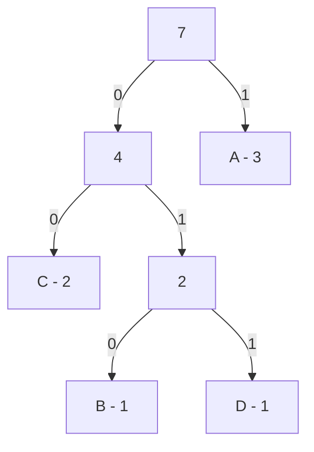

[TOC]

---

## 一、编码

- 二进制编码：存在**前缀**问题，可能会导致**歧义**
- 等长编码：不存在前缀问题，为一解码。但不是最短方案❌
- **哈夫曼编码**：不出现歧义的情况下的最短编码

---

## 二、霍夫曼树

!!! success

    统计每个字母出现次数
    
    不断合并最小两个节点
    
    向左的编号0，向右的编号1
    
    权值拼接为编码

```
A B A A C D C
A	1
B	01
C	00
D	011
```




带权路径长度 $WPL$：
$$
WPL = \sum_{i=1}^{n} w_i \times d_i
$$
e.g. $WPL=2\times2+1\times3+1\times3+3\times1=13$

---

