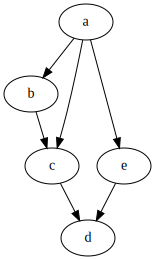
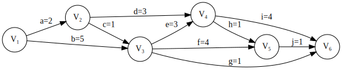

[TOC]

---

## 一、拓扑排序

- **每次**选择**入度为 $0$ **的点，然后**删除**这个点和他的出边

!!! danger
    - 只能用于有向无环图
    
    - 如果拓扑排序无法进行下去，就说明图中有环

!!! example
    
    
    - a b c e d
    
    - a b e c d
    
    - a e b c d

---

## 二、AOE网

- **关键活动**：不能拖延的活动（最早开始时间=最晚开始时间）
- $ve$ ：事件最早开始时间
- $vl$ ：事件最晚开始时间
- $e$ ：边最早开始时间
- $l$ ：边最晚开始时间

根据**<u>拓扑排序</u>**，每次更新 $ve$ ，取最大的

终点的 $ve=vl$ ，然后根据**<u>逆拓扑排序</u>**，每次更新 $vl$ ，取最小的

边的最早开始时间=发出这条边的节点的 $ve$ ，最晚开始时间=这条边的终点-边权

| 顶点 $v$ | $ve$ | $vl$ |
| -------- | ---- | ---- |
| $v_1$    | 0    | 0    |
| $v_2$    | 2    | 4    |
| $v_3$    | 5    | 5    |
| $v_4$    | 8    | 8    |
| $v_5$    | 9    | 11   |
| $v_6$    | 12   | 12   |

| 边 (活动) | $e$  | $l$  |
| --------- | ---- | ---- |
| a         | 0    | 2    |
| b✅        | 0    | 0    |
| c         | 2    | 4    |
| d         | 2    | 5    |
| e✅        | 5    | 5    |
| f         | 5    | 7    |
| g         | 5    | 11   |
| h         | 8    | 10   |
| i✅        | 8    | 8    |
| j         | 9    | 11   |

------

