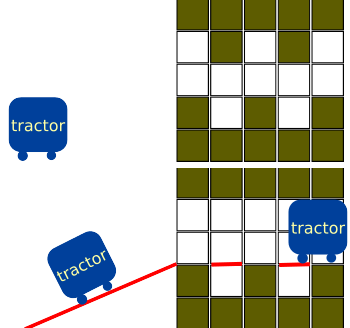

[TOC]

## 1、解释
!!! tip
    > 差分数组记录的是原来数组相邻元素的差值

    要对一个区间加上或者减去一个数，可以通过仅修改**差分数组**的两个端点来实现，而不遍历整个区间。

    > 差分时间复杂度： `O(1)`

    > 遍历数组时间复杂度：`O(n)`

```c++
#include <bits/stdc++.h>
using namespace std;
int a[100] = {0, 1, 2, 3, 4, 5, 6, 7};
int b[100];
int main() {
    int n=7;
    /*
    区间2-5都加3
    b[6]要先-3，再加3，最后是0
    */
    b[2] += 3, b[6] -= 3;
    for (int i = 0; i < n; i++) {
        b[i] += b[i - 1];
    }
    for(int i=0;i<n;i++){
        a[i]+=b[i];
    }
    for(int i=0;i<n;i++){
        cout<<a[i];
    }
    cout<<endl;
    for(int i=0;i<n;i++){
        cout<<b[i];
    }
}
/*
用于快速修改大量数组，而不爆时间复杂度
*/
```

## 2、常见思路

```c++
#include <iostream>
using namespace std;
const int N = 100010;  // 根据题目范围修改

int a[N];     // 原数组
int d[N];     // 差分数组
int n;        // 数组长度

// 构建差分数组
void init() {
    d[0] = a[0];
    for(int i = 1; i < n; i++) {
        d[i] = a[i] - a[i-1];
    }
}

// 区间加操作
void add(int l, int r, int val) {
    d[l] += val;
    d[r + 1] -= val;
}

// 还原原数组
void get_origin() {
    a[0] = d[0];
    for(int i = 1; i < n; i++) {
        a[i] = a[i-1] + d[i];
    }
}

int main() {
    int m;  // 操作次数
    cin >> n >> m;
    // 读入原数组
    for(int i = 0; i < n; i++) {
        cin >> a[i];
    }    
    // 构建差分数组
    init();
    // 处理操作
    while(m--) {
        int l, r, val;
        cin >> l >> r >> val;
        l--;  // 转换为0基下标
        r--;
        add(l, r, val);
    }
    // 还原并输出结果
    get_origin();
    for(int i = 0; i < n; i++) {
        cout << a[i] << " \n"[i == n-1];
    }
    
    return 0;
}
```


---

## 例题

### e.g.23 重新排序

问题描述

给定一个数组 A 和一些查询 $L_i,R_i$, 求数组中第 $L_i$至第 $R_i$个元素之和。

小蓝觉得这个问题很无聊, 于是他想重新排列一下数组, 使得最终每个查 询结果的和尽可能地大。小蓝想知道相比原数组, 所有查询结果的总和最多可 以增加多少?

输入格式

输入第一行包含一个整数 $n$ 。

第二行包含 $n$ 个整数$A_1,A_2,⋯,A_n$, 相邻两个整数之间用一个空格分隔。

第三行包含一个整数$m$表示查询的数目。

接下来 $m$行, 每行包含两个整数 $L_i、R_i$ 相邻两个整数之间用一个空格分隔。

输出格式

输出一行包含一个整数表示答案。

样例输入

```txt
5
1 2 3 4 5
2
1 3
2 5
```

样例输出

```text
4
```

样例说明

原来的和为 $6+14=20$, 重新排列为 $(1,4,5,2,3)$ 后和为 $10+14=24$, 增加了 $4$。

评测用例规模与约定

对于所有评测用例, $1≤n,m≤10^5,1≤A_i≤10^6,1≤L_i≤R_i≤10^6$。
???tip
    > 思路：让大的数字被查询的机会更多即可

```c++
#include <bits/stdc++.h>
using namespace std;
#define int long long
const int N = 1e5 + 10;
int n, m, a[N], b[N];
int32_t main() {
    cin >> n;
    for (int i = 1; i <= n; i++) {
        cin >> a[i];
    }
    cin >> m;
    for (int i = 1; i <= m; i++) {
        int l, r;
        cin >> l >> r;
        b[l] += 1;
        b[r + 1] -= 1;
    }
    for (int i = 1; i <= n; i++) {
        b[i] += b[i - 1]; 
    }
    // for (int i = 1; i <= n; i++) {
    //     cout << b[i] << " ";
    // }
    int ans1 = 0;
    for (int i = 0; i <= n; i++) {
        ans1 += a[i] * b[i];
    }
    sort(b + 1, b + n + 1);
    sort(a + 1, a + n + 1);
    int ans2 = 0;
    for (int i = 1; i <= n; i++) {
        ans2 += a[i] * b[i];
    }
    cout << ans2 - ans1;
}
```

---

### e.g.24 [NewOJ Week 6] 推箱子

题目描述

在一个高度为$H$的箱子前方，有一个长和高为$N$的障碍物。
障碍物的每一列存在一个连续的缺口，第i列的缺口从第l各单位到第h个单位（从底部由$0$开始数）。
现在请你清理出一条高度为$H$的通道，使得箱子可以直接推出去。
请输出最少需要清理的障碍物面积。
如下图为样例中的障碍物，长和高度均为$5$，箱子高度为$2$。（不需要考虑箱子会掉入某些坑中）

最少需要移除两个单位的障碍物可以造出一条高度为2的通道。



输入格式

输入第一行为两个正整数N和H，表示障碍物的尺寸和箱子的高度，$1≤H≤N≤1000000$。
接下来$N$行，每行包含两个整数$l_i$和$h_i$，表示第i列缺口的范围，$0≤l_i≤h_i<N$。

输出格式

输出一个数字表示答案。

输入样例 

```
5 2
2 3
1 2
2 3
1 2
2 3
```

输出样例 

```
2
```

```c++
#include <bits/stdc++.h>
using namespace std;
typedef long long ll;
const int N = 1e6 + 10;
ll n, h, a[N], s[N];

int main() {
    cin >> n >> h;
    // 差分
    for (int i = 1; i <= n; i++) {
        int l, r;
        cin >> l >> r;
        l++, r++;
        a[l]++, a[r + 1]--;
    }
    for (int i = 1; i <= n; i++) {
        a[i] += a[i - 1];
    }
    for (int i = 1; i <= n; i++) {
        s[i] = s[i - 1] + a[i];
    }
    ll ans = 1e18;
    for (int i = h; i <= n; i++) {
        ans = min(ans, n * h - (s[i] - s[i - h]));
    }
    cout << ans << endl;
}
```

---

### e.g.25  棋盘

问题描述

小蓝拥有 $n×n$ 大小的棋盘，一开始棋盘上全都是白子。小蓝进行了 $m$次操作，每次操作会将棋盘上某个范围内的所有棋子的颜色取反（也就是白色棋子变为黑色，黑色棋子变为白色）。请输出所有操作做完后棋盘上每个棋子的颜色。

输入格式

输入的第一行包含两个整数 $n$，$m$，用一个空格分隔，表示棋盘大小与操作数。

接下来$m$ 行每行包含四个整数 $x_1，y_1，x_2，y_2$，相邻整数之间使用一个空格分隔，表示将在 $x_1$ 至 $x_2$ 行和$y_1$ 至 $y_2$ 列中的棋子颜色取反。

输出格式

输出 $n$行，每行 $n$个 $0$或 $1$表示该位置棋子的颜色。如果是白色则输出$0$，否则输出$1$。

样例输入

```
3 3
1 1 2 2
2 2 3 3
1 1 3 3
```

样例输出

```
001
010
100
```

评测用例规模与约定

对于所有评测用例，$1≤n,m≤2000$，$1≤x_1≤x_2≤n$，$1≤y_1≤y_2≤m$。

```c++
#include <bits/stdc++.h>
using namespace std;
#define int long long
const int N = 2e3 + 10;
int n, m, a[N][N];

int32_t main() {
    cin >> n >> m;
    for (int i = 1; i <= m; i++) {
        int x1, x2, y1, y2;
        cin >> x1 >> y1 >> x2 >> y2;
        a[x1][y1]++, a[x2 + 1][y2 + 1]++;
        a[x1][y2 + 1]--, a[x2 + 1][y1]--;
    }
    for (int i = 1; i <= n; i++)
        for (int j = 1; j <= n; j++)
            a[i][j] += a[i - 1][j] + a[i][j - 1] - a[i - 1][j - 1];
    for (int i = 1; i <= n; i++) {
        for (int j = 1; j <= n; j++) {
            if (a[i][j] % 2 == 1)
                cout << 1;
            else
                cout << 0;
        }
        cout << endl;
    }
}
```