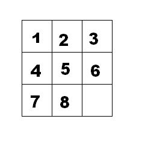

[TOC]

---

## 1、模板

```c++
queue <类型> Q;
Q.push(最初状态);
while(!Q.empty()){
	类型 u=Q.front(); Q.pop();
	for(枚举所有可扩展到的状态){
		if(满足入队条件){
			Q.push(状态); //维护某些必要信息 
		}
	} 
}
```

---

## 例题

### e.g.40 马的遍历

题目描述

有一个 $n \times m$ 的棋盘，在某个点 $(x, y)$ 上有一个马，要求你计算出马到达棋盘上任意一个点最少要走几步。

输入格式

输入只有一行四个整数，分别为 $n, m, x, y$。

输出格式

一个 $n \times m$ 的矩阵，代表马到达某个点最少要走几步（不能到达则输出 $-1$）。

样例 

样例输入 

```
3 3 1 1
```

样例输出 

```
0    3    2    
3    -1   1    
2    1    4
```

提示

数据规模与约定

对于全部的测试点，保证 $1 \leq x \leq n \leq 400$，$1 \leq y \leq m \leq 400$。

```c++
#include <bits/stdc++.h>
using namespace std;
const int N = 405;
struct node {
    int x, y;
    int s; // 走了多少步
};
int g[N][N];
int dir[8][2] = {{-1, -2},
                 {-2, -1},
                 {-2, 1},
                 {-1, 2},
                 {1, 2},
                 {2, 1},
                 {2, -1},
                 {1, -2}}; // 8个方向
int x, y, n, m;
queue<node> q;
int main() {
    cin >> n >> m >> x >> y;
    memset(g, -1, sizeof(g)); // 让数组都变成-1，也可以两层循环，但不能设成其他值（会出错）
    g[x][y] = 0;
    q.push({x, y, 0});
    while (!q.empty()) {
        node now = q.front();
        q.pop();
        int x = now.x, y = now.y, s = now.s; // 取出队头元素
        for (int i = 0; i <= 7; i++) {
            int nx = x + dir[i][0];
            int ny = y + dir[i][1];
            if (nx < 1 || nx > n || ny < 1 || ny > m || g[nx][ny] != -1)
                continue;            // 越界或者已经走过
            g[nx][ny] = s + 1;       // 记录步数
            q.push({nx, ny, s + 1}); // 入队
        }
    }
    for (int i = 1; i <= n; i++) {
        for (int j = 1; j <= m; j++) {
            cout << g[i][j] << " ";
        }
        cout << endl;
    }
}
```

---

### e.g.41 奇怪的电梯

题目描述

呵呵，有一天我做了一个梦，梦见了一种很奇怪的电梯。大楼的每一层楼都可以停电梯，而且第 $i$ 层楼（$1 \le i \le N$）上有一个数字 $K_i$（$0 \le K_i \le N$）。电梯只有四个按钮：开，关，上，下。上下的层数等于当前楼层上的那个数字。当然，如果不能满足要求，相应的按钮就会失灵。例如： $3, 3, 1, 2, 5$ 代表了 $K_i$（$K_1=3$，$K_2=3$，……），从 $1$ 楼开始。在 $1$ 楼，按“上”可以到 $4$ 楼，按“下”是不起作用的，因为没有 $-2$ 楼。那么，从 $A$ 楼到 $B$ 楼至少要按几次按钮呢？

输入格式

共二行。  

第一行为三个用空格隔开的正整数，表示 $N, A, B$（$1 \le N \le 200$，$1 \le A, B \le N$）。

第二行为 $N$ 个用空格隔开的非负整数，表示 $K_i$。

输出格式

一行，即最少按键次数，若无法到达，则输出 `-1`。

样例 

样例输入 

```
5 1 5
3 3 1 2 5
```

样例输出 

```
3
```

提示

对于 $100 \%$ 的数据，$1 \le N \le 200$，$1 \le A, B \le N$，$0 \le K_i \le N$。

本题共 $16$ 个测试点，前 $15$ 个每个测试点 $6$ 分，最后一个测试点 $10$ 分。

```c++
#include <bits/stdc++.h>
using namespace std;
int N, A, B, w[205];

struct node {  // 定义一个结构体，用于存储队列中的元素
    int floor; // 当前楼层
    int time;  // 到达当前楼层所需的时间
};

queue<node> q; // 定义一个队列，用于广度优先搜索
bool vis[205]; // 定义一个布尔数组，用于标记是否已经访问过某一层

int main() {
    cin >> N >> A >> B;
    for (int i = 1; i <= N; i++) {
        cin >> w[i];
    }

    q.push({A, 0}); // 将起始楼层加入队列，并初始化时间为0
    vis[A] = 1;     // 标记起始楼层为已访问

    while (!q.empty()) {      // 当队列不为空时，进行循环
        node now = q.front(); // 获取队列的第一个元素
        q.pop();              // 将该元素从队列中移除
        int f = now.floor;    
        int t = now.time;     

        if (f == B) {  // 如果当前楼层是目标楼层
            cout << t; // 输出到达目标楼层所需的时间
            return 0;  // 结束程序
        }
        // 尝试向上跳
        if (f + w[f] <= N && vis[f + w[f]] == 0) { // 如果可以向上跳，并且目标楼层未被访问
            vis[f + w[f]] = 1;                     // 标记为已访问
            q.push({f + w[f], t + 1});             // 将新楼层加入队列，并增加时间
        }
        // 尝试向下跳
        if (f - w[f] >= 1 && vis[f - w[f]] == 0) { // 如果可以向下跳，并且目标楼层未被访问
            vis[f - w[f]] = 1;                     // 标记为已访问
            q.push({f - w[f], t + 1});             // 将新楼层加入队列，并增加时间
        }
    }
    cout << -1 << endl; // 如果队列为空，说明无法到达目标楼层，输出-1
    return 0;
}
```

---

### e.g.42 [蓝桥杯 2018 省 AB] 全球变暖

题目描述

你有一张某海域 $N \times N$ 像素的照片，`.` 表示海洋、 `#` 表示陆地，如下所示：

```
.......
.##....
.##....
....##.
..####.
...###.
.......
```

其中 "上下左右" 四个方向上连在一起的一片陆地组成一座岛屿。例如上图就有 $2$ 座岛屿。

由于全球变暖导致了海面上升，科学家预测未来几十年，岛屿边缘一个像素的范围会被海水淹没。具体来说如果一块陆地像素与海洋相邻（上下左右四个相邻像素中有海洋），它就会被淹没。

例如上图中的海域未来会变成如下样子：

```
.......
.......
.......
.......
....#..
.......
.......
```

请你计算：依照科学家的预测，照片中有多少岛屿会被完全淹没。

输入格式

第一行包含一个整数 $N$。$(1 \le N \le 1000)$。

以下 $N$ 行 $N$ 列代表一张海域照片。

照片保证第 $1$ 行、第 $1$ 列、第 $N$ 行、第 $N$ 列的像素都是海洋。

输出格式

一个整数表示答案。

样例 

样例输入 

```
7 
.......
.##....
.##....
....##.
..####.
...###.
.......
```

样例输出 

```
1
```

提示

时限 1 秒, 256M

```c++
#include <bits/stdc++.h>
using namespace std;
const int N = 1e3 + 10;
struct node {
    int x, y;
};
int dir[4][2] = {{1, 0}, {0, 1}, {-1, 0}, {0, -1}};
char g[N][N];
bool vis[N][N];
int n, ans;
int bfs(int sx, int sy) {
    queue<node> q;
    q.push({sx, sy});
    vis[sx][sy] = 1;
    bool flag = 0;
    while (!q.empty()) {
        node now = q.front();
        q.pop();
        int x = now.x, y = now.y;
        if (g[x + 1][y] == '#' && g[x - 1][y] == '#' && g[x][y + 1] == '#' && g[x][y - 1] == '#')
            flag = 1;
        for (int i = 0; i <= 3; i++) {
            int nx = x + dir[i][0];
            int ny = y + dir[i][1];
            if (nx < 1 || nx > n || ny < 1 || ny > n || vis[nx][ny] || g[nx][ny] == '.')
                continue;
            vis[nx][ny] = 1;
            q.push({nx, ny});
        }
    }
    if (flag == 1)
        return false;
    else
        return true;
}
int main() {
    cin >> n;
    for (int i = 1; i <= n; i++)
        scanf("%s", g[i] + 1);
    for (int i = 1; i <= n; i++)
        for (int j = 1; j <= n; j++) {
            if (g[i][j] == '#' && vis[i][j] == 0) {
                if (bfs(i, j))
                    ans++;
            }
        }
    cout << ans << endl;
    return 0;
}
```

---

### e.g.43 九宫重排

题目描述

如下图的九宫格中，放着 1 ~ 8 的数字卡片，还有一个格子空着。与空格子相邻的格子中的卡片可以移动到空格中。 经过若干次移动，可以形成图 2 所示的局面。



我们把上图的局面记为：12345678.

把下图的局面记为：123.46758


显然是按从上到下，从左到右的顺序记录数字，空格记为句点。

题目的任务是已知九宫的初态和终态，求最少经过多少步的移动可以到达。如果无论多少步都无法到达，则输出 -1。

输入描述

输入第一行包含九宫的初态，第二行包含九宫的终态。

输出描述

输出最少的步数，如果不存在方案，则输出 -1。

输入输出样例

示例

输入

```txt
12345678.
123.46758
```

输出

```txt
3
```

!!! tip
	字符串→二维数组→字符串

```c++
#include <bits/stdc++.h>
using namespace std;
struct node {
    string s;
    int k;
};
int dir[4][2] = {{0, 1}, {1, 0}, {-1, 0}, {0, -1}};
string start, goal;
queue<node> q;
map<string, int> m;
int main() {
    cin >> start >> goal;
    q.push({start, 0});
    m[start] = 1;
    while (!q.empty()) {
        node now = q.front();
        q.pop();
        string s = now.s;
        int k = now.k;
        int p = 0, x, y;
        if (s == goal) {
            cout << k << endl;
            return 0;
        }
        for (int i = 0; i < s.size(); i++)
            if (s[i] == '.')
                p = i;
        x = p / 3 + 1, y = p % 3 + 1;
        for (int i = 0; i <= 3; i++) {
            int nx = x + dir[i][0];
            int ny = y + dir[i][1];
            if (nx < 1 || nx > 3 || ny < 1 || ny > 3)
                continue;
            int np = (nx - 1) * 3 + ny - 1;
            string ns = s;
            swap(ns[p], ns[np]);
            if (m[ns])
                continue;
            m[ns] = 1;
            q.push({ns, k + 1});
        }
    }
    cout << -1 << endl;
    return 0;
}
```

---

### e.g.44 质数拼图游戏

题目描述

拼图游戏由一个3×3的棋盘和数字1-9组成。目标是达到以下最终状态：
1 2 3
4 5 6
7 8 9
每次如果相邻两个数字之和为质数，则可以进行交换。
相邻：上下左右四联通
给定一个棋盘初始状态，求到达最终状态的最短步数。

输入格式

第一行为正整数T，表示存在T组测试数据，1≤T≤50。
对于每组测试数据，输入3行，每行3个数字表示棋盘。
输入保证合法，棋盘中的9个数字仅为1-9。

输出格式

对于每组测试数据输出一个整数表示答案。如果无法到达最终状态，输出-1。

输入样例 

```plain
2
7 3 2
4 1 5
6 8 9
9 8 5
2 4 1
3 7 6
```

输出样例 

```plain
6
-1
```

数据范围与提示

第一组测试数据的6步如下：
