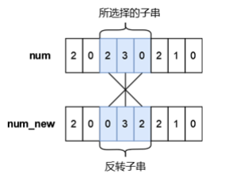

[TOC]

---

## 1、思想

!!! warning
	> **递推**状态方程表示

## 2、0/1背包问题

$n$个背包，每个价值$v_i$，每个体积$w_i$，求最大价值

`dp[i][j]`表示前$i$个物品，容量为$j$时的最大价值

①不拿 `dp[i][j] = dp[i-1][j]`

②拿    `dp[i][j] = dp[i-1][j-w[i]] + v[i]`

---

## 例题

### e.g.53 [USACO1.5] [IOI1994]数字三角形 Number Triangles

题目描述

观察下面的数字金字塔。


写一个程序来查找从最高点到底部任意处结束的路径，使路径经过数字的和最大。每一步可以走到左下方的点也可以到达右下方的点。


在上面的样例中，从 $7 \to 3 \to 8 \to 7 \to 5$ 的路径产生了最大权值。

输入格式

第一个行一个正整数 $r$ ,表示行的数目。

后面每行为这个数字金字塔特定行包含的整数。

输出格式

单独的一行,包含那个可能得到的最大的和。

样例 

样例输入 

```
5
7
3 8
8 1 0
2 7 4 4
4 5 2 6 5
```

样例输出 

```
30
```

提示

【数据范围】  
对于 $100\%$ 的数据，$1\le r \le 1000$，所有输入在 $[0,100]$ 范围内。

题目翻译来自NOCOW。

USACO Training Section 1.5

IOI1994 Day1T1


??? tip
	`dp[i][j]`表示现在在`i-1`层，`i`层在`j`点最大
	
	> 递推方程：$dp[i][j] = max(dp[i - 1][j], dp[i - 1][j - 1]) + a[i][j];$


```c++
#include <bits/stdc++.h>
using namespace std;
const int N = 1005;
int dp[N][N];
int main() {
    int r;
    cin >> r;
    int a[N][N];
    for (int i = 1; i <= r; i++) {
        for (int j = 1; j <= i; j++) {
            cin >> a[i][j];
        }
    }
    for (int i = 1; i <= r; i++) {
        for (int j = 1; j <= i; j++) {
            dp[i][j] = max(dp[i - 1][j], dp[i - 1][j - 1]) + a[i][j];
        }
    }
    cout << *max_element(dp[r] + 1, dp[r] + r + 1) << endl;
}
```

---

### e.g.54 最长上升子序列

题目描述

这是一个简单的动规板子题。

给出一个由 $n(n\le 5000)$ 个不超过 $10^6$ 的正整数组成的序列。请输出这个序列的**最长上升子序列**的长度。

最长上升子序列是指，从原序列中**按顺序**取出一些数字排在一起，这些数字是**逐渐增大**的。

输入格式

第一行，一个整数 $n$，表示序列长度。

第二行有 $n$ 个整数，表示这个序列。

输出格式

一个整数表示答案。

样例 

样例输入 

```
6
1 2 4 1 3 4
```

样例输出 

```
4
```

提示

分别取出 $1$、$2$、$3$、$4$ 即可。

??? tip
	`dp[i]` 表示以第`i`项结尾的，最长的子序列的**长度**
	
	> 递推方程：$dp[i] = max ( dp[i] , dp[j] + 1 ) ;$


```c++
#include <bits/stdc++.h>
using namespace std;
const int N = 1e5 + 10;
int n, a[N], dp[N];
int main() {
    cin >> n;
    for (int i = 1; i <= n; i++) {
        cin >> a[i];
        dp[i] = 1;
    }
    for (int i = 1; i <= n; i++) {
        for (int j = 1; j < i; j++) {
            if (a[i] > a[j]) {
                dp[i] = max(dp[i], dp[j] + 1);
            }
        }
    }
    cout << *max_element(dp + 1, dp + n + 1) << " ";
}
```

---

### e.g.55 [蓝桥杯 2023 省 A] 更小的数

题目描述



小蓝有一个长度均为 $n$ 且仅由数字字符 $0 \sim 9$ 组成的字符串，下标从 $0$ 到 $n-1$，你可以将其视作是一个具有 $n$ 位的十进制数字 $num$，小蓝可以从 $num$ 中选出一段连续的子串并将子串进行反转，最多反转一次。小蓝想要将选出的子串进行反转后再放入原位置处得到的新的数字 $num_{new}$ 满足条件 $num_{new}<num$，请你帮他计算下一共有多少种不同的子串选择方案，只要两个子串在 $num$ 中的位置不完全相同我们就视作是不同的方案。

注意，我们允许前导零的存在，即数字的最高位可以是 $0$，这是合法的。

输入格式

输入一行包含一个长度为 $n$ 的字符串表示 $num$（仅包含数字字符 $0 \sim 9$），从左至右下标依次为 $0 \sim n-1$。

输出格式

输出一行包含一个整数表示答案。

样例 

样例输入 

```
210102
```

样例输出 

```
8
```

提示

【样例说明】

一共有 $8$ 种不同的方案：

1. 所选择的子串下标为 $0\sim1$，反转后的 $num_{new} = 120102 < 210102$；
2. 所选择的子串下标为 $0\sim2$，反转后的 $num_{new} =  012102 < 210102$；
3. 所选择的子串下标为 $0\sim3$，反转后的 $num_{new} =  101202 < 210102$；
4. 所选择的子串下标为 $0\sim4$，反转后的 $num_{new} =  010122 < 210102$；
5. 所选择的子串下标为 $0\sim5$，反转后的 $num_{new} =  201012 < 210102$；
6. 所选择的子串下标为 $1\sim2$，反转后的 $num_{new} =  201102 < 210102$；
7. 所选择的子串下标为 $1\sim4$，反转后的 $num_{new} =  201012 < 210102$；
8. 所选择的子串下标为 $3\sim4$，反转后的 $num_{new} =  210012 < 210102$。

【评测用例规模与约定】

对于 $20\%$ 的评测用例，$1 \le n \le 100$；

对于 $40\%$ 的评测用例，$1 \le n \le 1000$；

对于所有评测用例，$1 \le n \le 5000$。

??? tip
	> 状态转移方程：
	$$
	s_i>s_j,dp_{i,j}=true\\
	$$
	$$
	s_i=s_j,dp_{i,j}=dp_{i+1,j-1}\\
	$$
	$$
	s_i<s_j,dp_{i,j}=false
	$$

```c++
#include <bits/stdc++.h>
using namespace std;
bool dp[5005][5005]; // 定义dp数组
int main() {
    int ans = 0; // 计数器
    string s;
    cin >> s;
    for (int i = s.size() - 1; i >= 0; i--) {
        for (int j = i; j < s.size(); j++) {
            // 状态转移方程
            if (s[i] > s[j])
                dp[i][j] = true; 
            else if (s[i] == s[j])
                dp[i][j] = dp[i + 1][j - 1]; 
            if (dp[i][j] == true)
                ans++; // 如果等于1方案数加1
        }
    }
    cout << ans;
    return 0;
}
```

---

### e.g.56 [NOIP2005 普及组] 采药

题目描述

辰辰是个天资聪颖的孩子，他的梦想是成为世界上最伟大的医师。为此，他想拜附近最有威望的医师为师。医师为了判断他的资质，给他出了一个难题。医师把他带到一个到处都是草药的山洞里对他说：“孩子，这个山洞里有一些不同的草药，采每一株都需要一些时间，每一株也有它自身的价值。我会给你一段时间，在这段时间里，你可以采到一些草药。如果你是一个聪明的孩子，你应该可以让采到的草药的总价值最大。”


如果你是辰辰，你能完成这个任务吗？

输入格式

第一行有 $2$ 个整数 $T$（$1 \le T \le 1000$）和 $M$（$1 \le  M \le 100$），用一个空格隔开，$T$ 代表总共能够用来采药的时间，$M$ 代表山洞里的草药的数目。

接下来的 $M$ 行每行包括两个在 $1$ 到 $100$ 之间（包括 $1$ 和 $100$）的整数，分别表示采摘某株草药的时间和这株草药的价值。

输出格式

输出在规定的时间内可以采到的草药的最大总价值。

样例 

样例输入 

```
70 3
71 100
69 1
1 2
```

样例输出 

```
3
```

提示

**【数据范围】**

- 对于 $30\%$ 的数据，$M \le 10$；
- 对于全部的数据，$M \le 100$。

**【题目来源】**

NOIP 2005 普及组第三题

```c++
#include <bits/stdc++.h>
using namespace std;
const int N = 1005;
struct node {
    int t, v;
} e[N]; // t: time, v: value
int T, M, dp[N][N];
int main() {
    cin >> T >> M;
    for (int i = 1; i <= M; i++) {
        cin >> e[i].t >> e[i].v;
    }
    for (int i = 1; i <= M; i++) {
        for (int j = 1; j <= T; j++) {
            dp[i][j] = dp[i - 1][j];
            if (j >= e[i].t) {
                dp[i][j] = max(dp[i][j], dp[i - 1][j - e[i].t] + e[i].v);
            }
        }
    }
    cout << dp[M][T] << endl;
}
```

---

### e.g.57 2022

问题描述

将 2022 拆分成 10 个互不相同的正整数之和, 总共有多少种拆分方法?

注意交换顺序视为同一种方法, 例如 $2022=1000+1022$ 和 $2022= 1022+1000$就视为同一种方法。

???tip 
    `dp[i][j][k]` 表示 `i` 个数，选了 `j` 个，和为 `k`
    
    ①不选 `dp[i][j][k] = dp[i - 1][j][k]`
    
    ②选   `dp[i][j][k] = dp[i - 1][j - 1][k - a[i]]`

=== "3-D"

	```c++
	#include <bits/stdc++.h>
	using namespace std;
	typedef long long ll;
	int n = 2022, m = 2022, k = 10;
	ll dp[2050][11][2050];
	
	int main() {
		for (int i = 0; i <= n; i++)
			dp[i][0][0] = 1;
		for (int i = 1; i <= n; i++) {
			for (int j = 1; j <= k; j++) {
				for (int l = 1; l <= m; l++) {
					dp[i][j][l] = dp[i - 1][j][l];
					if (l >= i)
						dp[i][j][l] += dp[i - 1][j - 1][l - i];
				}
			}
		}
		cout << dp[n][k][m] << endl;
	}
	```
=== "2-D"

	```c++
	#include <bits/stdc++.h>
	using namespace std;
	typedef long long ll;
	ll dp[11][2023];
	int main() {
		dp[0][0] = 1;
		for (int i = 1; i <= 2022; i++) {
			for (int j = 10; j >= 1; j--) {
				for (int k = 2022; k >= i; k--) {
					dp[j][k] += dp[j - 1][k - i];
				}
			}
		}
		cout << dp[10][2022] << endl;
		return 0;
	}
	```

---

### e.g.58 小A点菜

题目背景

uim 神犇拿到了 uoi 的 ra（镭牌）后，立刻拉着基友小 A 到了一家……餐馆，很低端的那种。

uim 指着墙上的价目表（太低级了没有菜单），说：“随便点”。

题目描述

不过 uim 由于买了一些书，口袋里只剩 $M$ 元 $(M \le 10000)$。

餐馆虽低端，但是菜品种类不少，有 $N$ 种 $(N \le 100)$，第 $i$ 种卖 $a_i$ 元 $(a_i \le 1000)$。由于是很低端的餐馆，所以每种菜只有一份。

小 A 奉行“不把钱吃光不罢休”的原则，所以他点单一定刚好把 uim 身上所有钱花完。他想知道有多少种点菜方法。

由于小 A 肚子太饿，所以最多只能等待 $1$ 秒。

输入格式

第一行是两个数字，表示 $N$ 和 $M$。

第二行起 $N$ 个正数 $a_i$（可以有相同的数字，每个数字均在 $1000$ 以内）。

输出格式

一个正整数，表示点菜方案数，保证答案的范围在 int 之内。

样例 

样例输入 

```
4 4
1 1 2 2
```

样例输出 

```
3
```

```c++
#include <bits/stdc++.h>
using namespace std;
const int N = 1005;
int n, m, a[N], dp[N][N];
int main() {
    cin >> n >> m;
    for (int i = 1; i <= n; i++)
        cin >> a[i];
    /*
    dp[i][j]表示前i道菜，花j元的方法数
    ①不点 第i道菜 dp[i][j] = dp[i-1][j]
    ②点第i道菜 dp[i][j] += dp[i-1][j-a[i]]
    */
    for (int i = 0; i <= n; i++)
        dp[i][0] = 1; // 初始化,前n道菜，花0元的方法数为1
    for (int i = 1; i <= n; i++) {
        for (int j = 1; j <= m; j++) {
            dp[i][j] = dp[i - 1][j];
            if (j >= a[i])
                dp[i][j] += dp[i - 1][j - a[i]];
        }
    }
    cout << dp[n][m] << endl;
}
```

---

### e.g.58 [蓝桥杯 2017 省 AB] 包子凑数

题目描述

小明几乎每天早晨都会在一家包子铺吃早餐。他发现这家包子铺有 $N$ 种蒸笼，其中第 $i$ 种蒸笼恰好能放 $A_i$ 个包子。每种蒸笼都有非常多笼，可以认为是无限笼。

每当有顾客想买 $X$ 个包子，卖包子的大叔就会迅速选出若干笼包子来，使得这若干笼中恰好一共有 $X$ 个包子。比如一共有 $3$ 种蒸笼，分别能放 $3$ 、 $4$ 和 $5$ 个包子。当顾客想买 $11$ 个包子时，大叔就会选 $2$ 笼 $3$ 个的再加 $1$ 笼 $5$ 个的（也可能选出 $1$ 笼 $3$ 个的再加 $2$ 笼 $4$ 个的）。

当然有时包子大叔无论如何也凑不出顾客想买的数量。比如一共有 $3$ 种蒸笼，分别能放 $4$ 、 $5$ 和 $6$ 个包子。而顾客想买 $7$ 个包子时，大叔就凑不出来了。

小明想知道一共有多少种数目是包子大叔凑不出来的。

输入格式

第一行包含一个整数 $N$。$(1 \le N \le 100)$。

以下 $N$ 行每行包含一个整数 $A_i$。$(1 \le A_i \le 100)$。

输出格式

一个整数代表答案。如果凑不出的数目有无限多个，输出 `INF`。

样例 

样例输入 

```
2  
4  
5
```

样例输出 

```
6
```

样例 

样例输入 

```
2  
4  
6
```

样例输出 

```
INF
```

提示

对于样例 $1$，凑不出的数目包括：$1,2,3,6,7,11$。

对于样例 $2$，所有奇数都凑不出来，所以有无限多个。

蓝桥杯 2017 省赛 A 组 H 题。

??? tip
	`dp[i]`表示`i`个能否凑出来
	

	`dp[i]=1`,`dp[i+w]=1`

```c++
#include <bits/stdc++.h>
using namespace std;
typedef long long ll;
const int N = 1e5 + 10;
int n, a[105], dp[N];
int main() {
    cin >> n;
    for (int i = 1; i <= n; i++)
        cin >> a[i];
    int d = 0;
    for (int i = 1; i <= n; i++)
        d = __gcd(d, a[i]);
    if (d != 1)
        cout << "INF" << endl;
    else {
        for (int i = 1; i <= n; i++) {
            dp[a[i]] = 1;
            for (int j = a[i]; j < N; j++)
                if (dp[j - a[i]] == 1)
                    dp[j] = 1;
        }
        int ans = 0;
        for (int i = 1; i < N; i++)
            if (dp[i] == 0)
                ans++;
        cout << ans << endl;
    }
    return 0;
}
```

---

### e.g.59 疯狂的采药（完全背包问题）

题目背景

此题为纪念 LiYuxiang 而生。

题目描述

LiYuxiang 是个天资聪颖的孩子，他的梦想是成为世界上最伟大的医师。为此，他想拜附近最有威望的医师为师。医师为了判断他的资质，给他出了一个难题。医师把他带到一个到处都是草药的山洞里对他说：“孩子，这个山洞里有一些不同种类的草药，采每一种都需要一些时间，每一种也有它自身的价值。我会给你一段时间，在这段时间里，你可以采到一些草药。如果你是一个聪明的孩子，你应该可以让采到的草药的总价值最大。”

如果你是 LiYuxiang，你能完成这个任务吗？

此题和原题的不同点：

$1$. 每种草药可以无限制地疯狂采摘。

$2$. 药的种类眼花缭乱，采药时间好长好长啊！师傅等得菊花都谢了！

输入格式

输入第一行有两个整数，分别代表总共能够用来采药的时间 $t$ 和代表山洞里的草药的数目 $m$。

第 $2$ 到第 $(m + 1)$ 行，每行两个整数，第 $(i + 1)$ 行的整数 $a_i, b_i$ 分别表示采摘第 $i$ 种草药的时间和该草药的价值。

输出格式

输出一行，这一行只包含一个整数，表示在规定的时间内，可以采到的草药的最大总价值。

样例 

样例输入 

```
70 3
71 100
69 1
1 2
```

样例输出 

```
140
```

提示

数据规模与约定

- 对于 $30\%$ 的数据，保证 $m \le 10^3$ 。
- 对于 $100\%$ 的数据，保证 $1 \leq m \le 10^4$，$1 \leq t \leq 10^7$，且 $1 \leq m \times t \leq 10^7$，$1 \leq a_i, b_i \leq 10^4$。

```c++
#include <bits/stdc++.h>
using namespace std;
typedef long long ll;
const int N = 1e4 + 10, M = 1e7 + 10;
struct node {
    ll t, v;
} e[N];
ll n, t, dp[2][M];
int main() {
    cin >> t >> n;
    for (int i = 1; i <= n; i++)
        cin >> e[i].t >> e[i].v;
    int now = 1, old = 0;
    for (int i = 1; i <= n; i++) {
        swap(old, now);
        for (int j = 0; j <= t; j++) {
            dp[now][j] = dp[old][j];
            if (j >= e[i].t)
                dp[now][j] = max(dp[now][j], dp[now][j - e[i].t] + e[i].v);
        }
    }
    cout << dp[now][t] << endl;
    return 0;
}
```

---

### ⭐e.g.60 通天之分组背包（分组背包问题）

题目背景

直达通天路·小 A 历险记第二篇

题目描述

自 $01$ 背包问世之后，小 A 对此深感兴趣。一天，小 A 去远游，却发现他的背包不同于 $01$ 背包，他的物品大致可分为 $k$ 组，每组中的物品相互冲突，现在，他想知道最大的利用价值是多少。

输入格式

两个数 $m,n$，表示一共有 $n$ 件物品，总重量为 $m$。

接下来 $n$ 行，每行 $3$ 个数 $a_i,b_i,c_i$，表示物品的重量，利用价值，所属组数。

输出格式

一个数，最大的利用价值。

样例 

样例输入 

```
45 3
10 10 1
10 5 1
50 400 2
```

样例输出 

```
10
```

提示

$0 \leq m \leq 1000$，$1 \leq n \leq 1000$，$1\leq k\leq 100$，$a_i, b_i, c_i$ 在 `int` 范围内。
