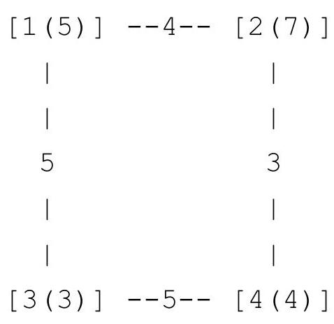

[TOC]

---

## 1、基本概念

由点（node，vertex）和连接点的边（edge）组成

图是点和边构成的网

## 2、邻接矩阵

二维数组：`graph[NUM][NUM]`

无向图：`graph[i][j]=graph[j][i]`

有向图：`graph[i][j]!=graph[j][i]`

权值：`graph[i][j]`存结点`i`到`j`的边的权值。

例：`graph[i][j]=INF`表示`i`,`j`无边。

```c++
#include <bits/stdc++.h>
using namespace std;
int main() {
    int g[10][10] = {0};
    g[1][3] = 1, g[2][5] = 6;
    g[4][2] = 8, g[2][1] = 2;
    g[3][1] = 2;
    for (int i = 1; i <= 5; i++) {
        for (int j = 1; j <= 5; j++) {
            cout << g[i][j] << " ";
        }
        cout << endl;
    }
}
/*
0 0 1 0 0
2 0 0 0 6
2 0 0 0 0
0 8 0 0 0
0 0 0 0 0
*/
```

!!! bug
    储存效率低下，只适用于**稠密图**

---

## 3、邻接表

```c++
#include <bits/stdc++.h>
using namespace std;
vector<int> v[100]; // 邻接表
int main() {
    v[0].push_back(3);
    v[1].push_back(0);
    v[1].push_back(2);
    v[2].push_back(0);
    v[2].push_back(1);
    for (int i = 0; i <= 3; i++) {
        cout << i << ":";
        for (int j = 0; j < v[i].size(); j++) {
            cout << v[i][j] << " ";
        }
        cout << endl;
    }
}
/*
0:3
1:0 2
2:0 1
3:
*/
```

---

## 4、最短路问题

### （1）$Floyd$算法

```c++
// 对于每个中间节点 k，尝试通过 k 来更新从节点 x 到节点 y 的最短路径
for (k = 1; k <= n; k++) {
    // 遍历所有起点 x
    for (x = 1; x <= n; x++) {
        // 遍历所有终点 y
        for (y = 1; y <= n; y++) {
            // 尝试通过中间节点 k 来更新最短路径
            // f[x][y] 是从 x 到 y 的当前最短路径
            // f[x][k] 是从 x 到 k 的最短路径
            // f[k][y] 是从 k 到 y 的最短路径
            // 如果通过 k 的路径更短，则更新 f[x][y]
            f[x][y] = min(f[x][y], f[x][k] + f[k][y]);
        }
    }
}

```

每次检查 `dist[i][k] + dist[k][j]` 是否小于 `dist[i][j]`，如果是，则更新最短路径。

算法的时间复杂度是 $O(n^3)$，适用于节点数不太多的情况。

!!! tip
    优点：可以知道**任意**两个点的最短路

### （2）$Dijkstra$算法

解决**单源最短路**径问题

- 优先队列

    每次往B中放新数据时，按照从小到大顺序（二分）

!!! bug
    边权不能为负

### （3）$Bellman-ford$算法

队列优化：SPFA,即 Shortest Path Faster Algorithm。

!!! bug
	边权为负时，复杂度不稳定

```c++
struct edge {
    int v, w;
};

vector<edge> e[MAXN];
int dis[MAXN], cnt[MAXN], vis[MAXN];
queue<int> q;

bool spfa(int n, int s) {
    memset(dis, 0x3f, (n + 1) * sizeof(int));
    dis[s] = 0, vis[s] = 1;
    q.push(s);
    while (!q.empty()) {
        int u = q.front();
        q.pop(), vis[u] = 0;
        for (auto ed : e[u]) {
            int v = ed.v, w = ed.w;
            if (dis[v] > dis[u] + w) {
                dis[v] = dis[u] + w;
                cnt[v] = cnt[u] + 1;  // 记录最短路经过的边数
                if (cnt[v] >= n) return false;
                // 在不经过负环的情况下，最短路至多经过 n - 1 条边
                // 因此如果经过了多于 n 条边，一定说明经过了负环
                if (!vis[v]) q.push(v), vis[v] = 1;
            }
        }
    }
    return true;
}
```

---

## 例题

### e.g.61 【模板】Floyd

题目描述

给出一张由 $n$ 个点 $m$ 条边组成的无向图。

求出所有点对 $(i,j)$ 之间的最短路径。

输入格式

第一行为两个整数 $n,m$，分别代表点的个数和边的条数。

接下来 $m$ 行，每行三个整数 $u,v,w$，代表 $u,v$ 之间存在一条边权为 $w$ 的边。

输出格式

输出 $n$ 行每行 $n$ 个整数。

第 $i$ 行的第 $j$ 个整数代表从 $i$ 到 $j$ 的最短路径。

样例 

样例输入 

```
4 4
1 2 1
2 3 1
3 4 1
4 1 1
```

样例输出 

```
0 1 2 1
1 0 1 2
2 1 0 1
1 2 1 0
```

提示

对于 $100\%$ 的数据，$n \le 100$，$m \le 4500$，任意一条边的权值 $w$ 是正整数且 $1 \leqslant w \leqslant 1000$。

**数据中可能存在重边。**

```c++
#include <bits/stdc++.h>
using namespace std;
const int N = 105;
int n, m, g[N][N];
int main() {
    memset(g, 0x3f, sizeof(g)); // 初始化为无穷大
    cin >> n >> m;
    for (int i = 1; i <= m; i++) {
        int x, y, z;
        cin >> x >> y >> z;
        g[x][y] = min(g[x][y], z);
        g[y][x] = min(g[y][x], z);
    }
    // Floyd-Warshall算法
    for (int k = 1; k <= n; k++) {
        for (int i = 1; i <= n; i++) {
            for (int j = 1; j <= n; j++) {
                if (i == j)
                    g[i][j] = 0;
                else
                    g[i][j] = min(g[i][j], g[i][k] + g[k][j]);
            }
        }
    }
    for (int i = 1; i <= n; i++) {
        for (int j = 1; j <= n; j++) {
            cout << g[i][j] << " ";
        }
        cout << endl;
    }
    return 0;
}
```

---

### e.g.62 医院设置

题目描述

设有一棵二叉树，如图：


其中，圈中的数字表示结点中居民的人口。圈边上数字表示结点编号，现在要求在某个结点上建立一个医院，使所有居民所走的路程之和为最小，同时约定，相邻接点之间的距离为 $1$。如上图中，若医院建在 $1$ 处，则距离和 $=4+12+2\times20+2\times40=136$；若医院建在 $3$ 处，则距离和 $=4\times2+13+20+40=81$。

输入格式

第一行一个整数 $n$，表示树的结点数。

接下来的 $n$ 行每行描述了一个结点的状况，包含三个整数 $w, u, v$，其中 $w$ 为居民人口数，$u$ 为左链接（为 $0$ 表示无链接），$v$ 为右链接（为 $0$ 表示无链接）。

输出格式

一个整数，表示最小距离和。

样例

样例输入

```
5						
13 2 3
4 0 0
12 4 5
20 0 0
40 0 0
```

样例输出

```
81
```

提示

数据规模与约定

对于 $100\%$ 的数据，保证 $1 \leq n \leq 100$，$0 \leq u, v \leq n$，$1 \leq w \leq 10^5$。

```c++
#include <bits/stdc++.h>
using namespace std;
const int N = 105;
struct node {
    int w, l, r;
} e[N];
int n, g[N][N];
int main() {
    memset(g, 0x3f, sizeof(g));
    cin >> n;
    for (int i = 1; i <= n; i++)
        cin >> e[i].w >> e[i].l >> e[i].r;
    for (int i = 1; i <= n; i++) {
        int l = e[i].l, r = e[i].r;
        if (l != 0) {
            g[i][l] = 1;
            g[l][i] = 1;
        }
        if (r != 0) {
            g[i][r] = 1;
            g[r][i] = 1;
        }
    }
    // Floyd
    for (int k = 1; k <= n; k++)
        for (int i = 1; i <= n; i++)
            for (int j = 1; j <= n; j++) {
                if (i == j)
                    g[i][j] = 0;
                else
                    g[i][j] = min(g[i][j], g[i][k] + g[k][j]);
            }
    int ans = 1e9;
    for (int i = 1; i <= n; i++) {
        int t = 0;
        for (int j = 1; j <= n; j++)
            t += g[j][i] * e[j].w;
        ans = min(ans, t);
    }
    cout << ans << endl;
    return 0;
}
```

---

### e.g.63【模板】单源最短路径（标准版）

题目背景

2018 年 7 月 19 日，某位同学在 [NOI Day 1 T1 归程] 一题里非常熟练地使用了一个广为人知的算法求最短路。

然后呢？

$100 \rightarrow 60$；

$\text{Ag} \rightarrow \text{Cu}$；

最终，他因此没能与理想的大学达成契约。

小 F 衷心祝愿大家不再重蹈覆辙。

题目描述

给定一个 $n$ 个点，$m$ 条有向边的带非负权图，请你计算从 $s$ 出发，到每个点的距离。

数据保证你能从 $s$ 出发到任意点。

输入格式

第一行为三个正整数 $n, m, s$。
第二行起 $m$ 行，每行三个非负整数 $u_i, v_i, w_i$，表示从 $u_i$ 到 $v_i$ 有一条权值为 $w_i$ 的有向边。

输出格式

输出一行 $n$ 个空格分隔的非负整数，表示 $s$ 到每个点的距离。

样例

样例输入

```
4 6 1
1 2 2
2 3 2
2 4 1
1 3 5
3 4 3
1 4 4
```

样例输出

```
0 2 4 3
```

提示

$1 \leq n \leq 10^5$；

$1 \leq m \leq 2\times 10^5$；

$s = 1$；

$1 \leq u_i, v_i\leq n$；

$0 \leq w_i \leq 10 ^ 9$,

$0 \leq \sum w_i \leq 10 ^ 9$。

```c++
#include <bits/stdc++.h>
using namespace std;

// 定义一个 pair<int, int> 类型，表示一个边的权重和目标节点
typedef pair<int, int> pii;

// 常量 N 为图的最大节点数（最大支持 100000 个节点）
const int N = 1e5 + 10;

// n 是节点数，m 是边数，s 是起始节点，dis 数组存储从起始节点到每个节点的最短距离
int n, m, s, dis[N];

// vis 数组用来标记每个节点是否已被访问过，避免重复处理
bool vis[N];

// v 数组是邻接表，用来存储图的边，v[x] 存储所有与节点 x 相邻的节点及其边的权重
vector<pii> v[N];

// 定义一个优先队列 q，用来实现最小堆，存储当前处理的节点和到该节点的距离
priority_queue<pii, vector<pii>, greater<pii>> q;

int main() {
    // 输入节点数、边数和起始节点
    cin >> n >> m >> s;

    // 输入边的信息，更新邻接表
    for (int i = 1; i <= m; i++) {
        int x, y, w;
        cin >> x >> y >> w;
        v[x].push_back({w, y}); // 将边 (x, y) 和权重 w 加入到邻接表中
    }

    // 初始化 dis 数组，所有节点的初始距离设为无穷大（0x3f3f3f3f）
    memset(dis, 0x3f, sizeof(dis));

    // 起始节点 s 的最短距离为 0
    dis[s] = 0;

    // 将起始节点 s 和其距离 0 入队
    q.push({0, s});

    // Dijkstra 算法主体，处理每个节点
    while (!q.empty()) {
        // 从优先队列中取出当前最小距离的节点
        pii now = q.top();
        q.pop();

        int x = now.second; // 当前节点

        // 如果当前节点已被访问过，跳过
        if (vis[x])
            continue;

        // 标记当前节点已访问
        vis[x] = 1;

        // 遍历所有与当前节点 x 相邻的节点
        for (int i = 0; i < v[x].size(); i++) {
            int nx = v[x][i].second; // 邻接节点
            int w = v[x][i].first;   // 边的权重

            // 如果通过当前节点 x 到达 nx 的距离更小，则更新
            if (dis[nx] > dis[x] + w) {
                dis[nx] = dis[x] + w;
                // 更新距离后，将新的 (距离, 节点) 入队
                q.push({dis[nx], nx});
            }
        }
    }

    // 输出每个节点从起始节点 s 的最短距离
    for (int i = 1; i <= n; i++) {
        // 如果某个节点的距离仍为无穷大，说明无法到达该节点，输出无穷大（这里输出 dis[i]）
        cout << dis[i] << " ";
    }

    return 0;
}

```

---

### e.g.64 邮递员送信

题目描述

有一个邮递员要送东西，邮局在节点 $1$。他总共要送 $n-1$ 样东西，其目的地分别是节点 $2$ 到节点 $n$。由于这个城市的交通比较繁忙，因此所有的道路都是单行的，共有 $m$ 条道路。这个邮递员每次只能带一样东西，并且**运送每件物品过后必须返回邮局**。求送完这 $n-1$ 样东西并且**最终回到邮局**最少需要的时间。

输入格式

第一行包括两个整数，$n$ 和 $m$，表示城市的节点数量和道路数量。

第二行到第 $(m+1)$ 行，每行三个整数，$u,v,w$，表示从 $u$ 到 $v$ 有一条通过时间为 $w$ 的道路。

输出格式

输出仅一行，包含一个整数，为最少需要的时间。

样例

样例输入

```
5 10
2 3 5
1 5 5
3 5 6
1 2 8
1 3 8
5 3 4
4 1 8
4 5 3
3 5 6
5 4 2
```

样例输出

```
83
```

提示

对于 $30\%$ 的数据，$1 \leq n \leq 200$。

对于 $100\%$ 的数据，$1 \leq n \leq 10^3$，$1 \leq m \leq 10^5$，$1\leq u,v \leq n$，$1 \leq w \leq 10^4$，输入保证任意两点都能互相到达。

```c++
#include <bits/stdc++.h>
using namespace std;
typedef pair<int, int> pii;
const int N = 1e3 + 10;
int n, m, disa[N], disb[N];
bool vis[N];
vector<pii> va[N], vb[N];
void dijkstra(vector<pii> v[N], int dis[]) {
    memset(vis, 0, sizeof(vis));
    dis[1] = 0;
    priority_queue<pii, vector<pii>, greater<pii>> q;
    q.push({0, 1});
    while (!q.empty()) {
        pii now = q.top();
        q.pop();
        int x = now.second;
        if (vis[x])
            continue;
        vis[x] = 1;
        for (int i = 0; i < v[x].size(); i++) {
            int nx = v[x][i].second;
            int w = v[x][i].first;
            if (dis[nx] > dis[x] + w) {
                dis[nx] = dis[x] + w;
                q.push({dis[nx], nx});
            }
        }
    }
}
int main() {
    cin >> n >> m;
    for (int i = 1; i <= m; i++) {
        int x, y, z;
        cin >> x >> y >> z;
        va[x].push_back({z, y});
        vb[y].push_back({z, x});
    }
    memset(disa, 0x3f, sizeof(disa));
    memset(disb, 0x3f, sizeof(disb));
    dijkstra(va, disa);
    dijkstra(vb, disb);
    int ans = 0;
    for (int i = 1; i <= n; i++)
        ans += disa[i] + disb[i];
    cout << ans << endl;
    return 0;
}
```

---

### e.g.65 最短路计数

题目描述

给出一个 $N$ 个顶点 $M$ 条边的无向无权图，顶点编号为 $1\sim N$。问从顶点 $1$ 开始，到其他每个点的最短路有几条。

输入格式

第一行包含 $2$ 个正整数 $N,M$，为图的顶点数与边数。

接下来 $M$ 行，每行 $2$ 个正整数 $x,y$，表示有一条连接顶点 $x$ 和顶点 $y$ 的边，请注意可能有自环与重边。

输出格式

共 $N$ 行，每行一个非负整数，第 $i$ 行输出从顶点 $1$ 到顶点 $i$ 有多少条不同的最短路，由于答案有可能会很大，你只需要输出 $ ans \bmod 100003$ 后的结果即可。如果无法到达顶点 $i$ 则输出 $0$。

样例 

样例输入 

```
5 7
1 2
1 3
2 4
3 4
2 3
4 5
4 5
```

样例输出 

```
1
1
1
2
4
```

提示

$1$ 到 $5$ 的最短路有 $4$ 条，分别为 $2$ 条 $1\to 2\to 4\to 5$ 和 $2$ 条 $1\to 3\to 4\to 5$（由于 $4\to 5$ 的边有 $2$ 条）。

对于 $20\%$ 的数据，$1\le N \le 100$；  
对于 $60\%$ 的数据，$1\le N \le 10^3$；  
对于 $100\%$ 的数据，$1\le N\le10^6$，$1\le M\le 2\times 10^6$。

```c++
#include <bits/stdc++.h>
using namespace std;
typedef pair<int, int> pii;
const int N = 1e6 + 10, mod = 100003;
int n, m, dis[N], cnt[N];
bool vis[N];
vector<int> v[N];
priority_queue<pii, vector<pii>, greater<pii>> q;
int main() {
    ios::sync_with_stdio(false);
    cin.tie(0);
    cout.tie(0);
    cin >> n >> m;
    for (int i = 1; i <= m; i++) {
        int x, y;
        cin >> x >> y;
        v[x].push_back(y);
        v[y].push_back(x);
    }
    memset(dis, 0x3f, sizeof(dis));
    dis[1] = 0, cnt[1] = 1;
    q.push({0, 1});
    while (!q.empty()) {
        pii now = q.top();
        q.pop();
        int x = now.second;
        if (vis[x])
            continue;
        vis[x] = 1;
        for (int i = 0; i < v[x].size(); i++) {
            int nx = v[x][i];
            if (dis[nx] > dis[x] + 1) {
                dis[nx] = dis[x] + 1;
                cnt[nx] = cnt[x];
                q.push({dis[nx], nx});
            } else if (dis[nx] == dis[x] + 1)
                cnt[nx] = (cnt[nx] + cnt[x]) % mod;
        }
    }
    for (int i = 1; i <= n; i++)
        cout << cnt[i] << endl;
    return 0;
}
```

---

### e.g.66 [蓝桥杯 2022 国 B] 出差

题目描述

$\mathrm{A}$ 国有 $N$ 个城市，编号为 $1 \ldots N$ 小明是编号为 $1$ 的城市中一家公司的员工，今天突然接到了上级通知需要去编号为 $N$ 的城市出差。

由于疫情原因，很多直达的交通方式暂时关闭，小明无法乘坐飞机直接从城市 $1$ 到达城市 $N$，需要通过其他城市进行陆路交通中转。小明通过交通信息网，查询到了 $M$ 条城市之间仍然还开通的路线信息以及每一条路线需要花费的时间。

同样由于疫情原因，小明到达一个城市后需要隔离观察一段时间才能离开该城市前往其他城市。通过网络，小明也查询到了各个城市的隔离信息。（由于小明之前在城市 $1$，因此可以直接离开城市 $1$，不需要隔离）

由于上级要求，小明希望能够尽快赶到城市 $\mathrm{N}$, 因此他求助于你，希望你能帮他规划一条路线，能够在最短时间内到达城市 $N$ 。

输入格式

第 $1$ 行：两个正整数 $N, M$ 表示 A 国的城市数量, $M$ 表示末关闭的路线数量。

第 $2$ 行: $N$ 个正整数，第 $i$ 个整数 $C_{i}$ 表示到达编号为 $\mathrm{i}$ 的城市后需要隔离的时间。

第 $3 \ldots M+2$ 行: 每行 $3$ 个正整数, $u, v, c$, 表示有一条城市 $u$ 到城市 $v$ 的双向路线仍然开通着，通过该路线的时间为 $c$。

输出格式

第 $1$ 行：$1$ 个正整数，表示小明从城市 $1$ 出发到达城市 $N$ 的最短时间。（到达城市 $N$，不需要计算城市 $N$ 的隔离时间）

样例 

样例输入 

```
4 4
5 7 3 4
1 2 4
1 3 5
2 4 3
3 4 5
```

样例输出 

```
13
```

提示

**【样例说明】**



**【评测用例规模与约定】**

对于 $100 \%$ 的数据, $1 \leq N \leq 1000,1 \leq M \leq 10000,1 \leq C_{i} \leq 200,1 \leq u, v \leq$ $N, 1 \leq c \leq 1000$ 


蓝桥杯 2022 国赛 B 组 E 题。

```c++
#include <bits/stdc++.h>
using namespace std;
typedef pair<int, int> pii;
const int N = 1e3 + 10;
int n, m, dis[N], a[N];
bool vis[N];
vector<pii> v[N];
queue<int> q;
int main() {
    cin >> n >> m;
    for (int i = 1; i <= n; i++)
        cin >> a[i];
    for (int i = 1; i <= m; i++) {
        int x, y, z;
        cin >> x >> y >> z;
        v[x].push_back({z, y});
        v[y].push_back({z, x});
    }
    memset(dis, 0x3f, sizeof(dis));
    dis[1] = 0;
    q.push(1);
    while (!q.empty()) {
        int x = q.front();
        q.pop();
        vis[x] = 0;
        for (int i = 0; i < v[x].size(); i++) {
            int nx = v[x][i].second;
            int w = v[x][i].first;
            if (dis[nx] > dis[x] + w + a[nx]) {
                dis[nx] = dis[x] + w + a[nx];
                if (!vis[nx]) {
                    vis[nx] = 1;
                    q.push(nx);
                }
            }
        }
    }
    cout << dis[n] - a[n] << endl;
    return 0;
}
```

---


### e.g.67 【模板】负环

题目描述

给定一个 $n$ 个点的有向图，请求出图中是否存在**从顶点 $1$ 出发能到达**的负环。

负环的定义是：一条边权之和为负数的回路。

输入格式

**本题单测试点有多组测试数据**。

输入的第一行是一个整数 $T$，表示测试数据的组数。对于每组数据的格式如下：

第一行有两个整数，分别表示图的点数 $n$ 和接下来给出边信息的条数 $m$。

接下来 $m$ 行，每行三个整数 $u, v, w$。

- 若 $w \geq 0$，则表示存在一条从 $u$ 至 $v$ 边权为 $w$ 的边，还存在一条从 $v$ 至 $u$ 边权为 $w$ 的边。
- 若 $w < 0$，则只表示存在一条从 $u$ 至 $v$ 边权为 $w$ 的边。

输出格式

对于每组数据，输出一行一个字符串，若所求负环存在，则输出 `YES`，否则输出 `NO`。

样例 

样例输入 

```
2
3 4
1 2 2
1 3 4
2 3 1
3 1 -3
3 3
1 2 3
2 3 4
3 1 -8
```

样例输出 

```
NO
YES
```

提示

数据规模与约定

对于全部的测试点，保证：

- $1 \leq n \leq 2 \times 10^3$，$1 \leq m \leq 3 \times 10^3$。
- $1 \leq u, v \leq n$，$-10^4 \leq w \leq 10^4$。
- $1 \leq T \leq 10$。

提示

请注意，$m$ **不是**图的边数。

```c++
#include <bits/stdc++.h>
using namespace std;
typedef pair<int, int> pii;
const int N = 2e3 + 10;
int t, n, m, dis[N], cnt[N];
bool vis[N];
int solve() {
    vector<pii> v[N];
    queue<int> q;
    cin >> n >> m;
    for (int i = 1; i <= m; i++) {
        int x, y, w;
        cin >> x >> y >> w;
        if (w >= 0) {
            v[x].push_back({w, y});
            v[y].push_back({w, x});
        } else
            v[x].push_back({w, y});
    }
    memset(dis, 0x3f, sizeof(dis));
    memset(cnt, 0, sizeof(cnt));
    memset(vis, 0, sizeof(vis));
    dis[1] = 0;
    q.push(1);
    while (!q.empty()) {
        int x = q.front();
        q.pop();
        vis[x] = 0;
        for (int i = 0; i < v[x].size(); i++) {
            int nx = v[x][i].second;
            int w = v[x][i].first;
            if (dis[nx] > dis[x] + w) {
                dis[nx] = dis[x] + w;
                if (!vis[nx]) {
                    vis[nx] = 1;
                    q.push(nx);
                    cnt[nx] = cnt[x] + 1;
                    if (cnt[nx] >= n)
                        return 1;
                }
            }
        }
    }
    return 0;
}
int main() {
    cin >> t;
    while (t--) {
        int ret = solve();
        if (ret)
            cout << "YES" << endl;
        else
            cout << "NO" << endl;
    }
    return 0;
}
```

---
