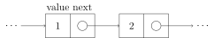
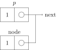
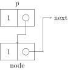

[TOC]

---

## 1、定义



```c++
struct Node{
    int data;	//4 bytes
    Node *next;	//4 bytes
}
```

有头结点的地址就能访问整个链表

- 与数组对比


- |          | 数组                 | 链表                 |
  | -------- | -------------------- | -------------------- |
  | 访问     | $O(1)$               | $O(n)$               |
  | 内存     | 固定                 | 无多余               |
  |          | 需要足够大的数组长度 | 多余内存用于储存指针 |
  | 插入删除 | a) 头插-$O(n)$       | a)-$O(1)$            |
  |          | b)尾插 -$O(1)$       | b)-$O(n)$            |
  | 便捷     | ✔️                    | ❌                    |
  

---

## 2、基本操作（单向链表）
```c++
Node *A;
A = NULL;
Node *temp = new Node();

(*temp).data = 2;
(*temp).link = NULL;

A = temp;
```

### ※ 遍历

```c++
while (temp1->link != NULL) {
    temp1 = temp1->link;
}
```

---

### （1）头插

```c++
struct Node {
    int data;
    Node *next;
};

struct Node *head; 

void Insert(int x) {
    Node *temp = new Node(); 

    temp->data = x;
    temp->next = head;
    head = temp;
}
void Print() {
    struct Node *temp = head;
    printf("List is:");
    while (temp != NULL) {
        printf("%d ", temp->data);
        temp = temp->next;
    }
    printf("\n");
}

int main() {
    head = NULL; // empty list
    printf("How many numbers?");
    int n, i, x;
    scanf("%d", &n);
    for (i = 0; i < n; i++) {
        printf("Enter number:");
        scanf("%d", &x);
        Insert(x);
        Print();
    }
}
```

---

### （2）中间插入






```c++
struct Node {
    int data;
    Node *next;
};

struct Node *head; 

void Insert(int data, int n);
void Print();

int main() {
    head = NULL;  // empty list
    Insert(2, 1); // List:2
    Insert(3, 2); // List:2,3
    Insert(4, 1); // list:4,2,3
    Insert(5, 2); // List:4,5,2,3
    Print();
}


void Insert(int data, int n) {
    Node *temp1 = new Node();
    temp1->data = data;
    temp1->next = NULL;
    if (n == 1) { // in case to insert in the beginning
        temp1->next = head;
        head = temp1;
        return;
    }
    Node *temp2 = head; // temp2 is an aid for finding the position
    for (int i = 0; i < n - 2; i++) {
        temp2 = temp2->next;
    } // go to the n-1 node
    temp1->next = temp2->next;
    temp2->next = temp1;
}


void Print() {
    Node *temp = head;
    while (temp != NULL) {
        printf("%d ", temp->data);
        temp = temp->next;
    }
    printf("\n");
}
```

---

### （3）删除

- **修复指针链接（fix the links）**
   在删除某个节点 `node` 时，需要修改前驱节点的 `next` 指针（对于单链表）或同时修改前驱和后继指针（对于双向链表），使其绕过该节点，保持链表结构完整。
- **释放内存空间（free the space from memory）**
   删除节点后，需要调用 `delete`（C++）或 `free`（C）释放该节点占用的内存，防止内存泄漏。

```c++
struct Node {
    int data;
    Node *next;
};
struct Node *head; // global

void Insert(int data); // insert at the end of the list
void Print();          // print all the elements in the list
void Delete(int n);    // delete node at position n

int main() {
    head = NULL;
    Insert(2);
    Insert(4);
    Insert(6);
    Insert(5); // List:5,6,4,2
    int n;
    printf("Enter a position:\n");
    scanf("%d", &n);
    Delete(n);
    Print();
}


void Delete(int n) {
    Node *temp1 = head;
    int i;
    if (n == 1) {
        head = temp1->next;
        free(temp1);
        return;
    }

    for (i = 0; i < n - 2; i++) {
        temp1 = temp1->next;
    } // temp1 points to the (n-1)th node
    struct Node *temp2 = temp1->next;
    temp1->next = temp2->next;
    free(temp2); // delete temp2
}

void Insert(int x) {
    struct Node *temp = new Node();
    temp->data = x;
    temp->next = head;
    head = temp;
}
void Print() {
    Node *temp = head;
    while (temp != NULL) {
        printf("%d ", temp->data);
        temp = temp->next;
    }
    printf("\n");
}
```

---

## 3、反转

### （1）迭代

```c++
void Reverse() {
    Node *next, *prev, *current;
    current = head;  // 当前遍历到的节点
    prev = NULL;     // 前一个节点，初始为 NULL（新的尾节点）

    while (current != NULL) {
        next = current->next;      // 保存下一个节点
        current->next = prev;      // 反转指针方向
        prev = current;            // prev 前移
        current = next;            // current 前移
    }

    head = prev;  // 最终 prev 会指向新头节点
}
```

??? example

    ```c++
    struct Node {
        int data;
        Node* next;
    };
    
    struct Node* head;
    
    struct Node* Insert(Node* head, int data);
    void Print(Node* head);
    struct Node* Reverse(Node* head);
    
    int main() {
        head = NULL;
        head = Insert(head, 2);
        head = Insert(head, 4);
        head = Insert(head, 6);
        head = Insert(head, 8);
        head = Reverse(head);
        Print(head);
    }
    
    struct Node* Insert(Node* head, int data) {
        Node* temp = new Node();
        temp->data = data;
        temp->next = NULL;
    
        if (head == NULL) {
            head = temp;
        } else {
            Node* current = head;
            while (current->next != NULL) {
                current = current->next;
            }
            current->next = temp;
        }
        return head;
    }
    
    void Print(Node* head) {
        while (head != NULL) {
            cout << head->data << " ";
            head = head->next;
        }
        std::cout << std::endl;
    }
    
    struct Node* Reverse(Node* head) {
        Node* next = NULL;
        Node* prev = NULL;
        Node* current = head;
    
        while (current != NULL) {
            next = current->next;
            current->next = prev;
            prev = current;
            current = next;
        }
        head = prev;
        return head;
    }
    ```

---

### （2）递归打印

!!! tip
      递归就是自我调用

```c++
/* 正常打印 */
void Print(struct Node* p) {
    if(p == NULL) return;            // 递归终止条件
    printf("%d ", p->data);          // 先打印当前节点的值
    Print(p->next);                  // 再打印下一个节点（递归）
}
```

```c++
/* 递归反转打印 */
void ReversePrint(struct Node* q) {
    if (q == NULL) return;             // 递归终止条件
    ReversePrint(q->next);             // 先递归到底
    printf("%d ", q->data);            // 再逐层“回溯”打印
}
```

??? example

    ```c++
    struct Node {
        int data;
        Node *next;
    };
    
    struct Node *Insert(Node *head, int data) {
        Node *temp = new Node;
        temp->data = data;
        temp->next = NULL;
        if (head == NULL) {
            head = temp;
        } else {
            Node *current = head;
            while (current->next != NULL) {
                current = current->next;
            }
            current->next = temp;
        }
        return head;
    }
    
    void Print(struct Node *p) {
        // recursion
        // 2 6 5 4
        if (p == NULL)
            return;             // Exit Recursion
        printf("%d ", p->data); // First print the value int the node
        Print(p->next);         // Recursive call
    }
    
    void ReversePrint(struct Node *q) {
        // recursion
        // 4 5 6 2
        if (q == NULL)
            return;             // Exit Recursion
        ReversePrint(q->next);  // First do a Recursive call
        printf("%d ", q->data); // print the value int the node
    }
    
    int main() {
        struct Node *head = NULL; // local variable,empty list
        head = Insert(head, 2);
        head = Insert(head, 4);
        head = Insert(head, 6);
        head = Insert(head, 5);
        Print(head);
        printf("\n");
        ReversePrint(head);
    }
    ```


---

### （3）递归反转

```c++
struct Node* head; // 全局链表头指针

void Reverse(struct Node* p) {
    if (p->next == NULL) { // 递归到底（最后一个节点）
        head = p;          // 最后一个节点变成新的头节点
        return;
    }

    Reverse(p->next);       // 递归处理子链表

    Node* q = p->next;      // 反转当前两个节点之间的链接
    q->next = p;
    p->next = NULL;         // 当前节点设为尾节点
}
```


!!! tip

    === "C++"
    
        ``` c++
        Node *q=p->next;
        q->next=p;
        // 也可以写作
        p->next->next=p
        ```

---

## 4、双向链表

```c++
struct Node {
    int data;
    Node* next;
    Node* prev;

    // 构造函数：方便直接初始化
    Node(int val) : data(val), next(nullptr), prev(nullptr) {}
};
```


!!! info
    | **优点**                          | **缺点**                                         |
    | --------------------------------- | ------------------------------------------------ |
    | 允许反向遍历（`Reverse look-up`） | 每个节点需要额外的指针（`prev`）来指向前一个节点 |

---

### （1）创建

```c++
struct Node *GetNewNode(int x) {
    Node *newNode = new Node;
    newNode->data = x;
    newNode->prev = NULL;
    newNode->next = head;
    return newNode;
}
```

### （2）头插

```c++
void InsertAhead(int x) {
    struct Node *newNode = GetNewNode(x);   // 通过 GetNewNode(x) 创建一个新节点，newNode 是局部变量，函数内独立存在
    if (head == NULL) {  // 如果链表为空
        head = newNode;  // 将新节点作为头节点
        return;  // 结束函数
    }
    head->prev = newNode;  // 让原链表的头节点的 prev 指针指向新节点
    newNode->next = head;  // 新节点的 next 指针指向原头节点
    head = newNode;  // 更新头节点为新节点
}

```

### （3）打印&反转

```c++
void Print() {
    Node* temp = head;
    printf("Forward:");
    while (temp != NULL) {
        printf("%d ", temp->data);
        temp = temp->next;
    }
    printf("\n");
}


void ReversePrint() {
    Node* temp = head;
    if (temp == NULL) return; // 如果链表为空，直接返回
    // 走到最后一个节点
    while (temp->next != NULL) {
        temp = temp->next;
    }
    // 使用 prev 指针从尾往前打印
    printf("Reverse :");
    while (temp != NULL) {
        printf("%d ", temp->data);
        temp = temp->prev;
    }
    printf("\n");
}

```

---

