[TOC]

---

## 1、定义



!!! tip
      LIFO（Last In First Out）：**“只能访问最上面那一个**

| 操作 | $O(1)$                                   |
| ------------ | ---------------------------------------- |
| (1)`Push`    | 入栈                    |
| (2)`Pop`     |出栈|
| (3)`Top`     |返回栈顶值|
| (4)`IsEmpty` | 返回True/False                     |

??? info 
    - 递归调用函数
    - 编辑器撤销
    - 括号匹配
    - 中缀表达式转换

---

## 2、实现

### （1）顺序栈

```
int A[10];
top ← -1;       // 栈为空时 top 初始为 -1,表示空栈

Push(x) {
    top ← top + 1;
    A[top] ← x;
}

Pop() {
    top ← top - 1;
}

Top() {
	return A[top];
}

IsEmpty() {
	if (top == -1) return true;
	else return false;
}
```

!!! warning
	- 不能出现溢出的情况

    - | 操作           | 时间复杂度     |
      | -------------- | -------------- |
      | Push           | $O(1)$ - Best  |
      |                | $O(n)$ - Worst |
      |                | $O(1)$ - Avg   |
      | n 次 Push 操作 | $O(n)$         |

```c++
#define MAX_SIZE 101
int A[MAX_SIZE];
int top = -1;
void Push(int x) {
    if (top == MAX_SIZE - 1) {
        printf("Stack Overflow\n");
    }
    A[++top] = x;
}
void Pop() {
    if (top == -1) {
        printf("Stack Underflow\n");
    }
    top--;
}
int Top() {
    return A[top];
}

void Print() {
    int i;
    printf("Stack:\n");
    for (i = top; i >= 0; i--) {
        printf("%d\n", A[i]);
    }
    printf("\n");
}

int main() {
    Push(2);
    Print();
    Push(5);
    Print();
    Push(10);
    Print();
    Pop();
    Print();
    Push(12);
    Print();
}
```

---

### （2）链栈

- 插入/删除
      - 尾插– $O(n)$
      - 头插– $O(1)$

```c++
struct Node {
    int data;
    Node *link;
};

struct Node *top = NULL; 

void Push(int x) {
    Node *temp = new Node;
    temp->data = x;
    temp->link = top;
    top = temp;
}

void Pop() {
    Node *temp;
    if (top == NULL) {
        printf("Stack is empty\n");
        return;
    }
    temp = top;
    top = top->link; 
    delete temp;    
}

void Top() {
    if (top == NULL) {
        printf("Stack is empty\n");
        return;
    }
    printf("%d\n", top->data);
}

void IsEmpty() {
    if (top == NULL) {
        printf("Stack is empty\n");
        return;
    } else {
        printf("Stack is not empty\n");
    }
}

void Print() {
    Node *temp = top;
    printf("Stack is : ");
    while (temp != NULL) { 
        printf("%d ", temp->data);
        temp = temp->link;
    }
    printf("\n");
}

int main() {
    Push(5);Print();IsEmpty();
    Pop();Print();IsEmpty();
    Push(6);Print();IsEmpty();
    Push(7);Print();IsEmpty();
    Push(8);Print();IsEmpty();
    return 0;
}
```

!!! note
	不用担心栈溢出；内存只在需要时使用

---

### （3）💖库函数`stack`

```c++
int main() {
    stack<int> s;  // 定义一个整数栈

    // 入栈
    s.push(10);
    s.push(20);
    s.push(30);

    // 查看栈顶元素
    cout << "Top element: " << s.top() << endl;  // 输出 30

    // 出栈
    s.pop();  // 移除 30

    cout << "New top element: " << s.top() << endl;  // 输出 20

    // 判断栈是否为空
    if (s.empty()) {
        cout << "Stack is empty" << endl;
    } else {
        cout << "Stack size: " << s.size() << endl;
    }

    return 0;
}
```

| 函数        | 作用                     |
| ----------- | ------------------------ |
| `s.push(x)` | 将 `x` 压入栈顶          |
| `s.pop()`   | 弹出栈顶元素（无返回值） |
| `s.top()`   | 返回栈顶元素             |
| `s.empty()` | 判断栈是否为空           |
| `s.size()`  | 返回栈中元素个数         |

---

## 3、反转

### （1）反转字符串

```C++
#include<bits/stdc++.h>
using namespace std;

void Reverse(char C[],int n) {
    stack<char> S;  // 创建一个栈（后进先出）

    // 将字符串中的字符依次压栈
    for(int i=0;i<n;i++) {
        S.push(C[i]);
    }

    // 再把字符依次从栈中弹出，覆盖原字符串中的字符
    for(int i=0;i<n;i++) {
        C[i]=S.top();  // 拿到栈顶元素
        S.pop();       // 弹出栈顶
    }
}


int main() {
    char C[51];
    cout << "Enter a string: ";
    cin.getline(C, 51);  // 安全读入（最多50个字符）
    
    Reverse(C, strlen(C));
    
    cout << "Output is: " << C << endl;
    return 0;
}
```

!!! note
	时间/空间复杂度都是：$O(n)$

---

### （2）反转链表

|            | 显式栈（迭代） | 隐式栈（迭代） |
| ---------- | -------------- | -------------- |
| 时间复杂度 | $O(n)$         | $O(n)$         |
| 空间复杂度 | $O(1)$         | $O(n)$         |

```c++
void Reverse() {
    if (head == NULL) return;  // 如果链表为空，直接返回

    stack<Node*> S;            // 创建一个栈，用于暂存节点地址
    Node* temp = head;         // 从头节点开始遍历

    // Step 1: 遍历链表，将所有节点指针压入栈中
    while (temp != NULL) {
        S.push(temp);          // 把当前节点地址压入栈
        temp = temp->next;     // 移动到下一个节点
    }

    // Step 2: 将栈顶元素（原链表的最后一个节点）设为新的头节点
    Node* temp2 = S.top();     // 获取栈顶（最后一个节点）
    head = temp2;              // 更新 head 指针
    S.pop();                   // 弹出这个节点，因为它已经设置为新头节点

    // Step 3: 依次弹出剩余节点，重新连接 next 指针
    while (!S.empty()) {
        temp2->next = S.top(); // 把当前节点的 next 指向下一个出栈的节点
        S.pop();               // 弹出该节点
        temp2 = temp2->next;   // 移动到刚设置的 next 节点上，准备继续连接
    }

    // Step 4: 最后一个节点的 next 应该是 NULL（否则会形成环）
    temp2->next = NULL;
}
```

---

## 4、应用

### （1）括号匹配

- 从左到右扫描字符串
- 遇到开括号`(`, `[`, `{`就压入栈
- 遇到闭括号`)`, `]`, `}`就从栈中弹出一个开括号，检查是否匹配
- 最终栈应为空（即所有括号都正确匹配）

```c++
Function CheckBalancedParentheses(exp):
    n ← length(exp)
    Create an empty stack S

    for i from 0 to n-1:
        if exp[i] is '(' or '[' or '{':
            S.Push(exp[i])  // 将开括号入栈

        else if exp[i] is ')' or ']' or '}':
            if S is empty:
                return false  // 没有对应的开括号，错误

            top ← S.Top()     // 查看栈顶元素
            if exp[i] and top 不匹配:
                return false  // 括号不成对，错误

            S.Pop()           // 匹配成功，弹出栈顶开括号

    // 所有字符处理完成后，栈应为空
    if S is empty:
        return true
    else:
        return false
```

```C++
bool CheckforParentheses(char* expression) {
    int n = strlen(expression);
    char S[100];       // 栈数组，最多存 100 个括号
    int top = -1;      // 栈顶指针，初始为 -1 表示空栈

    for (int i = 0; i < n; i++) {
        // 如果是开括号，压入栈中
        if (expression[i] == '(' || expression[i] == '[' || expression[i] == '{') {
            S[++top] = expression[i];
        } 
        // 如果是闭括号
        else if (expression[i] == ')' || expression[i] == ']' || expression[i] == '}') {
            if (top == -1) {
                return false;  // 栈空，说明没有匹配的开括号
            }
            // 判断是否与栈顶开括号匹配
            if ((expression[i] == ')' && S[top] == '(') ||
                (expression[i] == ']' && S[top] == '[') ||
                (expression[i] == '}' && S[top] == '{')) {
                top--; // 匹配成功，弹出栈顶
            } else {
                return false;  // 匹配失败
            }
        }
        // 非括号字符可忽略或按需处理
    }
    return top == -1; // 栈空说明全部匹配成功
}


int main() {
    char expression[100];
    printf("Enter an expression: ");
    fgets(expression, sizeof(expression), stdin); // 从输入读取字符串
    expression[strcspn(expression, "\n")] = '\0'; // 删除末尾的换行符

    // 调用检查函数并输出结果
    if (CheckforParentheses(expression)) {
        printf("The expression is valid\n");
    } else {
        printf("The expression is invalid\n");
    }
    return 0;
}
```

---

### （2）中缀转后缀

| 表达式类型          | 格式                             | 示例    | 特点与说明                                                   |
| ------------------- | -------------------------------- | ------- | ------------------------------------------------------------ |
| **Infix（中缀）**   | `<operand> <operator> <operand>` | `A + B` | 最常见的书写方式；需要括号或操作符优先级规则来解析运算顺序   |
| **Postfix（后缀）** | `<operand> <operand> <operator>` | `A B +` | 又称逆波兰表达法；不需要括号；从左到右，遇到运算符立即处理前两个操作数 |
| **Prefix（前缀）**  | `<operator> <operand> <operand>` | `+ A B` | 又称波兰表达法；也不需要括号；递归或从右到左处理；适合用栈或递归实现 |

!!! success
    📌Postfix 表达式处理规则：

    - **识别模式**：从左到右扫描，寻找 `<num><num><operator>` 的结构
    
      - **操作步骤**：
    
        1. 遇到数字（操作数）就 **压入栈中**
    
        2. 遇到操作符（如 `+`, `-`, `*`, `/`）时，从栈中 **弹出两个数**
    
           - 注意顺序：先弹出的是第二个操作数，后弹出的是第一个操作数
    
        3. 计算结果后，将结果 **压回栈中**
    
      - **最终结果**：扫描完毕后，栈中剩下的最后一个元素即为最终结果

```c++
// 计算postfix表达式
EvaluatePostfix(exp) {
    create a stack S;

    for i from 0 to length(exp) - 1 {
        if (exp[i] is an operand) {
            Push(exp[i])  // 操作数压栈
        }
        else if (exp[i] is an operator) {
            op2 = Pop();  // 注意：先弹出的是右操作数
            op1 = Pop();  // 然后是左操作数
            result = Perform(exp[i], op1, op2); // 执行 op1 exp[i] op2
            Push(result); // 结果压栈
        }
    }

    return Top of stack; // 栈顶即为表达式最终值
}

```

```c++
// 中缀转后缀
InfixToPostfix(exp) {
    create a stack S;           // 存储操作符
    result ← empty string;      // 存储输出的后缀表达式

    for i from 0 to length(exp) - 1 {
        if exp[i] is operand {
            result ← result + exp[i];  // 直接添加到结果
        }
        else if exp[i] is operator {
            while (!S.empty() && HasHigherPrec(S.top(), exp[i])) {
                result ← result + S.top();
                S.pop();
            }
            S.push(exp[i]);  // 当前运算符入栈
        }
    }

    // 处理剩余栈中的运算符
    while (!S.empty()) {
        result ← result + S.top();
        S.pop();
    }

    return result;
}

```

---

## 例题
### e.g.4 括号序列

题目描述

定义如下规则：

1. 空串是「平衡括号序列」
2. 若字符串 $S$ 是「平衡括号序列」，那么 $\texttt{[}S\texttt]$ 和 $\texttt{(}S\texttt)$ 也都是「平衡括号序列」
3. 若字符串 $A$ 和 $B$ 都是「平衡括号序列」，那么 $AB$（两字符串拼接起来）也是「平衡括号序列」。


例如，下面的字符串都是平衡括号序列：


- `()`，`[]`，`(())`，`([])`，`()[]`，`()[()]`


而以下几个则不是：


- `(`，`[`，`]`，`)(`，`())`，`([()`


现在，给定一个仅由 `(`，`)`，`[`，`]`构成的字符串 $s$，请你按照如下的方式给字符串中每个字符配对：
1. 从左到右扫描整个字符串。
2. 对于当前的字符，如果它是一个右括号，考察它与它左侧离它**最近**的**未匹配**的的左括号。如果该括号与之对应（即小括号匹配小括号，中括号匹配中括号），则将二者配对。如果左侧未匹配的左括号不存在或与之不对应，则其配对失败。

配对结束后，对于 $s$ 中全部未配对的括号，请你在其旁边添加一个字符，使得该括号和新加的括号匹配。

输入格式

输入只有一行一个字符串，表示 $s$。

输出格式

输出一行一个字符串表示你的答案。

样例 

样例输入 

```
([()
```

样例输出 

```
()[]()
```

样例 #2

样例输入 #2

```
([)
```

样例输出 #2

```
()[]()
```

提示

数据规模与约定

对于全部的测试点，保证 $s$ 的长度不超过 $100$，且只含  `(`，`)`，`[`，`]` 四种字符。

```c++
#include <bits/stdc++.h>
using namespace std;

int main() {
    string input;
    stack<int> st;  // Stack will store indices instead of characters
    vector<bool> matched;  // Track which positions are properly matched
    string answer;
    
    cin >> input;
    
    // Initialize matched vector with same size as input
    matched.resize(input.length(), false);
    
    // First pass: Find all matching pairs
    for (int i = 0; i < input.length(); ++i) {
        if (input[i] == '(' || input[i] == '[') {
            st.push(i);  // Push index onto stack
        } 
        else if (input[i] == ')' || input[i] == ']') {
            if (!st.empty()) {
                char opening = input[st.top()];
                // Check if brackets match
                if ((input[i] == ')' && opening == '(') ||
                    (input[i] == ']' && opening == '[')) {
                    // Mark both positions as matched
                    matched[i] = true;
                    matched[st.top()] = true;
                    st.pop();
                }
            }
        }
    }
    
    // Second pass: Build answer string
    for (int i = 0; i < input.length(); ++i) {
        if (!matched[i]) {
            // Replace unmatched brackets with their complete pairs
            if (input[i] == '(' || input[i] == ')') {
                answer += "()";
            } else {
                answer += "[]";
            }
        } else {
            // Keep matched brackets as they are
            answer += input[i];
        }
    }
    
    cout << answer << endl;
    return 0;
}
```

---

### e.g. 【模板】栈

题目描述

请你实现一个栈（stack），支持如下操作：
- `push(x)`：向栈中加入一个数 $x$。
- `pop()`：将栈顶弹出。如果此时栈为空则不进行弹出操作，输出 `Empty`。
- `query()`：输出栈顶元素，如果此时栈为空则输出 `Anguei!`。
- `size()`：输出此时栈内元素个数。

输入格式

**本题单测试点内有多组数据**。  
输入第一行是一个整数 $T$，表示数据组数。对于每组数据，格式如下：  
每组数据第一行是一个整数，表示操作的次数 $n$。  
接下来 $n$ 行，每行首先由一个字符串，为 `push`，`pop`，`query` 和 `size` 之一。若为 `push`，则其后有一个整数 $x$，表示要被加入的数，$x$ 和字符串之间用空格隔开；若不是 `push`，则本行没有其它内容。

输出格式

对于每组数据，按照「题目描述」中的要求依次输出。每次输出占一行。

输入输出样例 

输入 

```
2
5
push 2
query
size
pop
query
3
pop
query
size
```

输出 

```
2
1
Anguei!
Empty
Anguei!
0
```

说明/提示

样例 1 解释

对于第二组数据，始终为空，所以 `pop` 和 `query` 均需要输出对应字符串。栈的 size 为 0。

数据规模与约定

对于全部的测试点，保证 $1 \leq T, n\leq 10^6$，且单个测试点内的 $n$ 之和不超过 $10^6$，即 $\sum n \leq 10^6$。保证 $0 \leq x \lt 2^{64}$。

提示

- 请注意大量数据读入对程序效率造成的影响。
- 因为一开始数据造错了，请注意输出的 `Empty` 不含叹号，`Anguei!` 含有叹号。

```c++
#include <bits/stdc++.h>
using namespace std;

#define int unsigned long long
int32_t main() {
    int n;
    cin >> n;
    for (int i = 1; i <= n; i++) {

        int operateNum;
        cin >> operateNum;
        stack<int> s;
        for (int j = 0; j < operateNum; j++) {
            string op;
            cin >> op;
            if (op == "push") {
                int num;
                cin >> num;
                s.push(num);
            } else if (op == "pop") {
                if (!s.empty()) {
                    s.pop();
                } else {
                    cout << "Empty" << endl;
                }
            } else if (op == "query") {
                if (!s.empty()) {
                    cout << s.top() << endl;
                } else {
                    cout << "Anguei!" << endl;
                }
            } else if (op == "size") {
                cout << s.size() << endl;
            }
        }
    }
}
```

---

### e.g. 【模板】单调栈

题目背景

模板题，无背景。  

2019.12.12 更新数据，放宽时限，现在不再卡常了。

题目描述

给出项数为 $n$ 的整数数列 $a_{1 \dots n}$。

定义函数 $f(i)$ 代表数列中第 $i$ 个元素之后第一个大于 $a_i$ 的元素的**下标**，即 $f(i)=\min_{i<j\leq n, a_j > a_i} \{j\}$。若不存在，则 $f(i)=0$。

试求出 $f(1\dots n)$。

输入格式

第一行一个正整数 $n$。

第二行 $n$ 个正整数 $a_{1\dots n}$。

输出格式

一行 $n$ 个整数表示 $f(1), f(2), \dots, f(n)$ 的值。

输入输出样例 

输入 

```
5
1 4 2 3 5
```

输出 

```
2 5 4 5 0
```

说明/提示

【数据规模与约定】

对于 $30\%$ 的数据，$n\leq 100$；

对于 $60\%$ 的数据，$n\leq 5 \times 10^3$ ；

对于 $100\%$ 的数据，$1 \le n\leq 3\times 10^6$，$1\leq a_i\leq 10^9$。

!!! tip
    - 从后往前扫
    - 对于每个点：
        - 弹出栈顶比她小的元素
        - 此时栈顶就是答案
        - 加入这个元素

```c++
#include <bits/stdc++.h>
using namespace std;
int n, a[3000005], ans[3000005]; // a是需要判断的数组（即输入的数组），ans是存储答案的数组
stack<int> s;                    // 模拟用的栈
int main() {
    scanf("%d", &n);
    for (int i = 1; i <= n; i++)
        scanf("%d", &a[i]);
    for (int i = n; i >= 1; i--) {
        while (!s.empty() && a[s.top()] <= a[i])
            s.pop();                      // 弹出栈顶比当前数小的
        ans[i] = s.empty() ? 0 : s.top(); // 存储答案
        s.push(i);                        // 压入当前元素
    }
    for (int i = 1; i <= n; i++)
        printf("%d ", ans[i]); // 输出
    return 0;
}
```

---

### e.g. 后缀表达式

题目描述

所谓后缀表达式是指这样的一个表达式：式中不再引用括号，运算符号放在两个运算对象之后，所有计算按运算符号出现的顺序，严格地由左而右新进行（不用考虑运算符的优先级）。

本题中运算符仅包含 $\texttt{+-*/}$。保证对于 $\texttt{/}$ 运算除数不为 0。特别地，其中 $\texttt{/}$ 运算的结果需要**向 0 取整**（即与 C++ `/` 运算的规则一致）。

如：$\texttt{3*(5-2)+7}$ 对应的后缀表达式为：$\texttt{3.5.2.-*7.+@}$。在该式中，`@` 为表达式的结束符号。`.` 为操作数的结束符号。

输入格式

输入一行一个字符串 $s$，表示后缀表达式。

输出格式

输出一个整数，表示表达式的值。

输入输出样例 

输入 

```
3.5.2.-*7.+@
```

输出 

```
16
```

输入输出样例 

输入 

```
10.28.30./*7.-@
```

输出 

```
-7
```

说明/提示

数据保证，$1 \leq |s| \leq 50$，答案和计算过程中的每一个值的绝对值不超过 $10^9$。

```c++
#include <bits/stdc++.h>
using namespace std;
int k;
char ch;
int a, b;
int main() {
    stack<int> s;

    while (ch != '@') {
        ch = getchar();
        if (ch == '+') {
            a = s.top();
            s.pop();
            b = s.top();
            s.pop();
            s.push(a + b);

        } else if (ch == '-') {

            a = s.top();
            s.pop();
            b = s.top();
            s.pop();
            s.push(b - a);

        } else if (ch == '*') {

            a = s.top();
            s.pop();
            b = s.top();
            s.pop();
            s.push(a * b);

        } else if (ch == '/') {

            a = s.top();
            s.pop();
            b = s.top();
            s.pop();
            s.push(b / a);
        } else if (ch == '.') {
            // 遇到点号，表示前面数字结束，将构造好的整数 k 压入栈
            s.push(k);
            k = 0; // 清零 k，为下一个数字做准备

        } else if (isdigit(ch)) {
            // 如果当前字符是数字，则构造整数
            // 例如输入 '1' '2' 会变成 12
            k = k * 10 + (ch - '0');
        }
    }
    cout << s.top() << endl;
}
```

---

