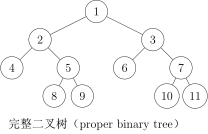
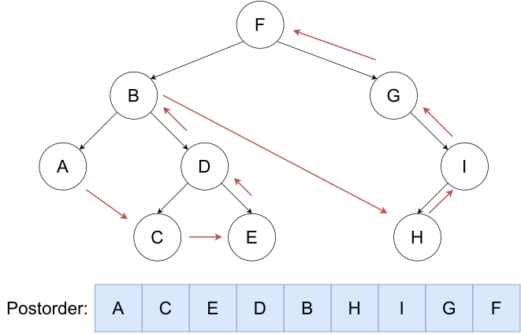

[TOC]


## 1、分类


### （1）满二叉树


每一层节点都是满的


### （2）完全二叉树



最后一层有缺失


### （3）退化二叉树

每一个节点**只有一个**子节点

### （4）完美二叉树

所有叶结点的深度均相同，且所有非叶节点的子节点数量均为 2 的二叉树称为完美二叉树。


---

## 2、静态写法

!!! tip
    === "C++"
        ```c++
        struct tree {
            int v;
            int l, r;
        } tree[N];
        ```

---

## 3、三种遍历方式

- 先（根）序遍历
  - **先根节点**，再左子树，再右子树
  - 
- 中（根）序遍历
  - 先左子树，**再根节点**，再右子树
  - 
- 后（根）序遍历
  - 先左子树，再右子树，**再根节点**
  - 

---

## 例题

### e.g.6二叉树的遍历

题目描述

有一个 $n(n \le 10^6)$ 个结点的二叉树。给出每个结点的两个子结点编号（均不超过 $n$），建立一棵二叉树（根节点的编号为 $1$），如果是叶子结点，则输入 `0 0`。

建好树这棵二叉树之后，依次求出它的前序、中序、后序列遍历。

输入格式

第一行一个整数 $n$，表示结点数。

<u>之后 $n$ 行，第 $i$ 行两个整数 $l$、$r$，分别表示结点 $i$ 的左右子结点编号。若 $l=0$ 则表示无左子结点，$r=0$ 同理。</u>

输出格式

输出三行，每行 $n$ 个数字，用空格隔开。

第一行是这个二叉树的前序遍历。

第二行是这个二叉树的中序遍历。

第三行是这个二叉树的后序遍历。

样例 

样例输入 

```
7
2 7
4 0
0 0
0 3
0 0
0 5
6 0
```

样例输出 

```
1 2 4 3 7 6 5
4 3 2 1 6 5 7
3 4 2 5 6 7 1
```

```c++
#include <bits/stdc++.h>
using namespace std;

const int N = 1e5 + 10;

struct tree {
    int value;//节点值
    int left, right;//左子树和右子树
} tr[N];

void Preorder(int u) {
    if (u == 0)
        return;//如果节点为空，则返回
    cout << u << " ";//输出节点值
    Preorder(tr[u].left);//递归遍历左子树
    Preorder(tr[u].right);//递归遍历右子树
}

void Inorder(int u) {
    if (u == 0)
        return;
    Inorder(tr[u].left);
    cout << u << " ";
    Inorder(tr[u].right);
}

void Postorder(int u) {
    if (u == 0)
        return;
    Postorder(tr[u].left);
    Postorder(tr[u].right);
    cout << u << " ";
}

int main() {
    int n;
    cin>>n;

    for (int i = 1; i <= n; i++) {//注意因为树的最小值从1开始，i也需要从1->n
        int a, b;
        cin >> a >> b;//输入左子树和右子树
        tr[i].value = i;//节点值
        tr[i].left = a;//左子树
        tr[i].right = b;//右子树
    }

    Preorder(1);//先序遍历
    cout<<endl;
    Inorder(1);//中序遍历
    cout<<endl;
    Postorder(1);//后序遍历
    cout<<endl;
}

```

---

### e.g.7[NOIP2004 普及组] FBI 树

题目描述

我们可以把由 0 和 1 组成的字符串分为三类：全 0 串称为 B 串，全 1 串称为 I 串，既含 0 又含 1 的串则称为 F 串。

FBI 树是一种二叉树，它的结点类型也包括 F 结点，B 结点和 I 结点三种。由一个长度为 $2^N$ 的 01 串 $S$ 可以构造出一棵 FBI 树 $T$，递归的构造方法如下：

1. $T$ 的根结点为 $R$，其类型与串 $S$ 的类型相同；
2. 若串 $S$ 的长度大于 $1$，将串 $S$ 从中间分开，分为等长的左右子串 $S_1$ 和 $S_2$；由左子串 $S_1$ 构造 $R$ 的左子树 $T_1$，由右子串 $S_2$ 构造 $R$ 的右子树 $T_2$。

现在给定一个长度为 $2^N$ 的 01 串，请用上述构造方法构造出一棵 FBI 树，并输出它的**<u>后序</u>**遍历序列。

输入格式

第一行是一个整数 $N(0 \le N \le 10)$，  

第二行是一个长度为 $2^N$ 的 01 串。

输出格式

一个字符串，即 FBI 树的后序遍历序列。

样例 

样例输入 

```
3
10001011
```

样例输出 

```
IBFBBBFIBFIIIFF
```

提示

对于 $40\%$ 的数据，$N \le 2$；

对于全部的数据，$N \le 10$。

noip2004普及组第3题

```c++
#include <bits/stdc++.h>
using namespace std;

const int N = 1e4 + 10;
int n;
string s;
int Ls(int p) { return 2 * p; }     // 左儿子
int Rs(int p) { return 2 * p + 1; } // 右儿子

struct tree {
    char ch;
    int l, r;
} tr[N];

void build(int p, int l, int r) {
    // 终止条件
    if (l == r) {
        if (s[l - 1] == '0') {
            tr[p].ch = 'B';
        } else {
            tr[p].ch = 'I';
        }
        return;
    }
    int mid = (l + r) / 2; // 切割字符串
    // 左右字符串
    tr[p].l = Ls(p);
    tr[p].r = Rs(p);
    // 递归
    build(Ls(p), l, mid);
    build(Rs(p), mid + 1, r);
    if (tr[Ls(p)].ch == 'B' && tr[Rs(p)].ch == 'B') {
        tr[p].ch = 'B';
    } else if (tr[Ls(p)].ch == 'I' && tr[Rs(p)].ch == 'I') {
        tr[p].ch = 'I';
    } else {
        tr[p].ch = 'F';
    }
}
// 后序遍历
void post(int p) {
    if(p==0) return;
    if (tr[p].l)
        post(tr[p].l);
    if (tr[p].r)
        post(tr[p].r);
    cout << tr[p].ch;
}

int main() {
    cin >> n >> s;
    int len = pow(2, n);
    build(1, 1, len);

    post(1);
    cout << endl;
}
```

