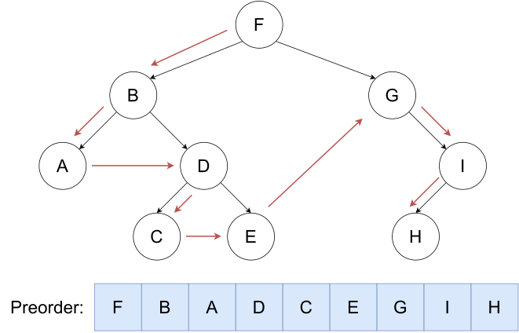

[TOC]

---

## 1、定义

树：非线性数据结构

叶节点：没有孩子的节点

- 树也可以写成递归结构


深度：从根开始的边的数量

高度：从这个节点开始到最深叶节点的边的数量

!!! info

    最多节点数：$n=2^{levels}-1$
    
    完美二叉树高度：$\log_2{(n+1)}-1$
    
    完全二叉树高度：$[\log_2n]$

---

## 2、分类

### （1）满二叉树

每一层节点都是满的

### （2）完全二叉树


最后一层有缺失

### （3）退化二叉树

每一个节点**只有一个**子节点

### （4）完美二叉树

所有叶结点的深度均相同，且所有非叶节点的子节点数量均为 2 的二叉树称为完美二叉树。


### （5）平衡二叉树

使用搜索树的目的之一是缩短插入、删除、修改和查找（插入、删除、修改都包括查找操作）节点的时间。

关于查找效率，如果一棵树的高度为 $h$，在最坏的情况，查找一个关键字需要对比$h$ 次，查找时间复杂度（也为平均查找长度
ASL，Average Search Length）不超过 $O(h)$。一棵理想的二叉搜索树所有操作的时间可以缩短到 $O(\log n)$n 是节点总数）。

然而 $O(\log n)$
的时间复杂度仅为理想情况。在最坏情况下，搜索树有可能退化为链表。想象一棵每个结点只有右孩子的二叉搜索树，那么它的性质就和链表一样，所有操作（增删改查）的时间是 $O(n)$.

可以发现操作的复杂度与树的高度 $h$ 有关。由此引出了平衡树，通过一定操作维持树的高度（平衡性）来降低操作的复杂度。

对于二叉搜索树来说，常见的平衡性的定义是指：以 T 为根节点的树，**每一个结点**的左子树和右子树高度差最多为 1。


---

## 3、静态/动态写法

!!! example

    === "static"

        ``` c++
        struct tree {
          int v;
          int l, r;
        } tree[N];
        ```

    === "dynamic"

        ``` c++
        struct Node {
          int data;
          Node * left;
          Node * right;
        };
        ```


---

## 4、二叉搜索树

搜索/插入/删除的时间复杂度都是$O(\log n)$

- 空树是二叉搜索树。
- 若二叉搜索树的左子树不为空，则其左子树上所有点的附加权值均小于其根节点的值。
- 若二叉搜索树的右子树不为空，则其右子树上所有点的附加权值均大于其根节点的值。
- 二叉搜索树的左右子树均为二叉搜索树。

搜索过程：比较和根节点的大小来决定继续递归左子树还是右子树（最坏情况：退化成链表）

### （1）实现

```c++
struct BstNode {
	int data;
	BstNode* left;
	BstNode* right;
};
BstNode* RootPtr = NULL;
```

```c++
#include <bits/stdc++.h>
using namespace std;
struct BstNode {
    int data;
    BstNode *left;
    BstNode *right;
};

BstNode *GetNewNode(int data) {
    BstNode *newNode = new BstNode();
    (*newNode).data = data;
    (*newNode).left = (*newNode).right = NULL;
    return newNode;
}

BstNode *Insert(BstNode *root, int data) {
    if (root == NULL) {
        root = GetNewNode(data);
        return root;
    } else if (data <= root->data) {
        root->left = Insert(root->left, data);
    } else {
        root->right = Insert(root->right, data);
    }
    return root;
}

bool Search(BstNode *root, int data) {
    if (root == NULL)
        return false;
    else if (root->data == data)
        return true;
    else if (root->data > data)
        return Search(root->left, data);
    else
        return Search(root->right, data);
}
int main() {
    BstNode *rootPtr = NULL;
    rootPtr = Insert(rootPtr, 15);
    rootPtr = Insert(rootPtr, 10);
    rootPtr = Insert(rootPtr, 20);
    int number;cin >> number;
    if (Search(rootPtr, number))
        cout << "Found\n";
    else
        cout << "Not Found\n";
}
```

---

### （2）最大值/最小值

```c++
/* 迭代 */
int FindMin(BstNode *root) {
    if (root == NULL) {
        cout << "The tree is empty\n";
        return -1;
    }
    BstNode *current = root;
    // 循环遍历左子树直到找到最左边的节点
    while ((*current).left != NULL) {
        current = (*current).left;
    }
    return (*current).data;
}

/* 递归 */
int FindMin(BstNode *root) {
    if (root == NULL) {
        cout << "The tree is empty\n";
        return -1;
    } else if (root->left == NULL) {
        return root->data;
    }
    return (FindMin(root->left));
}
```

---

### （3）高度

- 树的**高度**：最长的路径（到子叶节点）的边数
- 节点的**深度**：从根节点到那个节点的边数

```c++
int FindHeight(BstNode *root) {
    if (root == NULL) {
        return -1;
        // 因为返回的是 max(leftHeight, rightHeight) + 1，所以空节点返回 -1，
        // 这样叶子节点（左右子节点为空）时，高度是 0。
    }
    return max(FindHeight(root->left), FindHeight(root->right)) + 1;
}
```

---

### （4）判断是否是二叉搜索树

```c++
/* 易于理解的但是遍历所有节点效率低 */
bool isSubtreeLesser(BstNode *root, int value) {
    if (root == NULL) {
        return true;
    }
    if (root->data <= value 
        && isSubtreeLesser(root->left, value) 
        && isSubtreeLesser(root->right, value)) {
        return true;
    } else {
        return false;
    }
}
bool isSubtreeGreater(BstNode *root, int value) {
    if (root == NULL) {
        return true;
    }
    if (root->data > value 
        && isSubtreeGreater(root->left, value) 
        && isSubtreeGreater(root->right, value)) {
        return true;
    } else {
        return false;
    }
}

bool IsBST(BstNode *root) {
    if (isSubtreeLesser(root->left, root->data) 
        && isSubtreeGreater(root->right, root->data) 
        && IsBST(root->left) 
        && IsBST(root->right)) {
        return true;
    } else {
        return false;
    }
}
```

```c++
/* 效率更高 */
bool IsBstUtil(Node* root, int minValue, int maxValue) {
    if (root == NULL) return true;

    if (root->data > minValue && root->data < maxValue
        && IsBstUtil(root->left, minValue, root->data)
        && IsBstUtil(root->right, root->data, maxValue))
        return true;
    else
        return false;
}

bool IsBinarySearchTree(Node* root) {
    return IsBstUtil(root, INT_MIN, INT_MAX);
}
```

!!! tip
    还可以使用中序遍历，因为二叉搜索树**中序遍历**应该是**单调增**的所以判断中序遍历是否严格增即可

---

### （5）平衡二叉树

- 前提：二叉搜索树
- 对于任意节点：

$$
平衡因子=|左子树高度-右子树高度|\leq 1
$$

- 操作：**左旋、右旋**
  - 左旋：冲突的左孩变成右孩
  - 右旋：冲突的右子变成左孩

---

## 5、遍历

### （1）广度优先 → 层次遍历

!!! tip
    巧妙的使用队列结构，把根节点进入队列，然后进入队首的子节点

```c++
void LevelOrder(BstNode *root) {
    if(root == NULL) {return;}
    queue<BstNode *> q;
    q.push(root);
    while(!q.empty()) {
        BstNode *current = q.front();
        cout << current->data << " ";
        if(current->left != NULL) {q.push(current->left);}
        if(current->right != NULL) {q.push(current->right);}
        q.pop();
    }
}
```

- 时间复杂度：$O(1)$
- 空间复杂度：$O(n),O(1)$

---

### （2）深度优先

!!! info

    时间复杂度：$O(n)$

!!! bug

    给定前序和后序遍历没有办法确定一棵二叉树，必须要有中序

- 先（根）序遍历
    - **先根节点**，再左子树，再右子树
    ```c++
      void PreOrder(BstNode *root) {
          if (root == NULL) {
              return;
          }
          cout << root->data << " "; // 先访问根节点,所以是先序遍历
          PreOrder(root->left);
          PreOrder(root->right);
      }
    ```
    - 
- 中（根）序遍历
    - 先左子树，**再根节点**，再右子树
    ```c++
      void InOrder(BstNode *root) {
          if (root == NULL) {
              return;
          }
          InOrder(root->left);
          cout << root->data << " "; // 中序遍历
          InOrder(root->right);
      }
    ```
    - 
- 后（根）序遍历
    - 先左子树，再右子树，**再根节点**
    ```c++
      void PostOrder(BstNode *root) {
          if (root == NULL) {
              return;
          }
          PostOrder(root->left);
          PostOrder(root->right);
          cout << root->data << " "; // 后序遍历
      }
    ```
    - 

---

## 例题

### e.g.6二叉树的遍历

题目描述

有一个 $n(n \le 10^6)$ 个结点的二叉树。给出每个结点的两个子结点编号（均不超过 $n$），建立一棵二叉树（根节点的编号为 $1$
），如果是叶子结点，则输入 `0 0`。

建好树这棵二叉树之后，依次求出它的前序、中序、后序列遍历。

输入格式

第一行一个整数 $n$，表示结点数。

<u>之后 $n$ 行，第 $i$ 行两个整数 $l$、$r$，分别表示结点 $i$ 的左右子结点编号。若 $l=0$ 则表示无左子结点，$r=0$ 同理。</u>

输出格式

输出三行，每行 $n$ 个数字，用空格隔开。

第一行是这个二叉树的前序遍历。

第二行是这个二叉树的中序遍历。

第三行是这个二叉树的后序遍历。

样例

样例输入

```
7
2 7
4 0
0 0
0 3
0 0
0 5
6 0
```

样例输出

```
1 2 4 3 7 6 5
4 3 2 1 6 5 7
3 4 2 5 6 7 1
```

```c++
#include <bits/stdc++.h>
using namespace std;

const int N = 1e5 + 10;

struct tree {
    int value;//节点值
    int left, right;//左子树和右子树
} tr[N];

void Preorder(int u) {
    if (u == 0)
        return;//如果节点为空，则返回
    cout << u << " ";//输出节点值
    Preorder(tr[u].left);//递归遍历左子树
    Preorder(tr[u].right);//递归遍历右子树
}

void Inorder(int u) {
    if (u == 0)
        return;
    Inorder(tr[u].left);
    cout << u << " ";
    Inorder(tr[u].right);
}

void Postorder(int u) {
    if (u == 0)
        return;
    Postorder(tr[u].left);
    Postorder(tr[u].right);
    cout << u << " ";
}

int main() {
    int n;
    cin>>n;

    for (int i = 1; i <= n; i++) {//注意因为树的最小值从1开始，i也需要从1->n
        int a, b;
        cin >> a >> b;//输入左子树和右子树
        tr[i].value = i;//节点值
        tr[i].left = a;//左子树
        tr[i].right = b;//右子树
    }

    Preorder(1);//先序遍历
    cout<<endl;
    Inorder(1);//中序遍历
    cout<<endl;
    Postorder(1);//后序遍历
    cout<<endl;
}

```

---

### e.g.7[NOIP2004 普及组] FBI 树

题目描述

我们可以把由 0 和 1 组成的字符串分为三类：全 0 串称为 B 串，全 1 串称为 I 串，既含 0 又含 1 的串则称为 F 串。

FBI 树是一种二叉树，它的结点类型也包括 F 结点，B 结点和 I 结点三种。由一个长度为 $2^N$ 的 01 串 $S$ 可以构造出一棵 FBI
树 $T$，递归的构造方法如下：

1. $T$ 的根结点为 $R$，其类型与串 $S$ 的类型相同；
2. 若串 $S$ 的长度大于 $1$，将串 $S$ 从中间分开，分为等长的左右子串 $S_1$ 和 $S_2$；由左子串 $S_1$ 构造 $R$ 的左子树 $T_1$
   ，由右子串 $S_2$ 构造 $R$ 的右子树 $T_2$。

现在给定一个长度为 $2^N$ 的 01 串，请用上述构造方法构造出一棵 FBI 树，并输出它的**<u>后序</u>**遍历序列。

输入格式

第一行是一个整数 $N(0 \le N \le 10)$，

第二行是一个长度为 $2^N$ 的 01 串。

输出格式

一个字符串，即 FBI 树的后序遍历序列。

样例

样例输入

```
3
10001011
```

样例输出

```
IBFBBBFIBFIIIFF
```

提示

对于 $40\%$ 的数据，$N \le 2$；

对于全部的数据，$N \le 10$。

noip2004普及组第3题

```c++
#include <bits/stdc++.h>
using namespace std;

const int N = 1e4 + 10;
int n;
string s;
int Ls(int p) { return 2 * p; }     // 左儿子
int Rs(int p) { return 2 * p + 1; } // 右儿子

struct tree {
    char ch;
    int l, r;
} tr[N];

void build(int p, int l, int r) {
    // 终止条件
    if (l == r) {
        if (s[l - 1] == '0') {
            tr[p].ch = 'B';
        } else {
            tr[p].ch = 'I';
        }
        return;
    }
    int mid = (l + r) / 2; // 切割字符串
    // 左右字符串
    tr[p].l = Ls(p);
    tr[p].r = Rs(p);
    // 递归
    build(Ls(p), l, mid);
    build(Rs(p), mid + 1, r);
    if (tr[Ls(p)].ch == 'B' && tr[Rs(p)].ch == 'B') {
        tr[p].ch = 'B';
    } else if (tr[Ls(p)].ch == 'I' && tr[Rs(p)].ch == 'I') {
        tr[p].ch = 'I';
    } else {
        tr[p].ch = 'F';
    }
}
// 后序遍历
void post(int p) {
    if(p==0) return;
    if (tr[p].l)
        post(tr[p].l);
    if (tr[p].r)
        post(tr[p].r);
    cout << tr[p].ch;
}

int main() {
    cin >> n >> s;
    int len = pow(2, n);
    build(1, 1, len);

    post(1);
    cout << endl;
}
```

---

### e.g. 二叉树的宽度

设计算法计算二叉树最大的宽度（二叉树的最大宽度是指二叉树所有层中结点个数的最大值）。

输入：创建的二叉树，先序排列，以#虚设结点。

输出：一个正整数N，代表着该二叉树的最大宽度。

样例

样例输入

```
11111##11####1#11##1##11#11###1#1##
```

样例输出

```
5
```

```c++
#include <bits/stdc++.h>
using namespace std;

int MaxSize = 0;
struct binaryTree {
    char data;
    binaryTree *left;
    binaryTree *right;

    binaryTree(char val) : data(val), left(nullptr), right(nullptr) {} // 构造函数，传入参数为char，初始化data，left和right为nullptr
};

// 创建二叉树，传入字符串s和索引index，返回根节点指针
binaryTree *createTree(const string &s, int &index) {
    if (index >= s.size()) // 索引超出字符串长度，返回空指针
        return nullptr;

    if (s[index] == '#') { // 索引指向的字符为'#'，表示空节点
        index++;
        return nullptr;
    }

    binaryTree *root = new binaryTree(s[index++]); // 索引指向的字符不为'#'，表示非空节点，创建新节点，这边使用构造函数创建
    root->left = createTree(s, index);
    root->right = createTree(s, index);
    return root;
}

void levelOrder(binaryTree *root) {
    if (root == nullptr) // 空树
        return;

    queue<binaryTree *> q; // 注意数据类型是binaryTree*
    q.push(root);

    while (!q.empty()) {
        int levelSize = q.size(); // 当前层的节点数量

        MaxSize = max(MaxSize, levelSize); // 更新最大宽度

        for (int i = 0; i < levelSize; ++i) {
            binaryTree* node = q.front();
            q.pop();

            // 只处理这一层的节点，并把下一层的节点加入队列
            if (node->left)
                q.push(node->left);
            if (node->right)
                q.push(node->right);
        }
    }

    cout << endl;
}

int main() {
    string s;
    cin >> s;
    int index = 0;
    binaryTree *root = createTree(s, index);
    levelOrder(root);

    cout << MaxSize << endl;
    return 0;
}
```

---
