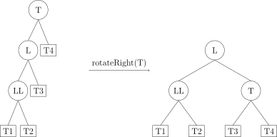

[TOC]

---

## 1、概念

- 前提：二叉搜索树
- 对于任意节点：

$$
平衡因子=|左子树高度-右子树高度|\leq 1
$$

- 操作：**左旋、右旋**
    - 左旋：冲突的左孩变成右孩
    - 右旋：冲突的右子变成左孩
    
---

## 2、失衡类型
- LL 型：T 的左孩子的左子树过长导致平衡性破坏。



- RR 型：与 LL 型类似，T 的右孩子的右子树过长导致平衡性破坏。


- LR 型：T 的左孩子的右子树过长导致平衡性破坏。


- RL 型：与 LR 型类似，T 的右孩子的左子树过长导致平衡性破坏。


  | 类型   | 标志                                | 操作                 |
  | ------ | ----------------------------------- | -------------------- |
  | **LL** | 失衡节点：2<br>失衡节点左孩子：1    | 右旋                 |
  | **RR** | 失衡节点：-2<br/>失衡节点右孩子：-1 | 左旋                 |
  | **LR** | 失衡节点：2<br/>失衡节点左孩子：-1  | 左旋左孩子，然后右旋 |
  | **RL** | 失衡节点：-2<br/>失衡节点右孩子：1  | 右旋右孩子，然后左旋 |
  
  ```mermaid
  graph LR
      A[失衡结点<br>平衡因子=2] --> B[L型]
      B --> C1[左孩子<br>平衡因子=1]
      C1 --> D1[LL型]
      B --> C2[左孩子<br>平衡因子=-1]
      C2 --> D2[LR型]
  
      E[失衡结点<br>平衡因子=-2] --> F[R型]
      F --> G1[右孩子<br>平衡因子=1]
      G1 --> H1[RL型]
      F --> G2[右孩子<br>平衡因子=-1]
      G2 --> H2[RR型]
  
  ```
  

!!! tip
    **插入**时遇到多个节点失衡，调整距离插入节点最接近的失衡节点即可

---
