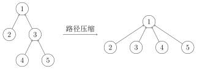

[TOC]


顾名思义，并查集支持两种操作：

- 合并（Union）：合并两个元素所属集合（合并对应的树）
- 查询（Find）：查询某个元素所属集合（查询对应的树的根节点），这可以用于判断两个元素是否属于同一集合

## 1、查询
!!! 实现
    ```c++
    	return x=s[x]? x:find_set(s[x]);
    ```

该函数用于查找元素 x 所在的集合的根节点。根节点是该集合的代表元素，通常是集合中的第一个元素或被指定为 "父" 的元素。

**递归查找：**

- 如果 `s[x] == x`，说明 x 是自己的父节点，即 x 是集合的代表元素或根节点，直接返回 x。


- 如果 `s[x] != x`，说明 x 的父节点不是自己（x 不是根节点），那么通过递归查找 s[x] 的父节点，直到找到根节点为止。


!!! danger
	问题：找到祖先时间复杂度过高

## 2、→方法：路径压缩
??? tip
    在递归查找过程中，路径上的每个节点的父节点都直接指向根节点`s[x] = find_set(s[x])`。这样可以加速后续的查找操作，减少树的高度，从而优化查询效率。


!!! SUCCESS
    ```c++
    int find_set(int x){
        if(x!=s[x]) s[x]=find_set(s[x]); //路径压缩
        return s[x];
    }
    ```

```c++
int find_set(int x) {
    return s[x] == x ? x : s[x] = find_set(s[x]);
}

int merge(int x, int y) {
    s[find_set(x)] = s[find_set(y)];
}  // (1)
```


1.  该函数用于将 x 和 y 所在的集合合并成一个集合。

    - 查找根节点：首先分别查找 x 和 y 所在集合的根节点，使用 `find_set(x)` 和 `find_set(y)`。

    - 合并操作：将 y 集合的根节点指向 x 集合的根节点，即 `s[find_set(x)] = s[find_set(y)]`。这样，x 和 y 所在的两个集合就被合并成了一个集合。


---

## 例题

### ==e.g.9亲戚（模板）==

题目背景

若某个家族人员过于庞大，要判断两个是否是亲戚，确实还很不容易，现在给出某个亲戚关系图，求任意给出的两个人是否具有亲戚关系。

题目描述

规定：$x$ 和 $y$ 是亲戚，$y$ 和 $z$ 是亲戚，那么 $x$ 和 $z$ 也是亲戚。如果 $x$，$y$ 是亲戚，那么 $x$ 的亲戚都是 $y$ 的亲戚，$y$ 的亲戚也都是 $x$ 的亲戚。

输入格式

第一行：三个整数 $n,m,p$，（$n,m,p \le 5000$），分别表示有 $n$ 个人，$m$ 个亲戚关系，询问 $p$ 对亲戚关系。

以下 $m$ 行：每行两个数 $M_i$，$M_j$，$1 \le M_i,~M_j\le n$，表示 $M_i$ 和 $M_j$ 具有亲戚关系。

接下来 $p$ 行：每行两个数 $P_i,P_j$，询问 $P_i$ 和 $P_j$ 是否具有亲戚关系。

输出格式

$p$ 行，每行一个 `Yes` 或 `No`。表示第 $i$ 个询问的答案为“具有”或“不具有”亲戚关系。

样例 

样例输入 

```
6 5 3
1 2
1 5
3 4
5 2
1 3
1 4
2 3
5 6
```

样例输出 

```
Yes
Yes
No
```

```c++
#include <bits/stdc++.h>
using namespace std;

const int N = 5e3 + 10; // 定义最大节点数，这里假设为5001
int n, m, p, s[N];      // n为节点数，m为边数，p为查询次数，s数组用于存储并查集信息

// 并查集的查找函数，用于找到元素k所在的集合的代表元素（根节点）
int find_set(int k) {
    if (k != s[k]) {           // 如果k不是根节点，则递归查找其根节点
        s[k] = find_set(s[k]); // 路径压缩，减少查找时间
    }
    return s[k]; // 返回根节点
}

// 并查集的合并函数，用于合并两个元素x和y所在的集合
void merge(int x, int y) {
    s[find_set(x)] = s[find_set(y)]; // 将x所在集合的根节点指向y所在集合的根节点
}

int main() {
    cin >> n >> m >> p; // 输入节点数n，边数m，查询次数p
    for (int i = 1; i <= n; i++)
        s[i] = i; // 初始化并查集，每个节点的根节点都是自己

    for (int i = 1; i <= m; i++) {
        int x, y;
        cin >> x >> y; // 输入一条边的两个节点
        merge(x, y);   // 合并这两个节点所在的集合
    }

    while (p--) { // 进行p次查询
        int x, y;
        cin >> x >> y;                  // 输入要查询的两个节点
        if (find_set(x) == find_set(y)) // 如果两个节点在同一个集合中
            cout << "Yes\n";            // 输出"Yes"
        else
            cout << "No\n"; // 否则输出"No"
    }
}
```

---

### e.g.10[蓝桥杯 2017 国 C] 合根植物

题目描述

w 星球的一个种植园，被分成 $m \times n$ 个小格子（东西方向 $m$ 行，南北方向 $n$ 列）。每个格子里种了一株合根植物。

这种植物有个特点，它的根可能会沿着南北或东西方向伸展，从而与另一个格子的植物合成为一体。

如果我们告诉你哪些小格子间出现了连根现象，你能说出这个园中一共有多少株合根植物吗？

输入格式

第一行，两个整数 $m$，$n$，用空格分开，表示格子的行数、列数（$1<m,n<1000$）。

接下来一行，一个整数 $k$，表示下面还有 $k$ 行数据 $(0<k<10^5)$。

接下来 $k$ 行，每行两个整数 $a$，$b$，表示编号为 $a$ 的小格子和编号为 $b$ 的小格子合根了。

格子的编号一行一行，从上到下，从左到右编号。

比如：$5 \times 4$ 的小格子，编号：

```
1  2  3  4
5  6  7  8
9  10 11 12
13 14 15 16
17 18 19 20
```

输出格式

一行一个整数，表示答案

样例 

样例输入 

```
5 4
16
2 3
1 5
5 9
4 8
7 8
9 10
10 11
11 12
10 14
12 16
14 18
17 18
15 19
19 20
9 13
13 17
```

样例输出 

```
5
```

提示

样例解释


时限 1 秒, 256M。蓝桥杯 2017 年第八届国赛

```c++
#include <bits/stdc++.h>
using namespace std;

const int N = 1e5 + 10;
int n, m, p, s[N];
// 并查集
int find_set(int k) {
    if (k != s[k]) {
        s[k] = find_set(s[k]);
    }
    return s[k];
}
void merge(int x, int y) {
    s[find_set(x)] = s[find_set(y)];
}
int main() {
    cin >> n >> m >> p;
    for (int i = 1; i <= n * m; i++)
        s[i] = i;

    for (int i = 1; i <= p; i++) {
        int x, y;
        cin >> x >> y;
        merge(x, y);
    }
    int ans = 0;
    for (int i = 1; i <= n * m; i++) {
        if (s[i] == i) {
            ans++;
        }
    }
    cout << ans << endl;
}
```

---

### e.g.11⭐[USACO16OPEN] Closing the Farm S

题目描述

FJ 和他的奶牛们正在计划离开小镇做一次长的旅行，同时 FJ 想临时地关掉他的农场以节省一些金钱。

这个农场一共有被用 $M$ 条双向道路连接的 $N$ 个谷仓（$1 \leq N,M \leq 3000$）。为了关闭整个农场，FJ 计划每一次关闭掉一个谷仓。当一个谷仓被关闭了，所有的连接到这个谷仓的道路都会被关闭，而且再也不能够被使用。

FJ 现在正感兴趣于知道在每一个时间（这里的“时间”指在每一次关闭谷仓之前的时间）时他的农场是否是“全连通的”——也就是说从任意的一个开着的谷仓开始，能够到达另外的一个谷仓。注意自从某一个时间之后，可能整个农场都开始不会是“全连通的”。

输入格式

输入第一行两个整数 $N,M$。

接下来 $M$ 行，每行两个整数 $u,v$（$1 \leq u,v \leq N$），描述一条连接 $u,v$ 两个农场的路。

最后 $N$ 行每行一个整数，表示第 $i$ 个被关闭的农场编号。

输出格式

输出 $N$ 行，每行包含 `YES` 或 `NO`，表示某个时刻农场是否是全连通的。

第一行输出最初的状态，第 $i$ 行（$2 \leq i \leq N$）输出第 $i-1$ 个农场被关闭后的状态。

样例 

样例输入 

```
4 3
1 2
2 3
3 4
3
4
1
2
```

样例输出 

```
YES
NO
YES
YES
```