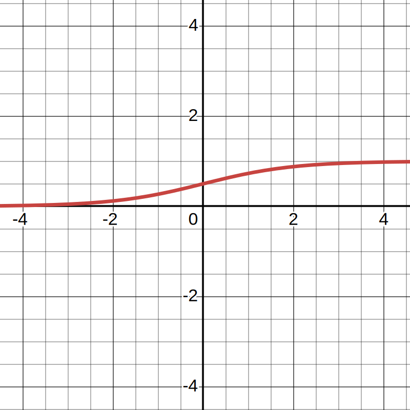
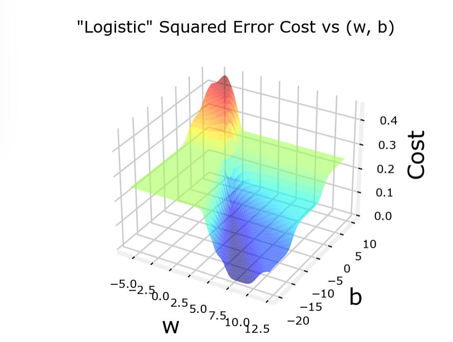
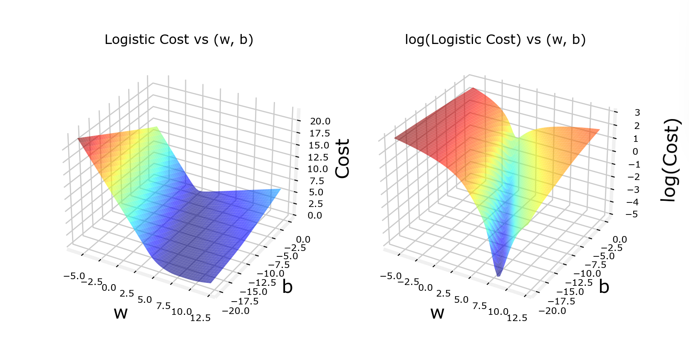

[TOC]

---

## 一、回归


| 监督    | 非监督    |
| ------- | --------- |
| 有答案 | 没有答案 |

| 回归模型            | 分类模型        |
| ------------------- |-------------|
| 线性回归，预测输出 | 预测类别，有限可能输出 |

!!! tip
     $x$ 输入变量
    
     $y$ 输出变量
    
     $(x,y)$ 单个训练样本
    
     $(x^{i}, y^{i})$ 第几个训练样本（第几行）

---

### 1、回归模型


- $ŷ$ 是 $y$ 的预测值

---

### 2、代价函数

$$
J(\theta) = \frac{1}{2m} \sum_{i=1}^{m} \left( f_{(w,b)}x^{(i)} - y^{(i)} \right)^2
$$

- 模型： $f=wx+b$  → 线性回归 $f=wx,(b=0)$
- 参数：  $w,b$
- 损失函数：$J(\theta) = \frac{1}{2m} \sum_{i=1}^{m} \left( f_{(w,b)}x^{(i)} - y^{(i)} \right)^2$
- 目标：  $minimize \text{      } J(w,b)$

```python
#Function to calculate the cost
def compute_cost(x, y, w, b):
   
    m = x.shape[0] 
    cost = 0
    
    for i in range(m):
        f_wb = w * x[i] + b
        cost = cost + (f_wb - y[i])**2
    total_cost = 1 / (2 * m) * cost

    return total_cost
```

---

### 3、梯度下降

方法不止适用于线性回归，每次寻找能够下降最多的方向

$\omega:=\omega−\frac{d}{d\omega}J(\omega,b)$

$b:=b−\frac{d}{db}J(\omega,b)$

$\alpha : 学习率，即步长,设置合适的学习率有助于更好的拟合$

```python
# load the dataset
X_train, y_train = load_house_data()
X_features = ['size(sqft)','bedrooms','floors','age']
fig,ax=plt.subplots(1, 4, figsize=(12, 3), sharey=True)
for i in range(len(ax)):
    ax[i].scatter(X_train[:,i],y_train)
    ax[i].set_xlabel(X_features[i])
ax[0].set_ylabel("Price (1000's)")
plt.show()
#set alpha to 9.9e-7
_, _, hist = run_gradient_descent(X_train, y_train, 10, alpha = 9.9e-7)
```

```python
plot_cost_i_w(X_train, y_train, hist)
```

---

### 4、线性回归算法
!!! note
     - 线性回归模型
     $$
     f_{w,b}(x) = wx + b
     $$
    
     - 代价方程
     $$
     J(w, b) = \frac{1}{2m} \sum_{i=1}^{m} \left( f_{w,b}(x^{(i)}) - y^{(i)} \right)^2
     $$
    
     - 梯度下降算法
    
         - 重复直到收敛:
    
     $$
     w = w - \alpha \frac{\partial}{\partial w} J(w, b)
     $$
    
     $$
     b = b - \alpha \frac{\partial}{\partial b} J(w, b)
     $$
    
     - 梯度计算（代价方程的偏导）
     $$
     \frac{\partial}{\partial w} J(w, b) = \frac{1}{m} \sum_{i=1}^{m} \left( f_{w,b}(x^{(i)}) - y^{(i)} \right) x^{(i)}
     $$

批量梯度下降（Batch Linear Regression）

---

### 5、特征工程

#### （1）向量化

$f(w,b)=w_1x_1+w_2x_2+w_3x_3+………+w_nx_n+b$
$$
f = \vec{w}· \vec{x} + b
$$

```python
#  向量化
f = np.dot(w,x) + b
#  无向量化
for j in range (0,16) : 
    f = f + w[j] * x[j]
```

并行运行，效率更高

!!! example
    ```python
    np.random.seed(1)
    a = np.random.rand(10000000)  # very large arrays
    b = np.random.rand(10000000)
    
    tic = time.time()  # capture start time
    c = np.dot(a, b)
    toc = time.time()  # capture end time
    
    print(f"np.dot(a, b) =  {c:.4f}")
    print(f"Vectorized version duration: {1000*(toc-tic):.4f} ms ")
    
    tic = time.time()  # capture start time
    c = my_dot(a,b)
    toc = time.time()  # capture end time
    
    print(f"my_dot(a, b) =  {c:.4f}")
    print(f"loop version duration: {1000*(toc-tic):.4f} ms ")
    
    del(a);del(b)  #remove these big arrays from memory
    ```

---

#### （2）多元线性回

| **特征数** | **权重更新公式** | **偏置项更新公式** |
|------------|--------------------------------------------------------------------------|------------------------------------------------------|
| **单变量** | $w = w - \alpha \frac{1}{m} \sum\limits_{i=1}^{m} ( f_{w,b}(x^{(i)}) - y^{(i)} ) x^{(i)}$ | $b = b - \alpha \frac{1}{m} \sum\limits_{i=1}^{m} ( f_{w,b}(x^{(i)}) - y^{(i)} )$ |
| **多变量** | $w_j = w_j - \alpha \frac{1}{m} \sum\limits_{i=1}^{m} ( f_{\vec{w},b}(\vec{x}^{(i)}) - y^{(i)} ) x_j^{(i)}$ | $b = b - \alpha \frac{1}{m} \sum\limits_{i=1}^{m} ( f_{\vec{w},b}(\vec{x}^{(i)}) - y^{(i)} )$ |

??? danger
     - 正规方程(Normal Equation)：只能用于**线性回归**，不用迭代求解 $w,b$
     ​	
    - 缺点：慢，不能用于其他算法
    
     ```python
     import numpy as np
     
     # 假设你有一个特征矩阵 X 和目标向量 y
     # X 的每一行代表一个样本，每一列代表一个特征
     # y 是目标变量的值
     
     def normal_equation(X, y):
         # 在特征矩阵 X 的前面加一列全为 1 的列，以便计算偏置项
         X_b = np.c_[np.ones((X.shape[0], 1)), X]
         
         # 计算正规方程的解
         theta = np.linalg.inv(X_b.T.dot(X_b)).dot(X_b.T).dot(y)
         return theta
     
     # 示例数据
     X = np.array([[1, 2], [2, 3], [3, 4]])  # 特征矩阵
     y = np.array([5, 7, 9])  # 目标变量
     
     theta = normal_equation(X, y)
     print("模型的参数:", theta)
     ```

---

#### （3）特征缩放
让多个变量范围类似，重新缩放特征可以**加快**梯度下降速度（**数据预处理**）

##### Ⅰ.均值归一化（Mean-Normalization)

- $x_{normalized}=\frac{x-μ}{max(x)−min(x)}$

  其中：

  - $μ$ 是特征 $x$ 的均值。

```python
from sklearn.preprocessing import MinMaxScaler
import numpy as np

# 示例数据：特征矩阵 X
X = np.array([[1, 2], [2, 3], [3, 4]])

# 创建 MinMaxScaler 对象，指定特定的范围 (默认范围是 [0, 1])
scaler = MinMaxScaler(feature_range=(-1, 1))

# 拟合并转换数据
X_normalized = scaler.fit_transform(X)

# 输出归一化后的数据
print("均值归一化后的数据：")
print(X_normalized)
```

---

##### Ⅱ.标准化（Z-Score Standardization）

- $z=\frac{x-μ}{\sigma}$

  其中：

  - $\mu$ 是数据的均值，
  - $\sigma$ 是数据的标准差。

```python
import numpy as np
from scipy import stats

# 示例数据
X = np.array([10, 20, 30, 40, 50])

# 计算 Z-score
z_scores = stats.zscore(X)
print("Z-scores:", z_scores)
```

---

#### （4）多项式回归

在原来基础上加入其他次项来使其更加拟合曲线
!!! example
    ```python
    x = np.arange(0,20,1)
    y = np.cos(x/2)
    
    X = np.c_[x, x**2, x**3,x**4, x**5, x**6, x**7, x**8, x**9, x**10, x**11, x**12, x**13]
    X = zscore_normalize_features(X) 
    
    model_w,model_b = run_gradient_descent_feng(X, y, iterations=1000000, alpha = 1e-1)
    
    plt.scatter(x, y, marker='x', c='r', label="Actual Value"); plt.title("Normalized x x**2, x**3 feature")
    plt.plot(x,X@model_w + model_b, label="Predicted Value"); plt.xlabel("x"); plt.ylabel("y"); plt.legend(); plt.show()
    ```
---
## 二、分类

### 1、逻辑（Logistic）回归

二元分类

```python
false - 0
true - 1
```

这时**线性回归**不再适用，需要选择新的函数来划分

---

### 2、$Sigmoid$ 函数

```python
# Plot sigmoid(z) over a range of values from -10 to 10
z = np.arange(-10,11)

fig,ax = plt.subplots(1,1,figsize=(5,3))
# Plot z vs sigmoid(z)
ax.plot(z, sigmoid(z), c="b")

ax.set_title("Sigmoid function")
ax.set_ylabel('sigmoid(z)')
ax.set_xlabel('z')
draw_vthresh(ax,0)
```



$$
z= \vec w·\vec x + b
$$

$$
g(z) = \frac{1}{1 + e^{-z}}=\frac{1}{1+e^{-(\vec w· \vec x +b)}}
$$

- 输出为是$1/0$ 的可能性大小
- $P(y=0)+P(y=1)=1$

```python
import numpy as np

def sigmoid(x):
    return 1 / (1 + np.exp(-x))

# 示例
x = np.array([-2, -1, 0, 1, 2])
print(sigmoid(x))
```

---

### 3、决策边界

$z=\vec w· \vec x +b = 0$

可以是线性的也可以是多项式函数，最后的边界也相应的是直线或者其他形状

```python
# Choose values between 0 and 6
x0 = np.arange(0,6)

x1 = 3 - x0
fig,ax = plt.subplots(1,1,figsize=(5,4))
# Plot the decision boundary
ax.plot(x0,x1, c="b")
ax.axis([0, 4, 0, 3.5])

# Fill the region below the line
ax.fill_between(x0,x1, alpha=0.2)

# Plot the original data
plot_data(X,y,ax)
ax.set_ylabel(r'$x_1$')
ax.set_xlabel(r'$x_0$')
plt.show()
```

---

### 4、代价函数

|                  | 线性回归                                                     | 逻辑回归                                                     |
| ---------------- | ------------------------------------------------------------ | ------------------------------------------------------------ |
| 模型             | $f(\vec x )=\vec w ·\vec x +b$                               | $f(\vec x )=\frac{1}{1+e^{-(\vec w· \vec x +b)}}$            |
| 代价函数         | $J(w, b) = \frac{1}{2m} \sum_{i=1}^{m} \left( f_{w,b}(x^{(i)}) - y^{(i)} \right)^2$ | $J(w, b) = \frac{1}{m} \sum_{i=1}^{m} L(f_{\vec w,b}(\vec x^{(i)}),y^{(i)})$ |
| 形状             | 凹函数                                                       | 凹函数                                                       |
| 是否可以梯度下降 | √                                                            | √                                                            |

$$
f(\vec x )=\frac{1}{1+e^{-(\vec w· \vec x +b)}}
$$

$$
L\left(f_{\vec{w},b}(\vec{x}^{(i)}), y^{(i)}\right) =
\begin{cases}
    -\log \left( f_{\vec{w},b}(\vec{x}^{(i)}) \right), & \text{if } y^{(i)} = 1 \\
    -\log \left(1 - f_{\vec{w},b}(\vec{x}^{(i)}) \right), & \text{if } y^{(i)} = 0
\end{cases}
$$
!!! bug
    如果在逻辑回归中使用原来的模型函数，得到的并非凹函数，也无法使用梯度下降法寻找最小值

    | 线性回归函数                                                                     |                                     逻辑回归函数                                     |
    |----------------------------------------------------------------------------|:------------------------------------------------------------------------------:|
    | |  |

!!! tip
    - 紧凑表达

    $$
    L\left(f_{\vec{w},b}(\vec{x}^{(i)}), y^{(i)}\right) =
    -y^{(i)} \log \left( f_{\vec{w},b}(\vec{x}^{(i)}) \right)
    -(1 - y^{(i)}) \log \left(1 - f_{\vec{w},b}(\vec{x}^{(i)}) \right)
    $$

---

### 5、梯度下降

思路和回归模型一样，区别在于$f$ 的选择不同

```python
def gradient_descent(X, y, w_in, b_in, alpha, num_iters): 
    """
    Performs batch gradient descent
    
    Args:
      X (ndarray (m,n)   : Data, m examples with n features
      y (ndarray (m,))   : target values
      w_in (ndarray (n,)): Initial values of model parameters  
      b_in (scalar)      : Initial values of model parameter
      alpha (float)      : Learning rate
      num_iters (scalar) : number of iterations to run gradient descent
      
    Returns:
      w (ndarray (n,))   : Updated values of parameters
      b (scalar)         : Updated value of parameter 
    """
    # An array to store cost J and w's at each iteration primarily for graphing later
    J_history = []
    w = copy.deepcopy(w_in)  #avoid modifying global w within function
    b = b_in
    
    for i in range(num_iters):
        # Calculate the gradient and update the parameters
        dj_db, dj_dw = compute_gradient_logistic(X, y, w, b)   

        # Update Parameters using w, b, alpha and gradient
        w = w - alpha * dj_dw               
        b = b - alpha * dj_db               
      
        # Save cost J at each iteration
        if i<100000:      # prevent resource exhaustion 
            J_history.append( compute_cost_logistic(X, y, w, b) )

        # Print cost every at intervals 10 times or as many iterations if < 10
        if i% math.ceil(num_iters / 10) == 0:
            print(f"Iteration {i:4d}: Cost {J_history[-1]}   ")
        
    return w, b, J_history         #return final w,b and J history for graphing
```

---

## 三、过拟合和正则化

### 1、过拟合问题

| 泛化能力 | 对应问题                |
| -------- | ----------------------- |
| 欠拟合   | 高偏差（high bias)      |
|          | 泛化（generalization）  |
| 过拟合   | 高方差（high variance） |

解决：

- 收集更多数据
- 选择合适的特征
- 使用正则化减小某些参数的值

---

### 2、正则化

带正则化项的均方误差（MSE）损失函数

$$
J(\vec{w}, b) = \frac{1}{2m} \sum_{i=1}^{m} (f_{\vec{w},b}(\vec{x}^{(i)}) - y^{(i)})^2 + \frac{\lambda}{2m} \sum_{j=1}^{n} w_j^2
$$

#### （1） **误差项（均方误差 MSE）**

- 用于衡量预测值与真实值的差距

$$
\frac{1}{2m} \sum_{i=1}^{m} (f_{\vec{w},b}(\vec{x}^{(i)}) - y^{(i)})^2
$$

#### （2） **正则化项（L2 正则化/Ridge 正则化）**
$$
\frac{\lambda}{2m} \sum_{j=1}^{n} w_j^2
$$

- 这部分的作用是 **惩罚过大的权重 $w_j$**，从而让模型更简单，避免过拟合。

- **λ（lambda）** 控制正则化强度：
  - 如果 **λ 太大**，模型可能会欠拟合（underfitting）。
  - 如果 **λ 太小**，正则化效果不明显，可能会过拟合（overfitting）。

---

### 3、应用

#### （1）线性回归

```python
def compute_cost_linear_reg(X, y, w, b, lambda_ = 1):
    """
    Computes the cost over all examples
    Args:
      X (ndarray (m,n): Data, m examples with n features
      y (ndarray (m,)): target values
      w (ndarray (n,)): model parameters  
      b (scalar)      : model parameter
      lambda_ (scalar): Controls amount of regularization
    Returns:
      total_cost (scalar):  cost 
    """

    m  = X.shape[0]
    n  = len(w)
    cost = 0.
    for i in range(m):
        f_wb_i = np.dot(X[i], w) + b                                   #(n,)(n,)=scalar, see np.dot
        cost = cost + (f_wb_i - y[i])**2                               #scalar             
    cost = cost / (2 * m)                                              #scalar  
 
    reg_cost = 0
    for j in range(n):
        reg_cost += (w[j]**2)                                          #scalar
    reg_cost = (lambda_/(2*m)) * reg_cost                              #scalar
    
    total_cost = cost + reg_cost                                       #scalar
    return total_cost                                                  #scalar
```

```python
def compute_gradient_linear_reg(X, y, w, b, lambda_): 
    """
    Computes the gradient for linear regression 
    Args:
      X (ndarray (m,n): Data, m examples with n features
      y (ndarray (m,)): target values
      w (ndarray (n,)): model parameters  
      b (scalar)      : model parameter
      lambda_ (scalar): Controls amount of regularization
      
    Returns:
      dj_dw (ndarray (n,)): The gradient of the cost w.r.t. the parameters w. 
      dj_db (scalar):       The gradient of the cost w.r.t. the parameter b. 
    """
    m,n = X.shape           #(number of examples, number of features)
    dj_dw = np.zeros((n,))
    dj_db = 0.

    for i in range(m):                             
        err = (np.dot(X[i], w) + b) - y[i]                 
        for j in range(n):                         
            dj_dw[j] = dj_dw[j] + err * X[i, j]               
        dj_db = dj_db + err                        
    dj_dw = dj_dw / m                                
    dj_db = dj_db / m   
    
    for j in range(n):
        dj_dw[j] = dj_dw[j] + (lambda_/m) * w[j]

    return dj_db, dj_dw
```

---

#### （2）逻辑回归

```python
def compute_cost_logistic_reg(X, y, w, b, lambda_ = 1):
    """
    Computes the cost over all examples
    Args:
    Args:
      X (ndarray (m,n): Data, m examples with n features
      y (ndarray (m,)): target values
      w (ndarray (n,)): model parameters  
      b (scalar)      : model parameter
      lambda_ (scalar): Controls amount of regularization
    Returns:
      total_cost (scalar):  cost 
    """

    m,n  = X.shape
    cost = 0.
    for i in range(m):
        z_i = np.dot(X[i], w) + b                                      #(n,)(n,)=scalar, see np.dot
        f_wb_i = sigmoid(z_i)                                          #scalar
        cost +=  -y[i]*np.log(f_wb_i) - (1-y[i])*np.log(1-f_wb_i)      #scalar
             
    cost = cost/m                                                      #scalar

    reg_cost = 0
    for j in range(n):
        reg_cost += (w[j]**2)                                          #scalar
    reg_cost = (lambda_/(2*m)) * reg_cost                              #scalar
    
    total_cost = cost + reg_cost                                       #scalar
    return total_cost                                                  #scalar
```

```python
def compute_gradient_logistic_reg(X, y, w, b, lambda_): 
    """
    Computes the gradient for linear regression 
 
    Args:
      X (ndarray (m,n): Data, m examples with n features
      y (ndarray (m,)): target values
      w (ndarray (n,)): model parameters  
      b (scalar)      : model parameter
      lambda_ (scalar): Controls amount of regularization
    Returns
      dj_dw (ndarray Shape (n,)): The gradient of the cost w.r.t. the parameters w. 
      dj_db (scalar)            : The gradient of the cost w.r.t. the parameter b. 
    """
    m,n = X.shape
    dj_dw = np.zeros((n,))                            #(n,)
    dj_db = 0.0                                       #scalar

    for i in range(m):
        f_wb_i = sigmoid(np.dot(X[i],w) + b)          #(n,)(n,)=scalar
        err_i  = f_wb_i  - y[i]                       #scalar
        for j in range(n):
            dj_dw[j] = dj_dw[j] + err_i * X[i,j]      #scalar
        dj_db = dj_db + err_i
    dj_dw = dj_dw/m                                   #(n,)
    dj_db = dj_db/m                                   #scalar

    for j in range(n):
        dj_dw[j] = dj_dw[j] + (lambda_/m) * w[j]

    return dj_db, dj_dw  

```

---

## 四、Scikit-Learn

```python
import numpy as np

X = np.array([[0.5, 1.5], [1,1], [1.5, 0.5], [3, 0.5], [2, 2], [1, 2.5]])
y = np.array([0, 0, 0, 1, 1, 1])
```

### 1、拟合模型

下面的代码从 Scikit-Learn导入逻辑回归模型。 你可以通过调用 `fit` 函数，在训练数据上拟合该模型。

```python
from sklearn.linear_model import LogisticRegression

lr_model = LogisticRegression()
lr_model.fit(X, y)
```

### 2、进行预测

你可以通过调用 `predict` 函数，查看该模型的预测结果。

```python
y_pred = lr_model.predict(X)
print("训练集上的预测结果:", y_pred)
```

### 3、计算准确率

你可以通过调用 `score` 函数来计算该模型的准确率。

```python
print("训练集上的准确率:", lr_model.score(X, y))
```

