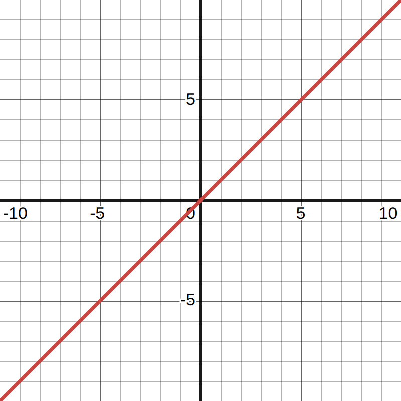
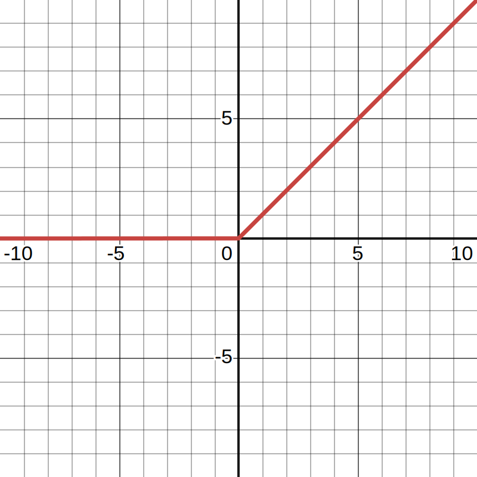
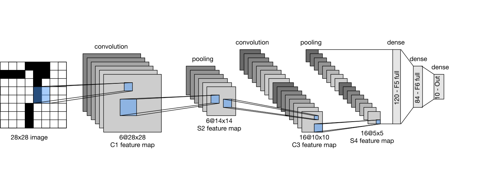
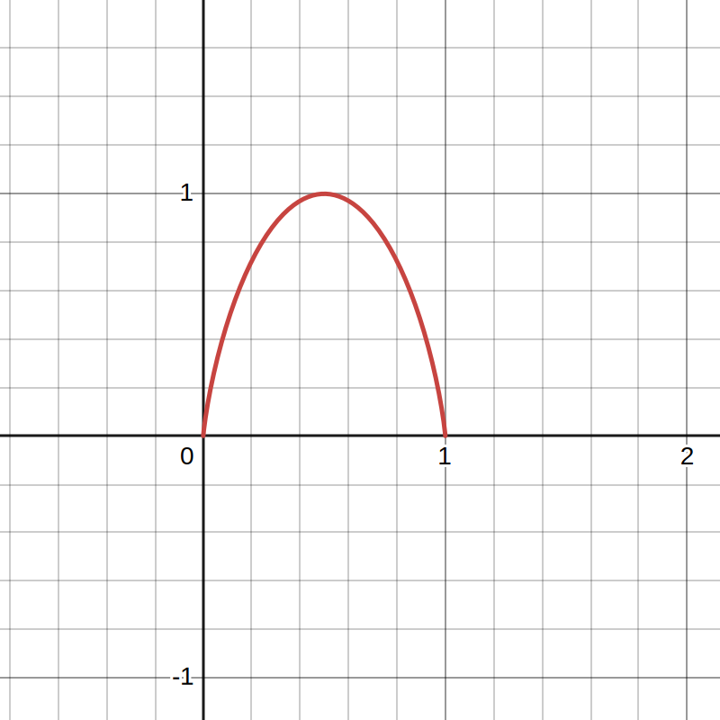

[TOC]

---

## 一、神经网络

### 1、神经元

**神经元**接受输入给出输出

```mermaid
graph LR
    D[x] --> E[f]
    E --> G[a]
```

- 神经网络架构常常会有多个隐藏层，也称为**多层感知器**（Multilayer Perceptron）,每一层的神经元与前一层的神经元全连接，通过加权求和和激活函数进行计算。


```mermaid
graph LR
    subgraph Input Layer
        In((Input))
    end

    subgraph 1st Hidden Layer
        H1_1((Neuron))
        H1_2((Neuron))
    end

    subgraph 2nd Hidden Layer
        H2_1((Neuron))
        H2_2((Neuron))
        H2_3((Neuron))
    end

    subgraph 3rd Hidden Layer
        H3_1((Neuron))
        H3_2((Neuron))
    end

    subgraph Output Layer
        Out((Output))
    end

    In --> H1_1 & H1_2
    H1_1 & H1_2 --> H2_1 & H2_2 & H2_3
    H2_1 & H2_2 & H2_3 --> H3_1 & H3_2
    H3_1 & H3_2 --> Out
```

---

### 2、前向传播

神经元中不同的就是**参数** $w,b$

$$
a_j^{[l]}=g(\vec w _j^{[l]}·\vec a ^{[l-1]}+b_j^{[l]})
$$

其中 $g$ 为激活函数

从输入层向输出层进行计算，因而叫做**前向传播**

---

### 3、`tensorflow`的`Keras`库

```python
import numpy as np
# 准备输入数据x，一个4x2的NumPy数组
x = np.array([[200.0, 17.0],
              [120.0, 5.0],
              [425.0, 20.0],
              [212.0, 18.0]])

# 准备输出标签y，一个包含4个元素的NumPy数组
y = np.array([1, 0, 0, 1])

# 导入Dense类，这是Keras库中的一个类，用于创建全连接层
from tensorflow.keras.layers import Dense
from tensorflow.keras.models import Sequential

# 创建一个全连接层layer_1，它有3个神经元（units=3），并且使用sigmoid激活函数
layer_1 = Dense(units=3, activation='sigmoid')
# 将输入数据x传递给layer_1，得到该层的输出a1
a1 = layer_1(x)

layer_2 = Dense(units=1, activation='sigmoid')
a2 = layer_2(a1)

# 创建一个顺序模型，将layer_1和layer_2添加到模型中
model = Sequential([layer_1, layer_2])

# 编译模型，指定优化器、损失函数和评估指标
model.compile(optimizer='adam', loss='binary_crossentropy', metrics=['accuracy'])

# 使用x和y训练模型
model.fit(x, y, epochs=10)
model.predict(x_new)
```

---

### 4、`numpy`硬编码

```python
import numpy as np

def dense(a_in, W, b, g):
    """
    A single dense (fully connected) layer.
    
    Parameters:
    a_in (np.array): Input to the layer.
    W (np.array): Weights matrix for the layer.
    b (np.array): Bias vector for the layer.
    g (function): Activation function to be applied.
    
    Returns:
    np.array: Output of the layer.
    """
    units = W.shape[1]
    a_out = np.zeros(units)
    
    for j in range(units):
        w = W[:, j]
        z = np.dot(w, a_in) + b[j]
        a_out[j] = g(z)
    
    return a_out

def sequential(x):
    """
    A simple sequential neural network model.
    
    Parameters:
    x (np.array): Input to the model.
    
    Returns:
    np.array: Output of the model.
    """
    a1 = dense(x, W1, b1, sigmoid)
    a2 = dense(a1, W2, b2, sigmoid)
    a3 = dense(a2, W3, b3, sigmoid)
    a4 = dense(a3, W4, b4, sigmoid)
    
    f_x = a4
    return f_x
```

??? tip
    ```python
    import numpy as np

    # 矩阵加法
    matrix_sum = matrix_a + matrix_b
    # 矩阵乘法
    matrix_product = np.dot(matrix_a, matrix_b)
    # 矩阵转置
    matrix_transpose = matrix.T
    # 矩阵求逆
    matrix_inverse = np.linalg.inv(matrix)
    # 矩阵的特征值和特征向量
    eigenvalues, eigenvectors = np.linalg.eig(matrix)
    # 矩阵的行列式
    determinant = np.linalg.det(matrix)
    # 矩阵的迹
    trace = np.trace(matrix)
    ```

---

### 5、训练步骤

| 步骤                                         | 逻辑回归                                                     | 神经网络                                                     |
| -------------------------------------------- | ------------------------------------------------------------ | ------------------------------------------------------------ |
| **① 定义模型**                               | 给定输入 $x$ 和参数 $w, b$ 计算输出 $f(x) = \frac{1}{1 + e^{-z}}$ <br>其中 $z = w \cdot x + b$ | 使用 `Sequential` 模型定义神经网络结构 <br> `model = Sequential([Dense(...), Dense(...), Dense(...)])` |
| **② 指定损失函数和代价**                     | 逻辑回归损失函数：<br>$L= -y \cdot \log(f(x))$<br>$- (1 - y) \cdot \log(1 - f(x))$ | 使用二元交叉熵作为损失函数：<br> `model.compile(loss=BinaryCrossentropy())`<br>也可以使用均方误差作为损失函数：<br>`model.compile(loss=mean_squared_error())` |
| **③ 在数据上训练以最小化代价函数 $J(w, b)$** | 最小化损失函数：<br>$w = w - \alpha \cdot \frac{\partial J}{\partial w}$<br>$b = b - \alpha \cdot \frac{\partial J}{\partial b}$ | 使用模型的 `fit` 方法训练神经网络：<br> `model.fit(X, y, epochs=100)` |

---

### 6、激活函数

|                       $线性$                        |                       $Sigmoid$                       |                     $ReLU$                      |
| :-------------------------------------------------: | :---------------------------------------------------: | :---------------------------------------------: |
|                     $f(x) = x$                      |                $\frac{1}{1 + e^{-x}}$                 |               $\text{}\max(0, x)$               |
|  |  |  |
|                     二分类问题                      |                     $y$ 可取正负                      |                   $y$ 取非负                    |

- **隐藏层**不要使用**线性**激活函数，因为线性相关 $\Leftrightarrow$ 相当于简单的线性回归

---

## 二、多类

### 1、Softmax回归模型

??? example
    
    | 计算得分 $z$                          | 计算概率 $a$                                                 |
    | ------------------------------------- | ------------------------------------------------------------ |
    | $z_1 = \vec{w}_1 \cdot \vec{x} + b_1$ | $a_1 = \frac{e^{z_1}}{e^{z_1} + e^{z_2} + e^{z_3} + e^{z_4}}$ |
    | $z_2 = \vec{w}_2 \cdot \vec{x} + b_2$ | $a_2 = \frac{e^{z_2}}{e^{z_1} + e^{z_2} + e^{z_3} + e^{z_4}}$ |
    | $z_3 = \vec{w}_3 \cdot \vec{x} + b_3$ | $a_3 = \frac{e^{z_3}}{e^{z_1} + e^{z_2} + e^{z_3} + e^{z_4}}$ |
    | $z_4 = \vec{w}_4 \cdot \vec{x} + b_4$ | $a_4 = \frac{e^{z_4}}{e^{z_1} + e^{z_2} + e^{z_3} + e^{z_4}}$ |

- $$
  z_j = \vec{w}_j \cdot \vec{x} + b_j \quad \text{for } j = 1, \ldots, N
  $$

  

- $$
  a_j = \frac{e^{z_j}}{\sum_{k=1}^{N} e^{z_k}} = P(y = j|\vec{x})
  $$

- $$
  a_1 + a_2 + \ldots + a_N = 1
  $$

| 步骤     | 逻辑回归                                            | Softmax回归                                                  |
| -------- | --------------------------------------------------- | ------------------------------------------------------------ |
| 模型     | $z = \vec{w} \cdot \vec{x} + b$                     | $z_j = \vec{w}_j \cdot \vec{x} + b_j$ for $j = 1, \ldots, N$ |
| 概率计算 | $a_1 = g(z) = \frac{1}{1 + e^{-z}}$                 | $a_j = \frac{e^{z_j}}{\sum_{k=1}^{N} e^{z_k}}$               |
|          | $a_2 = 1 - a_1$                                     |                                                              |
| 损失函数 | $\text{loss} = -y \log a_1 - (1 - y) \log(1 - a_1)$ | $\text{loss}(a_1, \ldots, a_N, y) = -\log a_y$               |
| 代价函数 | $J(\vec{w}, b) = \text{average loss}$               | $J(\vec{w}, b) = \text{average loss}$                        |
|          | $a_1 + a_2 = 1$                                     | $a_1 + a_2 + \ldots + a_N = 1$                               |

---

### 2、Softmax实现


```python
import tensorflow as tf
from tensorflow.keras import Sequential
from tensorflow.keras.layers import Dense
from tensorflow.keras.losses import SparseCategoricalCrossentropy

# 创建一个顺序模型
model = Sequential([
    Dense(units=25, activation='relu'),
    Dense(units=15, activation='relu'),
    Dense(units=10, activation='softmax')
])

# 编译模型，指定损失函数为SparseCategoricalCrossentropy
model.compile(loss=SparseCategoricalCrossentropy())
model.fit(X, Y, epochs=100)
```

---

### 3、改进

数值舍入误差

- 你的输出层提供的是logits（即未经过激活函数的原始分数），而不是概率值

```python
model.compile(loss=BinaryCrossentropy(from_logits=True))
model.compile(loss=SparseCategoricalCrossentropy(from_logits=True))
```

```python
# 创建一个顺序模型
model = Sequential([
    Dense(units=25, activation='relu'),
    Dense(units=15, activation='relu'),
     # 最后一层相应的改成线性模型
    Dense(units=10, activation='linear')
])
```

---

### 4、多个输出的分类

（Muti-label Classification)

- 选择使用多个神经网络分别给出输出
- 使用一个神经网络，最后一层使用Sigmoid激活函数，给出多个输出的概率值

---

### 5、高级优化方法

- $Adam$算法(Adaptive Moment estimation)：使用多个学习率 $\alpha$

```python
import tensorflow as tf
from tensorflow.keras import Sequential
from tensorflow.keras.layers import Dense
from tensorflow.keras.optimizers import Adam
from tensorflow.keras.losses import SparseCategoricalCrossentropy

# 定义模型结构
model = Sequential([
    Dense(units=25, activation='sigmoid'),
    Dense(units=15, activation='sigmoid'),
    Dense(units=10, activation='linear')
])

# 编译模型
model.compile(
    # 使用Adam优化器，学习率为0.001
    optimizer=Adam(learning_rate=1e-3),
    # 使用SparseCategoricalCrossentropy损失函数，from_logits=True表示输出层为logits
    loss=SparseCategoricalCrossentropy(from_logits=True)
)

# 训练模型
model.fit(X, Y, epochs=100)
```

---

### 6、其他类型的层

- 全连接层（Dense Layer）
- 卷积层（Convolutional Layer）：每个神经元只关注输入的一部分



---

## 三、模型评估

把数据集切分成训练集和测试集

!!! tip
    $J$ 越大，误差越大

---

### 1、模型

#### （1）回归

- 最小化代价函数

$$
J(\mathbf{w}, b) = \min_{\mathbf{w}, b} \left[ \frac{1}{2m_{\text{train}}} \sum_{i=1}^{m_{\text{train}}} \left( f_{\mathbf{w},b} (\mathbf{x}^{(i)}) - y^{(i)} \right)^2 + \frac{\lambda}{2m_{\text{train}}} \sum_{j=1}^{n} w_j^2 \right]
$$

- 训练集误差


$$
J_{\text{test}} (\mathbf{w}, b) = \frac{1}{2m_{\text{test}}} \sum_{i=1}^{m_{\text{test}}} \left( f_{\mathbf{w},b} (\mathbf{x}^{(i)}_{\text{test}}) - y^{(i)}_{\text{test}} \right)^2
$$

- 测试集误差


$$
J_{\text{train}} (\mathbf{w}, b) = \frac{1}{2m_{\text{train}}} \sum_{i=1}^{m_{\text{train}}} \left( f_{\mathbf{w},b} (\mathbf{x}^{(i)}_{\text{train}}) - y^{(i)}_{\text{train}} \right)^2
$$

#### （2）分类

- 最小化代价函数


$$
J(\vec{w}, b) = -\frac{1}{m} \sum_{i=1}^{m} \left[ y^{(i)}\log(f_{\vec{w},b}(\vec{x}^{(i)})) + (1 - y^{(i)})\log(1 - f_{\vec{w},b}(\vec{x}^{(i)})) \right] + \frac{\lambda}{2m} \sum_{j=1}^{n} w_j^2
$$

- 训练集误差


$$
J_{test}(\vec{w}, b) = -\frac{1}{m_{test}} \sum_{i=1}^{m_{test}} \left[ y_{test}^{(i)}\log(f_{\vec{w},b}(\vec{x}_{test}^{(i)})) + (1 - y_{test}^{(i)})\log(1 - f_{\vec{w},b}(\vec{x}_{test}^{(i)})) \right]
$$

- 测试集误差


$$
J_{train}(\vec{w}, b) = -\frac{1}{m_{train}} \sum_{i=1}^{m_{train}} \left[ y_{train}^{(i)}\log(f_{\vec{w},b}(\vec{x}_{train}^{(i)})) + (1 - y_{train}^{(i)})\log(1 - f_{\vec{w},b}(\vec{x}_{train}^{(i)})) \right]
$$

---

### 2、模型选择和交叉验证测试集

使用交叉验证集（Cross Validation Set）确定参数个数等等，再用测试集来验证

| 高偏差           | 正好             | 高方差           |
| ---------------- | ---------------- | ---------------- |
| $J_{train}$ 很大 | $J_{train}$ 很小 | $J_{train}$ 很小 |
| $J_{cv}$ 很大    | $J_{cv}$ 很小    | $J_{cv}$ 很大    |

---


### 3、建立表现基准

- 基准（其他模型，人类表现……）
- 训练集误差
- 交叉验证集误差

!!! failure
    - **基准测试**和**训练集**误差相差较大 $\Leftrightarrow$ 高方差（过拟合）
    - **训练集**误差和**交叉验证集**误差相差较大 $\Leftrightarrow$ 高偏差（欠拟合）
    - 两两相差都大 $\Leftrightarrow$ 高偏差和高方差

---

### 4、学习曲线

$J_{cv}$ 随测试集增大减小，$J_{train}$ 随着测试集增加增加，最后**趋于平衡**

- 高偏差 → 平衡误差最终高于人类基准
- 高方差 → $J_{cv}$ 一直高于 $J_{train}$ ，人类基准介于中间

??? info
    > - 更多训练样本 → 高方差
    >   - 少量特征 → 高方差
    >   - 更多特征 → 高偏差
    >   - 尝试高次项 → 高偏差
    >   - 减小 λ → 高偏差
    >   - 增大 λ → 高方差


---

### 5、实现

未正则化的 MNIST 模型

```python
layer_1 = Dense(units=25, activation="relu")
layer_2 = Dense(units=15, activation="relu")
layer_3 = Dense(units=1, activation="sigmoid")
model = Sequential([layer_1, layer_2, layer_3])
```

正则化的 MNIST 模型

```python
layer_1 = Dense(units=25, activation="relu", kernel_regularizer=L2(0.01))
layer_2 = Dense(units=15, activation="relu", kernel_regularizer=L2(0.01))
layer_3 = Dense(units=1, activation="sigmoid", kernel_regularizer=L2(0.01))
model = Sequential([layer_1, layer_2, layer_3])
```

---

### 6、误差

数据增强

声音数据：增加背景噪音等等

图片数据：旋转、扭曲照片、机器生成数据训练集

---

### 7、迁移学习

输出层神经元数量改变

- ① 只训练最后输出层的参数 → **微调**模型
- ② 训练所有参数 → 监督预训练

!!! tip

     1. 下载预训练的参数
     2. 用自己的数据微调参数

```mermaid
sequenceDiagram
    participant MobileApp as Mobile app
    participant Server as Inference server
    MobileApp->>Server: API call (x) (audio clip)
    Server->>MobileApp: Inference ŷ (text transcript)
    Note over Server: ML model
```


---

## 四、决策树（Decision Tree）

决策树是一种树状结构的监督学习模型，能够用于**分类**与**回归**任务。
 其核心思想是：通过对特征的递归划分，使得叶节点中的样本尽可能“纯”（即属于同一类别）。

### 1、纯度（Purity）

决策树每次分裂的目标是**提升节点的纯度**。纯度可通过**熵（Entropy）**或**基尼系数（Gini Index）**衡量。

#### （1）熵定义

熵度量了系统的不确定性：
$$
H(p_1) = -p_1 \log_2(p_1) - (1 - p_1)\log_2(1 - p_1)
$$
其中，$p_1$ 表示样本属于正类（或某一目标类别）的概率。

若节点中样本全为同类（纯度最高），则 $H=0$；
 若正负样本各半（纯度最低），则 $H=1$。



#### （2）基尼指数（可选）

另一个常用指标是基尼指数（Gini Index）：
$$
Gini(p_1) = 2p_1(1 - p_1)
$$
它与熵趋势类似，但计算量更小，因此 CART（Classification and Regression Tree）常采用该指标。

------

### 2、信息增益（Information Gain）

信息增益衡量一次划分带来的**熵的下降量**，即“划分后不确定性的减少”。

公式为：
$$
InformationGain = H(p_1^{root}) - \Big(w^{left} H(p_1^{left}) + w^{right} H(p_1^{right})\Big)
$$
其中：

- $H(p_1^{root})$：根节点的熵；
- $H(p_1^{left}), H(p_1^{right})$：左右子节点的熵；
- $w^{left}, w^{right}$：左右节点的样本权重（即样本数占比）。

算法会选择**信息增益最大的特征**进行拆分，从而最大化纯度提升。

### 3、独热编码（One-Hot Encoding）

在使用决策树前，若特征为**类别型变量（categorical features）**，需要进行独热编码（One-hot Encoding）：

每个类别转换为一个独特的二进制向量，长度等于类别总数，当前类别位置标记为 1，其余为 0。


??? example

    | Index | Brown Cap | Tapering Stalk Shape | Solitary | Edible |
    | ----- | --------- | -------------------- | -------- | ------ |
    | 0     | 1         | 1                    | 1        | 1      |
    | 1     | 1         | 0                    | 1        | 1      |
    | 2     | 1         | 0                    | 0        | 0      |
    | 3     | 1         | 0                    | 0        | 0      |
    | 4     | 1         | 1                    | 1        | 1      |
    | 5     | 0         | 1                    | 1        | 0      |
    | 6     | 0         | 0                    | 0        | 0      |
    | 7     | 1         | 0                    | 1        | 1      |
    | 8     | 0         | 1                    | 0        | 1      |
    | 9     | 1         | 0                    | 0        | 0      |
    
    ```python
    import numpy as np
    
    X_train = np.array([
        [1,1,1],
        [1,0,1],
        [1,0,0],
        [1,0,0],
        [1,1,1],
        [0,1,1],
        [0,0,0],
        [1,0,1],
        [0,1,0],
        [1,0,0]
    ])
    y_train = np.array([1,1,0,0,1,0,0,1,1,0])
    ```

### 4、集成学习（Ensemble Learning）

集成学习的核心思想是：**将多个弱学习器（base learners）组合成一个强学习器**，通过模型间的互补性提升整体的泛化性能。

#### （1）Bagging（Bootstrap Aggregating）

Bagging 通过**有放回地随机采样**数据集，训练多个独立模型（如决策树），再对预测结果取平均或多数投票。
 其主要作用是**降低方差（variance）**，从而增强模型的稳定性和泛化能力。典型代表：**随机森林（Random Forest）**。
$$
f_{bag}(x) = \frac{1}{M}\sum_{m=1}^{M} f_m(x)
$$

#### （2）Boosting

Boosting 的思想是**对训练结果打补丁**：
 先训练一个基础模型，之后每一轮根据前一轮的错误样本调整权重，让模型更关注之前预测错误的样本。

其目标是**逐步降低偏差（bias）**，构建强分类器。
$$
F_{t+1}(x) = F_t(x) + \alpha_t h_t(x)
$$
其中：

- $h_t(x)$ 为第 $t$ 个弱学习器；
- $\alpha_t$ 为学习率或权重；
- $F_{t+1}(x)$ 为组合模型。

典型代表：**AdaBoost、Gradient Boosting、XGBoost**。

#### （3）Stacking（堆叠集成）

Stacking 的核心思想是**多层模型融合**：
 所有基础模型（第一层）都完整地跑一遍数据，得到预测结果；
 然后使用一个**元学习器（meta-learner）**，对这些预测结果进行再学习。

简而言之，Stacking 是“用模型去学习模型的输出”。

例如：

```
Level 1: [Decision Tree, Random Forest, Logistic Regression]
↓
Level 2: [Meta Model → e.g. XGBoost or Linear Model]
```

Stacking 通常能够进一步提升模型的预测性能，但训练与调参较复杂。

### 4、随机森林

随机森林是由多棵决策树组成的**集成学习（Ensemble Learning）**方法。
 其思想是通过“**随机性 + 多样性**”降低单棵树的**过拟合**风险，从而提高模型的泛化能力。

**关键思想：**

1. **特征随机选择**：每个节点划分时，仅从部分特征中选择最优分裂点；
2. **投票/平均**：少数服从多数。

**优点：**

- 稳定、鲁棒；
- 对异常值不敏感；
- 不需要做标准化；
- 可以处理高维数据

------

### 5、XGBoost（eXtreme Gradient Boosting）

XGBoost 是一种高效的**梯度提升树（Gradient Boosted Trees）**实现，结合了：

- 基于梯度的优化；
- 正则化约束；
- 并行化计算。

其性能与鲁棒性通常优于传统随机森林。

#### （1）分类任务示例

```python
from xgboost import XGBClassifier

# 初始化并训练模型
model_clf = XGBClassifier(
    n_estimators=100,
    learning_rate=0.1,
    max_depth=4,
    subsample=0.8,
    colsample_bytree=0.8,
    random_state=42
)
model_clf.fit(X_train, y_train)

# 预测
y_pred_clf = model_clf.predict(X_test)
```

#### （2）回归任务示例

```python
from xgboost import XGBRegressor

model_reg = XGBRegressor(
    n_estimators=200,
    learning_rate=0.05,
    max_depth=5,
    subsample=0.8,
    colsample_bytree=0.8,
    random_state=42
)
model_reg.fit(X_train, y_train)

# 预测
y_pred_reg = model_reg.predict(X_test)
```

??? info

    | 模型     | 特点                 | 适用场景                       |
    | -------- | -------------------- | ------------------------------ |
    | 决策树   | 可解释性强、易可视化 | 小规模表格数据                 |
    | 随机森林 | 高准确率、抗过拟合   | 中等规模结构化数据             |
    | XGBoost  | 高性能、支持正则化   | 大规模高维数据、Kaggle竞赛常用 |
    | 神经网络 | 非线性强、可迁移学习 | 图像、文本、语音等非结构化数据 |
