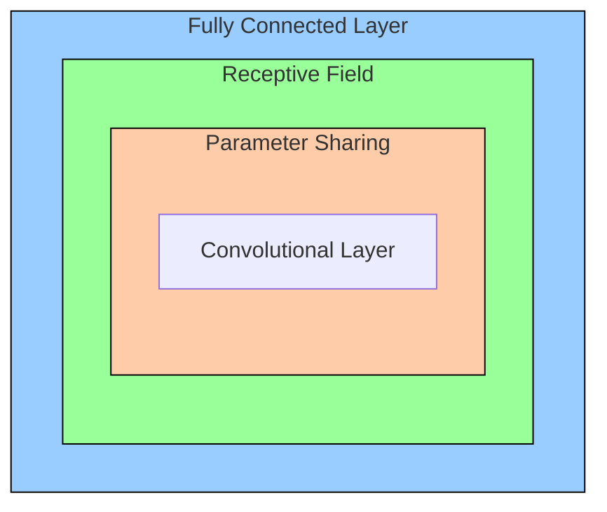
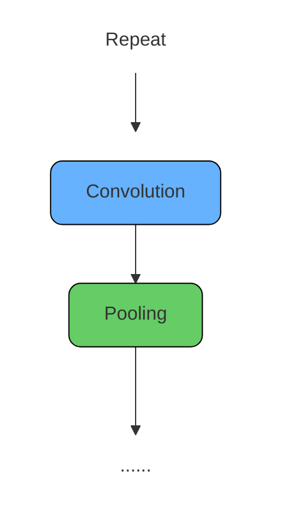

[TOC]

---

## 一、卷积

label是一个高维的one-hot vector

- 图像是一个三维tensor（长、宽、通道）
- 如果是100 × 100 的图片，全连接则会有 $100 × 100 × 3 × 1000 = 3\times10^7$ 个weight需要调整，计算量非常大
- 人看图片也是根据图片中的特征，也许并不需要整张图片

---

### 1、神经元视角

每个neuron只考虑自己的receptive field中的即可，比如receptive field是 $3\times3$，那么每个neuron只需要考虑 $3\times3\times3$ 的一个列向量

经典设计：

- 考虑所有通道
- kernel size ：$3\times3$
- 一个receptive field 会有一组neuron对其响应
- stride = 2 → overlap = 1


__参数共享__：某些neuron参数一样，检测的是相同的内容


!!! danger "？Bias"
    bias很大，但是由于图像识别本身就可以接受弹性，而全连接会存在过拟合问题

---

### 2、卷积核视角

convolution层里面有**很多**`filter`，每个`filter`就是$3\times3\times3$ 的`tensor`，和图片中的receptive field做点乘 → **寻找特征**

每个filter和原图中的receptive field点成得到的新图称为“Feature Map”，比如有63个fliter，stride = 1，那么第二层就会有 $3\times3\times64$个filter

----

共用参数就是filter，filter扫过整张图片就是convolution的过程

| **神经元视角**                   | **卷积核（滤波器）视角**         |
| -------------------------------- | -------------------------------- |
| 每个神经元只考虑一个感受野。     | 有一组滤波器用来检测局部小模式。 |
| 不同感受野位置的神经元共享参数。 | 每个滤波器在输入图像上滑动卷积。 |

---


## 二、池化

Max/Min/Mean Pooling：通过在窗口内选取 最大/最小/平均 值来**缩小特征图尺寸**，同时保留关键信息。



!!! example "AlphaGo"
    CNN应用于下围棋
    
    1. **围棋棋盘是一个二维空间（19x19的网格）**
    
           - 棋盘就像一张图像，黑白棋子分布在网格上，棋子形成的形状、连接、眼、死活等都有**局部和全局的空间模式**。
           - CNN 善于处理这种“网格状”的数据，就像它处理图像中的像素关系一样。
    
    2. **局部模式识别（局部特征提取）**
           - 在围棋中，有很多**局部定式**（比如星位小飞、二间夹、虎口）是围棋手熟知的战术。
    
    3. **Pooling移除**
           - 但是这里特别注意不需要pooling，浅显的想就是随意地移除行或者列棋局是不一样的，而且本来就是19x19尺寸很小不需要下采样来降低尺寸

---

## 🌟 HW03

<div class="grid cards" markdown>

- [:fontawesome-brands-git-alt: __HW03__ reference code -- “__CNN__”](https://github.com/Gerard-Devlin/NTU-EE5184/tree/main/HW03)


</div>

??? danger "Gimmicks"
    - 以下方法是原本HW03禁止使用的方法，也就是使用pretrained model，__方法仅作参考__，这里使用ResNet101

    ResNet-101 是 **Residual Neural Network（ResNet）** 的一种变体，专门用于 **图像分类、目标检测和语义分割** 等任务。它由 **101 层** 深度卷积神经网络组成，主要特点是 **残差连接（Residual Connections）**，可以有效解决 **深度网络中的梯度消失** 和 **梯度爆炸** 问题。
    
    ------
    
    **1️⃣ ResNet-101 结构**
    
    ResNet-101 由 **卷积层（Conv）、批归一化（BatchNorm）、ReLU 激活函数和残差块（Residual Blocks）** 组成。
     它与 ResNet-50 结构类似，但有 **更深的层数**：
    
    **2️⃣ 残差连接（Residual Connection）**
    
    **核心思想：跳跃连接（Skip Connection）**
     在深度学习中，层数过多会导致梯度消失（Vanishing Gradient）。ResNet 通过 **残差连接** 解决了这个问题。
    
    ------
    
    **3️⃣ 代码实现**
    
    - 需要添加依赖
    
    ```python
    import torchvision.models as models
    from torchvision.models import resnet50, ResNet50_Weights
    ```
    
    ```python
    class Classifier(nn.Module):
        def __init__(self, num_classes=11):
            super(Classifier, self).__init__()
    
            # 加载 ResNet101 预训练模型
            self.resnet = models.resnet101(weights=ResNet50_Weights.IMAGENET1K_V1)
    
            # 仅解冻 ResNet101 的最后几层进行训练
            for param in self.resnet.parameters():
                param.requires_grad = False
            for param in self.resnet.layer4.parameters():  # 仅解冻 layer4
                param.requires_grad = True
    
            # 修改全连接层
            in_features = self.resnet.fc.in_features
            self.resnet.fc = nn.Sequential(
                nn.Linear(in_features, 1024),
                nn.BatchNorm1d(1024),  # 加速收敛
                nn.ReLU(),
                nn.Dropout(0.2),  # 增加 Dropout 防止过拟合
                nn.Linear(1024, 512),
                nn.BatchNorm1d(512),
                nn.ReLU(),
                nn.Dropout(0.2),
                nn.Linear(512, num_classes)
            )
    
        def forward(self, x):
            return self.resnet(x)    
    ```
!!! tip
    因为是图像处理，可以做一个**数据增强**以增加模型弹性（泛化能力、鲁棒性），再修改网络，调整超参数等等

1、__数据增强__

```python
train_tfm = transforms.Compose([
    # Resize (height = width = 128)
    transforms.Resize((128, 128)),
    transforms.RandomHorizontalFlip(),  # 随机水平翻转图像
    transforms.RandomRotation(15),      # 随机旋转15度
    transforms.ColorJitter(brightness=0.2, contrast=0.2, saturation=0.2, hue=0.2),  # 随机色彩调整
    transforms.RandomAffine(10, shear=10),  # 随机裁切角度
    # ToTensor() 转换为张量
    transforms.ToTensor(),
])
```

2、__残差连接（ResNet架构）__

```python
class ResidualBlock(nn.Module):
    def __init__(self, in_channels, out_channels, stride=1, downsample=None):
        super(ResidualBlock, self).__init__()
        self.conv1 = nn.Conv2d(in_channels, out_channels, kernel_size=3, stride=stride, padding=1, bias=False)
        self.bn1 = nn.BatchNorm2d(out_channels)
        self.conv2 = nn.Conv2d(out_channels, out_channels, kernel_size=3, stride=1, padding=1, bias=False)
        self.bn2 = nn.BatchNorm2d(out_channels)
        self.downsample = downsample  # 用于匹配维度

    def forward(self, x):
        identity = x
        if self.downsample is not None:
            identity = self.downsample(x)  # 处理维度变化
        
        out = F.relu(self.bn1(self.conv1(x)))
        out = self.bn2(self.conv2(out))
        out += identity  # 残差连接
        return F.relu(out)

class ResNetClassifier(nn.Module):
    def __init__(self):
        super(ResNetClassifier, self).__init__()
        self.conv1 = nn.Conv2d(3, 64, kernel_size=3, stride=1, padding=1, bias=False)
        self.bn1 = nn.BatchNorm2d(64)
        
        self.layer1 = ResidualBlock(64, 128, stride=2, downsample=nn.Sequential(
            nn.Conv2d(64, 128, kernel_size=1, stride=2, bias=False),
            nn.BatchNorm2d(128)))
        self.layer2 = ResidualBlock(128, 256, stride=2, downsample=nn.Sequential(
            nn.Conv2d(128, 256, kernel_size=1, stride=2, bias=False),
            nn.BatchNorm2d(256)))
        self.layer3 = ResidualBlock(256, 512, stride=2, downsample=nn.Sequential(
            nn.Conv2d(256, 512, kernel_size=1, stride=2, bias=False),
            nn.BatchNorm2d(512)))
        
        self.avgpool = nn.AdaptiveAvgPool2d((1, 1))
        self.fc = nn.Sequential(
            nn.Linear(512, 1024),
            nn.ReLU(),
            nn.Linear(1024, 512),
            nn.ReLU(),
            nn.Linear(512, 11)
        )
        
    def forward(self, x):
        out = F.relu(self.bn1(self.conv1(x)))
        out = self.layer1(out)
        out = self.layer2(out)
        out = self.layer3(out)
        out = self.avgpool(out)
        out = torch.flatten(out, 1)
        return self.fc(out)

```

---

