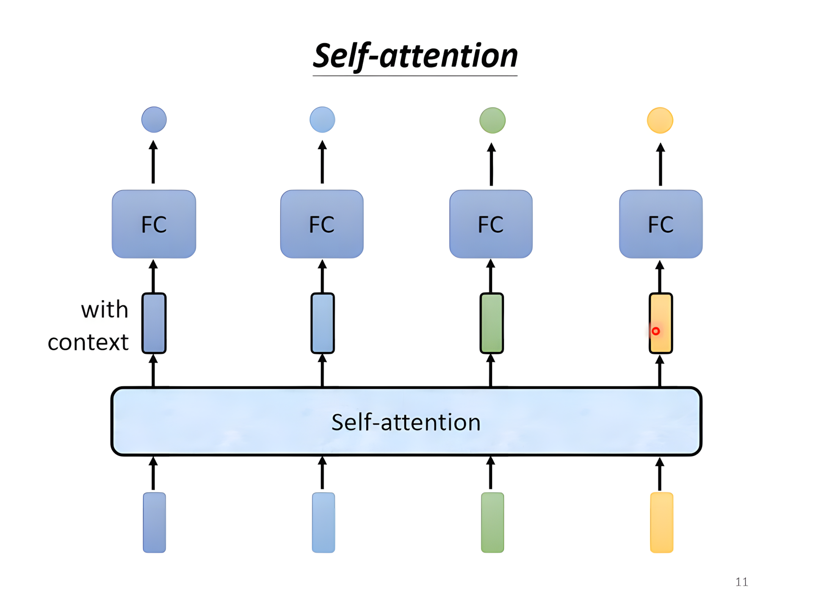
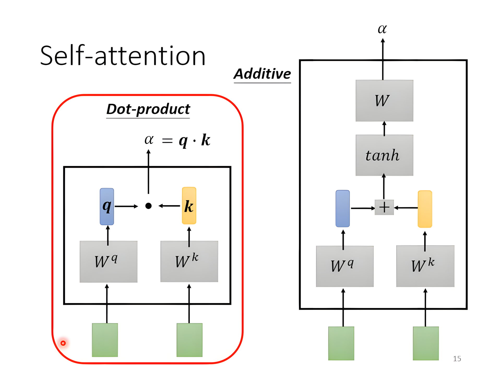
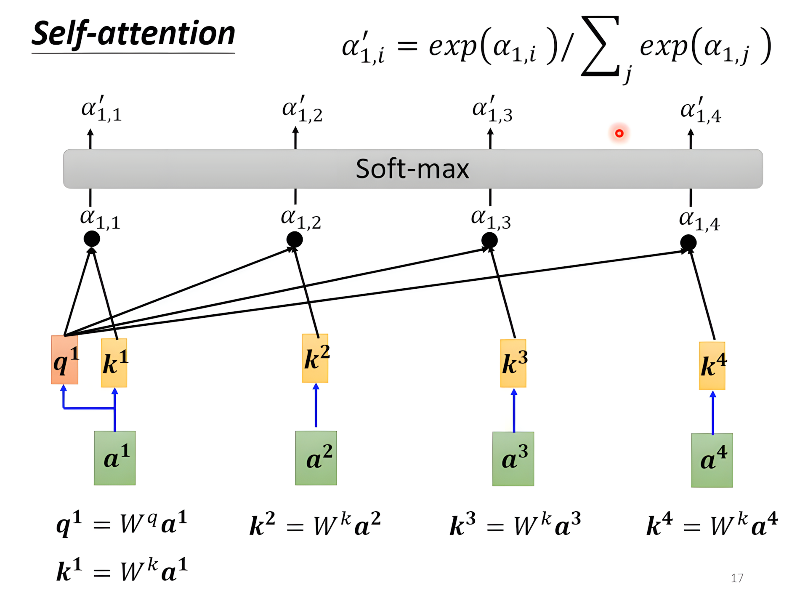
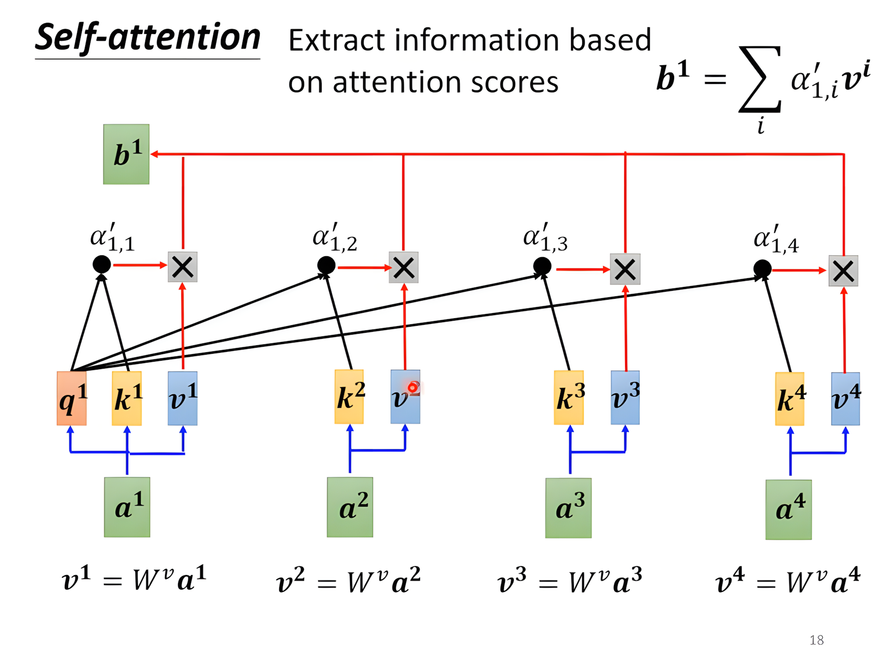
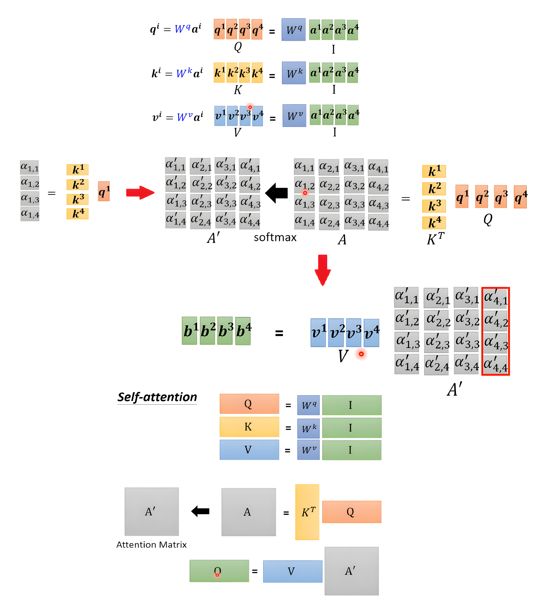
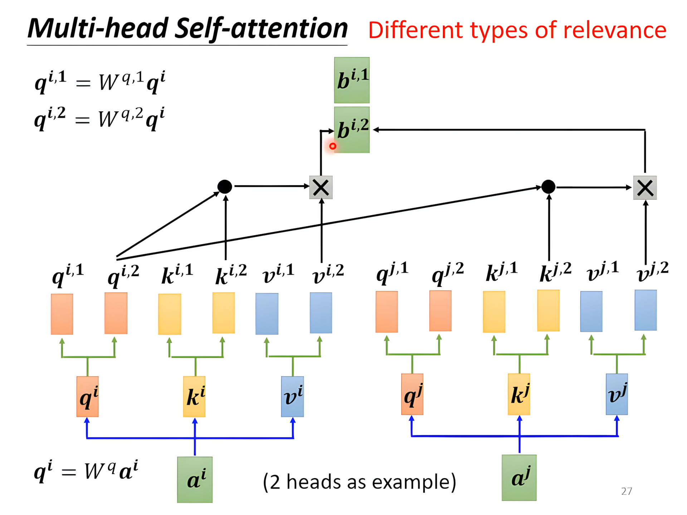
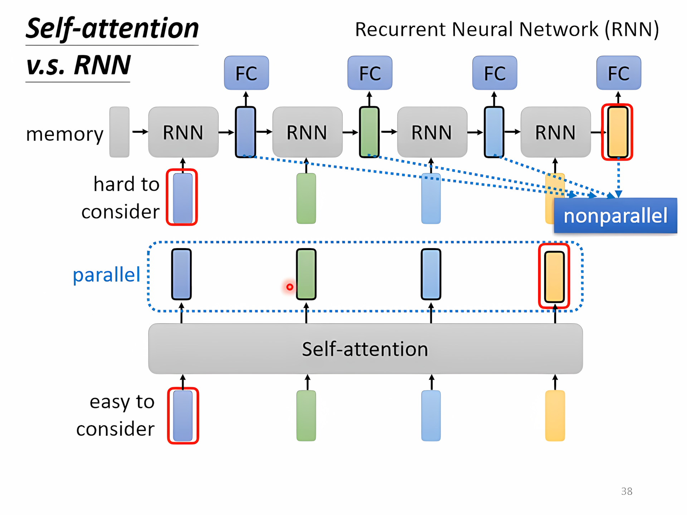
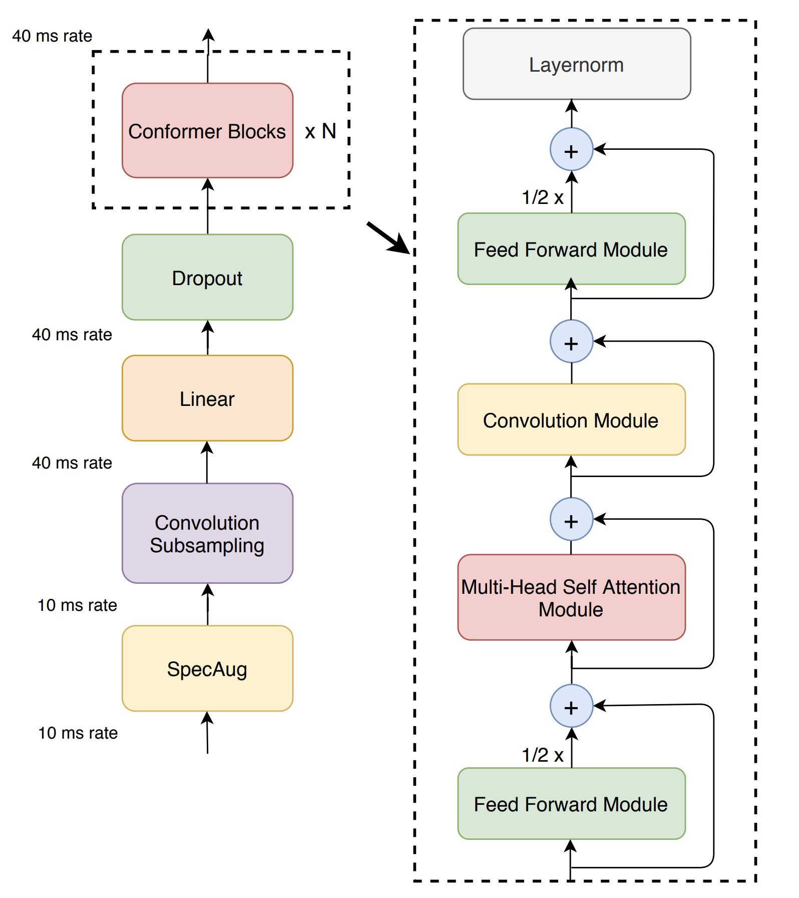

[TOC]

---

## 一、引入

输入是一个向量可以用之前的模型解决，但假如输入是一排向量而且数量不固定，这时候怎么办？

### 1、输入

问题： 输入一句句子，每个词可以看作一个向量，如何编码？

解决方法：

- One-hot Encoding：可以开一个很长的one-hot vector，但是向量**没有**任何**语义**信息
- Word Embedding：含有语义信息

!!! example
    e.g. 一段声音信号，取25ms为一个frame，用一个向量描述一个frame中的信息，每次向右滑动10ms，所以1s含有100个frame
    
    e.g. 图（Graph）可以被看作是一组向量。这里的“向量”指的是图的每一个节点，每个节点都可以被视为一个向量。

---

### 2、输出

- **一个输入有一个输出**。每个输入数据点（向量）都有一个对应的输出或类别（标签）
    - e.g. 词性标注（POS tagging），Social Network
- **一整个序列只有一个输出**
    - e.g. 情感分析（Sentiment Analysis），语者辨识（Speaker  recognition）
- **不知道要输出几个类别（标签）**
    - e.g. `seq2seq`翻译，语音辨识

---

### 3、序列标注

序列标注（sequence labelling）：就是**给序列中的每个元素打标签**，一般会**参考前后一定范围（窗口）**的数据来做决定，比如用 BiLSTM 或 Self-Attention 处理上下文信息。

!!! bug
    全连接：比如词性标注，e.g. I saw a saw. 一句话中同一个词词性输出一定一样

    → 改进：考虑一个window的vector

!!! question "怎么考虑整个序列？"  
    → 自注意力机制

---

## 二、自注意力



<div class="grid cards" markdown>

- [:fontawesome-brands-medapps:__Attention__ Is All You Need](https://arxiv.org/abs/1706.03762)

</div>


---

### 1、机制

- 寻找词之间的关联性 $\alpha$
    - 每个词当作query和其他词当作key做dot-product，算出attention score（自己和自己也要算关联性），之后做一个`Soft-max`（不一定是`Soft-max`，`ReLU`也可以）







---

#### 矩阵乘法角度

$$
\text{Attention}(Q, K, V) = \text{softmax} \left(\frac{QK^T}{\sqrt{d_k}}\right) V
$$

其中：

- $Q$（Query）：查询矩阵，表示当前词的查询向量
- $K$（Key）：键矩阵，表示整个序列中的键向量
- $V$（Value）：值矩阵，表示整个序列中的值向量
- $d_k$：向量的维度，$\sqrt{d_k}$ 用于数值稳定性



---

### 2、多头自注意力

**多头机制（Muti-head Self-attention）**的核心思想是：让模型可以学习多个不同的注意力模式，从不同的角度理解输入数据。
$$
\text{MultiHead}(Q, K, V) = \text{Concat}(\text{head}_1, \dots, \text{head}_h) W^O
$$


其中：

- $\text{head}_i = \text{Attention}(QW_i^Q, KW_i^K, VW_i^V)$
- $W_i^Q, W_i^K, W_i^V$ 是不同头的投影矩阵
- $W^O$ 是最终输出的投影矩阵




??? info
    - 位置编码 :在每个 $a^i$ 上加上一个 $e^i$，$e^i$ 是人定的（尚待研究）
    
    - Self-attention 应用：
    
        - 语音：truncated self-attention
    
        - 图片：把图片看作vector set → 那么CNN和Self-attention都可以处理图片有什么区别呢？
---

### 3、对比CNN/RNN

!!! danger "Comparison"

    比较① ：Self-attention v.s CNN
        
    - CNN可以看作简化版的Self-attention，因为每个neuron只考虑receptive field
    
    - CNN在资料少的时候效果好，Self-attention在资料多的时候效果好。CNN弹性小，资料多容易过拟合；Self-attention弹性大，资料多了反而效果好
    
    ---
    
    比较② ：Self-attention v.s RNN
    
    

---

## 🌟 HW04

<div class="grid cards" markdown>

- [:fontawesome-brands-git-alt: __HW04__ reference code -- “__Self-attention__”](https://github.com/Gerard-Devlin/NTU-EE5184/tree/main/HW04)

</div>

!!! tip
    思路照旧：先调整模型（构建Conformer架构，多一个convolutional module），再调整超参数

- 可以尝试 `self-attention pooling` ， `additive margin softmax`，还有使用 __`conformer`__

??? info "Dataset"
    - 文件结构如下
      ``` bash
      \- data directory 
       |---- metadata.json # `"n_mels"`：梅尔谱的维度。
       |                   # `"speakers"`：一个字典。**键**：说话人 ID；**值**：包含 "特征路径" 和 "梅尔长度"
       |---- testdata.json # 信息基本同上
       |---- mapping.json  # “speaker2id”: 指明了演讲者和 id 的对应关系，例: id00464": 0, “id00559”: 1, “id00578”: 2, “id00905”: 3
       |---- uttr-{random string}.pt # 语音片段
      ```

---


