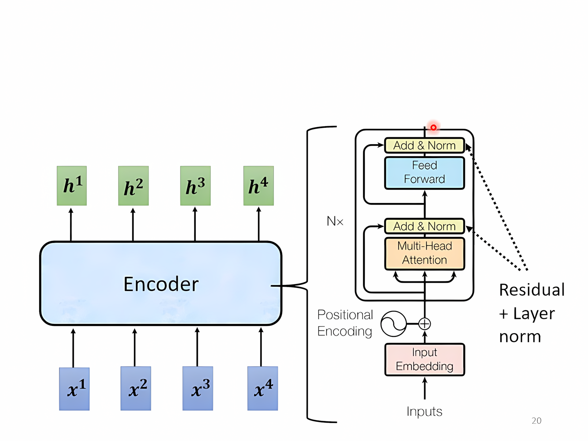
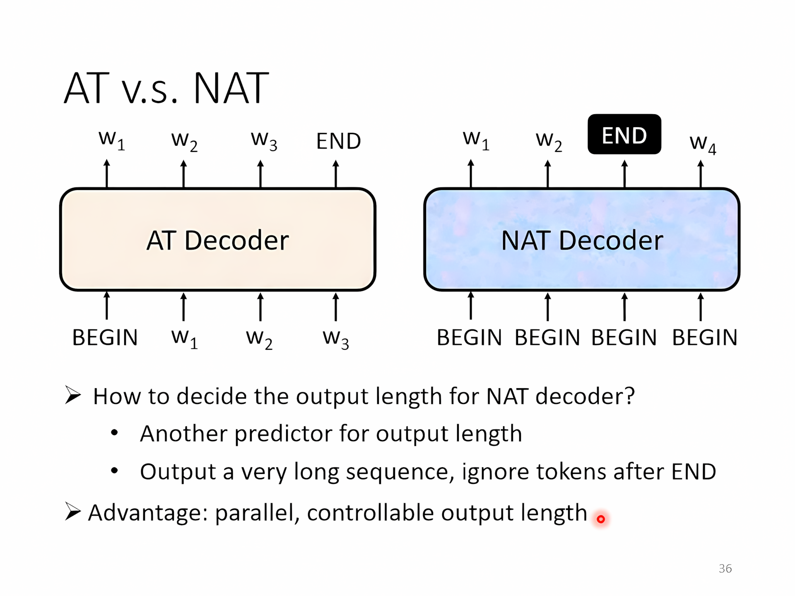
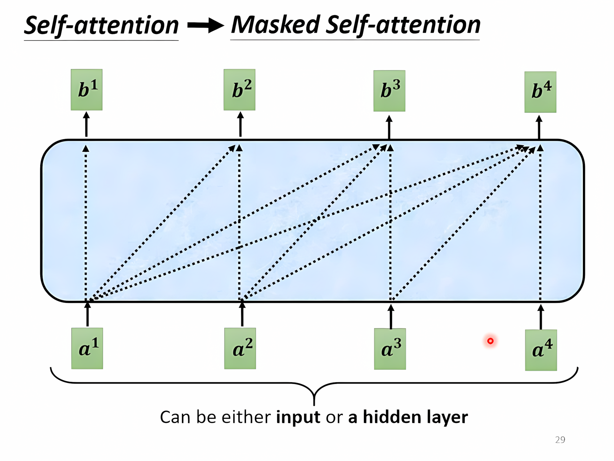

[TOC]

---

## 一、简述

输入一个sequence输出一个sequence，输出长度由模型决定（语音识别中甚至可以做到语言没有文字形式也可以做翻译!）

应用：语音识别、语音合成（TTS）、Chatbot、NLP（看作是Q&A → 用**seq2seq**的模型解决）、文法剖析、Muti-label Classification、目标检测……

!!! info
    Muti-label Classification和Muti-class Classification 有区别，前者是一个东西可以有多个标签，后者是多类用softmax即可

---

## 二、Transformer模型

### 1、`Encoder`

输入和进入self-attention block之后做残差连接（residual），在做normalization（layer normalization，只对一个向量即可不需要batch）。之后再经过FC layer，同样也有一个残差连接，再做一个layer normalization。

!!! warning
    但是这边原始的网络架构也不是最优的

---

### 2、`Decoder`    

__过程:__

给一个`special token`表示开始，用一个one-hot vector表示，向量大小为字库的大小（汉字用一个字，英文用subword），经过decoder再经过softmax输出概率最高的字，decoder把前一个时间点的输出当作下一次的输入（有可能error propagation），再给定一个`special token` 表示结束

---

#### AT v.s. NAT

**自回归**（Autoregressive）:每次预测都是基于当前输入和先前生成的输出进行的。

- AT Decoder：逐步生成，质量较高但速度较慢。
- NAT Decoder：一次性并行生成，速度较快但可能牺牲质量。

---

观察图发现decoder中间去掉和encoder是几乎一样的，除了输入经过的是`Masked Muti-head Attention`。

#### 掩码自注意力

Masked Muti-head Attention

- **掩码**：在掩码自注意力中，会对注意力矩阵应用掩码。如果词元 `i` 正在关注词元 `j`（且 `j > i`），则掩码会将这些位置的注意力分数设置为 `-inf`，这样它们的贡献在通过 softmax 后会变成零。

- **因果性**：这种机制防止未来的词元影响当前词元，保持序列生成过程中的因果关系。

---

### 3、Encoder → Decoder

**Cross attention**机制，再**LSTM encoder/decoder**中也有使用，不是在transformer中才出现

|                | **Attention（注意力）** | **Self-Attention（自注意力）**  |
|----------------| ----------------------- | ------------------------------- |
| Query 来源       | 目标序列（Decoder）     | 输入序列本身（Encoder/Decoder） |
| Key / Value 来源 | 源序列（Encoder）       | 输入序列本身（Encoder/Decoder） |
| 关注范围           | 目标序列关注源序列      | 序列中的所有位置相互关注        |
| 主要用途           | Encoder-Decoder 交互    | 计算句子内部的语义关系          |

!!! warning
    `cross attention`不一定是`encoder`最后一层和`decoder`连接，也可以有各种其他的连接方式

---

## 三、训练

- 思路就是分类的思路：decoder产生结果是一个softmax产生的概率分布，ground truth是由one-hot vector表示，然后想办法最小化cross-entropy
- 投喂给decoder的就是ground truth（Teacher forcing：使用ground truth作为输入）
- **评估模型**：选择BLEU score高的而不是Loss低的
- 我用了Teacher forcing导致decoder收到的都是正确答案，那么现实中encoder给出的不是正确答案怎么办（产生exposure bias）：**Scheduled Sampling（计划采样）** 是一种用于训练 **序列到序列（Seq2Seq）模型** 的方法，主要是为了减少 **Exposure Bias（暴露偏差）** 问题。
    - **Scheduled Sampling** 的核心思想是：训练时，我们不总是使用 Ground Truth，而是**随机选择** Ground Truth 或者模型自己生成的输出作为下一步的输入。schedule的就是随机的概率

!!! danger
    training过程中不用BLEU score来调参，**BLEU** 是一个离散的评估指标，**不可微**，这使得无法直接对其进行梯度计算。**强行**要使用可以用**RL**

!!! tip
    1️⃣ 拷贝机制（Copy mechanism）：e.g. 生成摘要、聊天机器人
    
    **思路**：允许模型 **从词表（Vocabulary）生成词**（像标准 Seq2Seq）。也允许模型 **直接从源文本拷贝词**（通过 Attention 指向源文本）。**最终选择：** 由模型动态决定当前时间步是“生成”还是“拷贝”。
    
    ---
    
    2️⃣️ 引导注意力（Guided attention）：e.g. 语音辨识就要注意力从左向右……
    
    核心目标是 **让注意力分布更规则、更符合输入输出的自然对齐**，避免注意力漂移、跳跃、或者重复关注错误的部分。
    
    ---
    
    3️⃣ 束搜索（Beam search）
    
    在 **序列生成任务** 中，目标是生成概率最高的输出序列：
    
    $$
    Y^* = \arg\max_Y P(Y | X)
    $$

    - **贪心搜索（Greedy Search）** 只考虑每一步概率最大的 token，可能错过全局最优解。
    - **Beam Search 通过维护 $k$ 个最优候选序列**（称为 **beam width**），避免局部最优，提升翻译质量。
    
---
## 🌟 HW05

- [:fontawesome-brands-git-alt: __HW05__ reference code -- “__Transformer__”](https://github.com/Gerard-Devlin/NTU-EE5184/tree/main/HW05)

---

    
