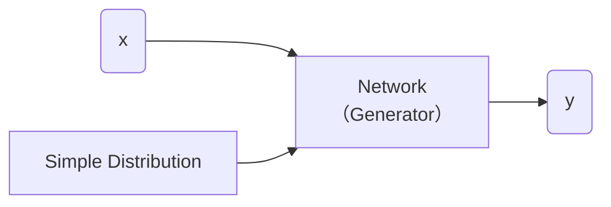
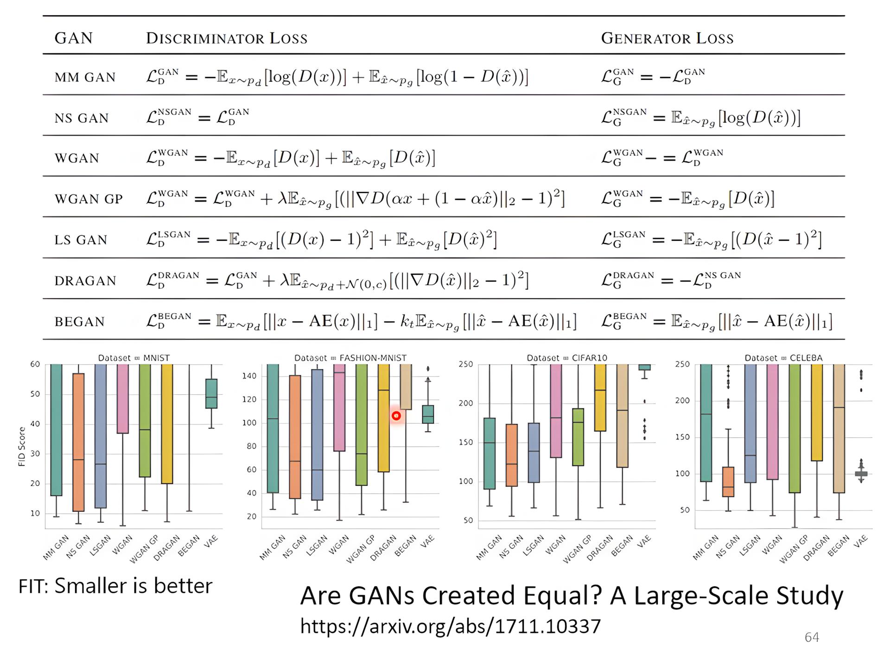
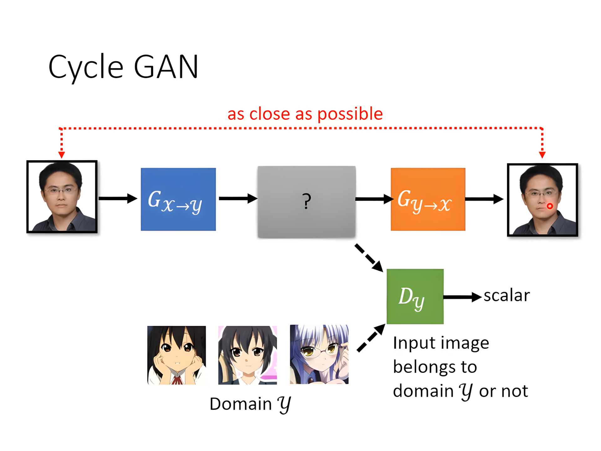
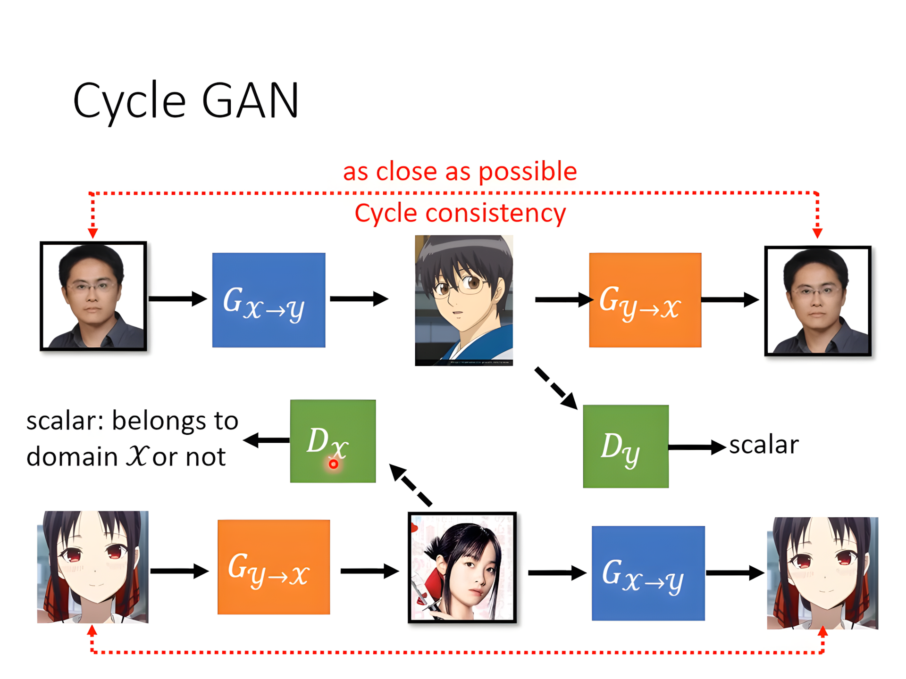

[TOC]

---

## 一、基本概念

### 1、结构

#### 生成器（Generator）

- **输入噪声**：生成器接收一个随机噪声向量（通常是一个高维的随机向量，或者从标准分布（例如高斯分布）中抽取），这个噪声是生成器的“种子”，它并不代表任何特定的数据或信息。

- **数据生成**：生成器通过一系列的神经网络层（通常是全连接层、卷积层等），将噪声转化为一个数据样本，可能是图像、音频、文本等，具体取决于生成的任务。



- 简单分布的方程我们知道，比如高斯分布、正态分布……

??? question  "为什么要分布？"

    比如生成视频的模型单纯使用监督学习可能出现出现鬼影的情况，这时就应该加入分布**处理多样性和不确定性**
    
    - 当任务需要创造力（e.g. 绘画、chatbot

---

#### 判别器（Discriminator）

它的任务是区分由生成器（Generator）生成的假数据和真实数据。经过对抗训练，生成器生成的数据越来越真实，判别器则变得越来越难以分辨真假数据。

---

### 2、无条件生成

这样的模型会从**随机噪声**生成图像，而**不依赖于任何输入**或指导图像内容的特定信息。


---

算法

- step1：固定生成器 $G$，更新判别器 $D$（就当作分类的问题来做）
- step2：固定判别器 $D$，更新生成器 $G$
- 反复重复step1，step2

---

## 二、理论

### 1、目标函数
**目标**：是训练一个生成器 $G$，使其将简单的分布（如正态分布）转换为与真实数据分布 $P_{data}$ 匹配的复杂分布。这是通过最小化生成分布 $P_G$ 与真实数据分布 $P_{data}$ 之间的散度 $\text{Div}(P_G, P_{data})$ 来实现的。

$$
G^*=\arg\min_G Div(P_{G},P_{Data})
$$

**训练**：$D^* = \arg \max_D V(D, G)$

判别器D的**目标函数**：

$$
V(G, D) = \mathbb{E}_{y \sim P_{data}}[\log D(y)] + \mathbb{E}_{y \sim P_G}[\log(1 - D(y))] 
$$

!!! tip 
	- 叫目标函数是因为要maximize，叫Loss是要minimize
	- 这个就是 ==cross-entropy== 取负号，最大化目标函数可以当作就是最小化Loss

$$
G^*=\arg\min_G \max_D V(G,D)
$$

- 这个等式的过程就是前面所说的生成器和判别器的迭代过程

---

## 三、训练技巧 - WGAN

!!! danger "$JS$ 散度不适合"  
    - ①$P_G, P_{data}$ 是在高维中的低维流形（manifold）
    - ②只要采样不够多，那么交叠区域会很小
    
    只要分布不重合那么$JS(P_G, P_{data})=\log2$ 恒成立 $\Rightarrow$ 如果两个分布完全不重叠，**二元分类器**可以达到100%的准确率。在GAN训练过程中，准确率（或损失）可能没有意义，因为即使生成器分布与真实数据分布完全不同，JS散度仍然可以保持不变。


$Wasserstein$ 距离：

可以被直观地理解为：假设有两个分布，一个是源分布，另一个是目标分布，$Wasserstein$ 距离就是将源分布“移动”到目标分布所需的最小“工作量”。这里的“工作量”是根据分布之间的“距离”来计算的。

用$Wasserstein$ 距离代替$JS$ 散度就是WGAN:

$$
D_{Wasserstein}=\max_{D \in 1-Lipschitz} \left\{ \mathbb{E}_{y \sim P_{data}}[D(x)] - \mathbb{E}_{y \sim P_G}[D(x)] \right\}
$$

$D \in 1-Lipschitz \Rightarrow$D必须是一个足够平滑的分布

??? tip
    - **Tips from Soumith**
        - [https://github.com/soumith/ganhacks](https://github.com/soumith/ganhacks)
      - **Tips in DCGAN: Guideline for network architecture design for image generation**
          - [https://arxiv.org/abs/1511.06434](https://arxiv.org/abs/1511.06434)
      - **Improved techniques for training GANs**
          - [https://arxiv.org/abs/1606.03498](https://arxiv.org/abs/1606.03498)
      - **Tips from BigGAN**
          - [https://arxiv.org/abs/1809.11096](https://arxiv.org/abs/1809.11096)

!!! warning
    
    GAN生成文字（序列）：改变decoder输出，不影响最大的token，分布没有变化，导致判别器输出的分数没有变化，所以**不能梯度下降**
    能不能使用监督学习的方法，把一张图片当作向量然后训练？→ 可以，但是也很难


---

## 四、衡量生成质量

- 人眼衡量❌
- 对于**一张图**：跑一个影像分类器，看**分布是否集中**，集中说明**质量**（Quality）够高 → 也会有问题 **==模式崩溃（Mode Collapse）==**：生成重复内容
- **==模式掉落（Model Dropping）==**：产生的仍然与真实分布有差异缺乏**多样性**（Diversity）
- 对于**一堆图**：跑一个影像分类器，看**分布是否分散**，分散说明**多样性**足够

1️⃣使用IS（Inception Score）

$$
 P(c) = \frac{1}{N} \sum_{n} P(c|y^n) 
$$

2️⃣使用FID（Fréchet Inception Distance）✅

- 拿出进入softmax前的特征向量来计算Fréchet Distance，也称为Wasserstein-2距离。这个距离衡量了两个多变量**高斯分布**之间的差异



但是这个实验使用的网络架构都是一样的，所以有可能某些GAN对于某些架构更有偏好所以需要进一步研究来验证

---

## 五、有条件生成

无条件生成是：模型会从**随机噪声**生成图像，而**不依赖于任何输入**或指导图像内容的特定信息。

有条件生成是：

- 依赖**输入**+**分布**

- 应用：Text-to-image，图片产生图片（pix2pix）

**判别器**要有所改变，需要考虑到输入的文字。输入资料是有标注的**成对资料**（文字+图片……）

!!! danger "使用监督学习可能会产生模糊，鬼影"
	监督学习+GAN 效果最好

---

## 六、Cycle GAN

- 从不成对资料学习
- 应用：文字/图片风格转换





1. **两个生成器（Generators）：**
    - $G_{X \to Y}$：将 **域 X（如真人照片）** 转换为 **域 Y（如动漫风格图像）**。
      - $G_{Y \to X}$：将 **域 Y（如动漫风格图像）** 转换回 **域 X（如真人照片）**。
2. **两个判别器（Discriminators）：**
    - $D_Y$：用于判断输入的图像是否属于 **域 Y**（如动漫风格图像）。
      - $D_X$：用于判断输入的图像是否属于 **域 X**（如真人照片）。
      - 判别器的目标是提升生成图像的真实性，让转换后的图像更贴近目标域的真实数据分布。
3. **循环一致性（Cycle Consistency）：**
    - CycleGAN 的核心思想是**转换后的图像再转换回来，应该尽量接近原始图像**。
      - 例如，一个 **真人照片 $X$ 经过 $G_{X \to Y}$ 变成动漫风格 $Y$**，再经过 $G_{Y \to X}$ 变回 **真人照片**，应尽可能与原来的 $X$ 贴近。
      - 反之，一个 **动漫风格图像 $Y$ 经过 $G_{Y \to X}$ 变成人脸 $X$**，再经过 $G_{X \to Y}$ 变回动漫风格图像 $Y$，也应尽量与原图一致。

**关键点总结**

- **无监督学习**：不需要成对的数据进行训练，适用于风格转换、图像增强等任务。
- **GAN 损失**：通过判别器 $D_X$ 和 $D_Y$ 确保转换后的图像符合目标域的特征。
- **循环一致性损失**：确保转换后的图像在双向映射后尽可能接近原始图像。

---

## 🌟 HW06

<div class="grid cards" markdown>

- [:fontawesome-brands-git-alt: __HW06__ reference code -- “__GAN__”](https://github.com/Gerard-Devlin/NTU-EE5184/tree/main/HW06)

</div>

!!! tip
    原本代码使用DCGAN，可以改进为WGAN/WGAN-GP，需要达到较好的效果需要使用StyleGan

1.**WGAN**：从DCGAN修改而来

- 从判别器中移除最后的sigmoid层。
- 在计算损失时不取对数。
- 将判别器的权重限制在一个常数（1 ~ -1）范围内。
- 使用RMSProp或SGD作为优化器。

2.**WGAN-GP**：从**WGAN**修改而来

- 使用梯度惩罚来替代权重裁剪。
- 梯度惩罚累积来自插值图像的梯度。

```python
# Generator

class Generator(nn.Module):
    """
    Input shape: (batch, in_dim)
    Output shape: (batch, 3, 64, 64)
    """
    def __init__(self, in_dim, feature_dim=64):
        super().__init__()
    
        #input: (batch, 100)
        self.l1 = nn.Sequential(
            nn.Linear(in_dim, feature_dim * 8 * 4 * 4, bias=False),
            nn.BatchNorm1d(feature_dim * 8 * 4 * 4),
            nn.ReLU()
        )
        self.l2 = nn.Sequential(
            self.dconv_bn_relu(feature_dim * 8, feature_dim * 4),               #(batch, feature_dim * 16, 8, 8)     
            self.dconv_bn_relu(feature_dim * 4, feature_dim * 2),               #(batch, feature_dim * 16, 16, 16)     
            self.dconv_bn_relu(feature_dim * 2, feature_dim),                   #(batch, feature_dim * 16, 32, 32)     
        )
        self.l3 = nn.Sequential(
            nn.ConvTranspose2d(feature_dim, 3, kernel_size=5, stride=2,
                               padding=2, output_padding=1, bias=False),
            nn.Tanh()   
        )
        self.apply(weights_init)
    def dconv_bn_relu(self, in_dim, out_dim):
        return nn.Sequential(
            nn.ConvTranspose2d(in_dim, out_dim, kernel_size=5, stride=2,
                               padding=2, output_padding=1, bias=False),        #double height and width
            nn.BatchNorm2d(out_dim),
            nn.ReLU(True)
        )
    def forward(self, x):
        y = self.l1(x)
        y = y.view(y.size(0), -1, 4, 4)
        y = self.l2(y)
        y = self.l3(y)
        return y
```

```python
# Discriminator
class Discriminator(nn.Module):
    """
    Input shape: (batch, 3, 64, 64)
    Output shape: (batch)
    """
    def __init__(self, in_dim, feature_dim=64):
        super(Discriminator, self).__init__()
            
        #input: (batch, 3, 64, 64)
        """
        NOTE FOR SETTING DISCRIMINATOR:

        Remove last sigmoid layer for WGAN
        """
        self.l1 = nn.Sequential(
            nn.Conv2d(in_dim, feature_dim, kernel_size=4, stride=2, padding=1), #(batch, 3, 32, 32)
            nn.LeakyReLU(0.2),
            self.conv_bn_lrelu(feature_dim, feature_dim * 2),                   #(batch, 3, 16, 16)
            self.conv_bn_lrelu(feature_dim * 2, feature_dim * 4),               #(batch, 3, 8, 8)
            self.conv_bn_lrelu(feature_dim * 4, feature_dim * 8),               #(batch, 3, 4, 4)
            nn.Conv2d(feature_dim * 8, 1, kernel_size=4, stride=1, padding=0),
            nn.Sigmoid() 
        )
        self.apply(weights_init)
    def conv_bn_lrelu(self, in_dim, out_dim):
        """
        NOTE FOR SETTING DISCRIMINATOR:

        You can't use nn.Batchnorm for WGAN-GP
        Use nn.InstanceNorm2d instead
        """

        return nn.Sequential(
            nn.Conv2d(in_dim, out_dim, 4, 2, 1),
            nn.BatchNorm2d(out_dim),
            nn.LeakyReLU(0.2),
        )
    def forward(self, x):
        y = self.l1(x)
        y = y.view(-1)
        return y
```


---

