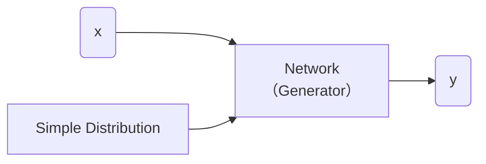

[TOC]

---

## 一、基本概念

### 1、结构

#### 生成器（Generator）

- **输入噪声**：生成器接收一个随机噪声向量（通常是一个高维的随机向量，或者从标准分布（例如高斯分布）中抽取），这个噪声是生成器的“种子”，它并不代表任何特定的数据或信息。

- **数据生成**：生成器通过一系列的神经网络层（通常是全连接层、卷积层等），将噪声转化为一个数据样本，可能是图像、音频、文本等，具体取决于生成的任务。

- 简单分布的方程我们知道，比如高斯分布、正态分布……

??? question  "为什么要分布？"

    比如生成视频的模型单纯使用监督学习可能出现出现鬼影的情况，这时就应该加入分布**处理多样性和不确定性**

    - 当任务需要创造力（e.g. 绘画、chatbot

---

#### 判别器（Discriminator）

它的任务是区分由生成器（Generator）生成的假数据和真实数据。经过对抗训练，生成器生成的数据越来越真实，判别器则变得越来越难以分辨真假数据。

---

### 2、无条件生成

这样的模型会从**随机噪声**生成图像，而**不依赖于任何输入**或指导图像内容的特定信息。

---

算法

- step1：固定生成器 $G$，更新判别器 $D$（就当作分类的问题来做）
- step2：固定判别器 $D$，更新生成器 $G$
- 反复重复step1，step2

---

## 二、理论

### 1、目标函数
**目标**：是训练一个生成器 $G$，使其将简单的分布（如正态分布）转换为与真实数据分布 $P_{data}$ 匹配的复杂分布。这是通过最小化生成分布 $P_G$ 与真实数据分布 $P_{data}$ 之间的散度 $\text{Div}(P_G, P_{data})$ 来实现的。

$$
G^*=\arg\min_G Div(P_{G},P_{Data})
$$

**训练**：$D^* = \arg \max_D V(D, G)$

判别器D的**目标函数**：

$$
V(G, D) = \mathbb{E}_{y \sim P_{data}}[\log D(y)] + \mathbb{E}_{y \sim P_G}[\log(1 - D(y))] 
$$

!!! tip 
	- 叫目标函数是因为要maximize，叫Loss是要minimize
	- 这个就是 ==cross-entropy== 取负号，最大化目标函数可以当作就是最小化Loss

$$
G^*=\arg\min_G \max_D V(G,D)
$$

- 这个等式的过程就是前面所说的生成器和判别器的迭代过程

---

### 2、训练技巧 - WGAN

!!! danger "$JS$ 散度不适合"  
    - ①$P_G, P_{data}$ 是在高维中的低维流形（manifold）
    - ②只要采样不够多，那么交叠区域会很小
    
    只要分布不重合那么$JS(P_G, P_{data})=\log2$ 恒成立 $\Rightarrow$ 如果两个分布完全不重叠，**二元分类器**可以达到100%的准确率。在GAN训练过程中，准确率（或损失）可能没有意义，因为即使生成器分布与真实数据分布完全不同，JS散度仍然可以保持不变。

$Wasserstein$ 距离：

可以被直观地理解为：假设有两个分布，一个是源分布，另一个是目标分布，$Wasserstein$ 距离就是将源分布“移动”到目标分布所需的最小“工作量”。这里的“工作量”是根据分布之间的“距离”来计算的。

用$Wasserstein$ 距离代替$JS$ 散度就是WGAN:

$$
D_{Wasserstein}=\max_{D \in 1-Lipschitz} \left\{ \mathbb{E}_{y \sim P_{data}}[D(x)] - \mathbb{E}_{y \sim P_G}[D(x)] \right\}
$$

$D \in 1-Lipschitz \Rightarrow$D必须是一个足够平滑的分布

