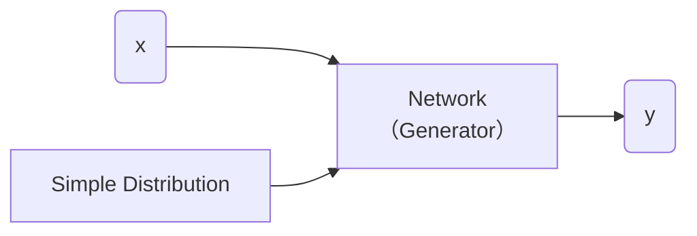
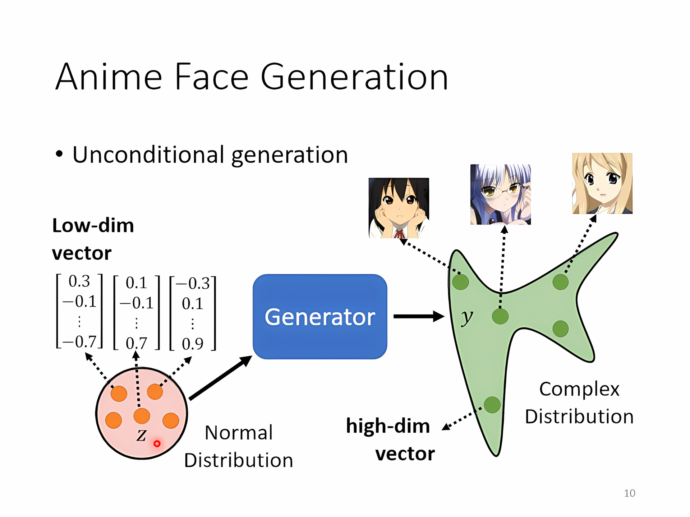
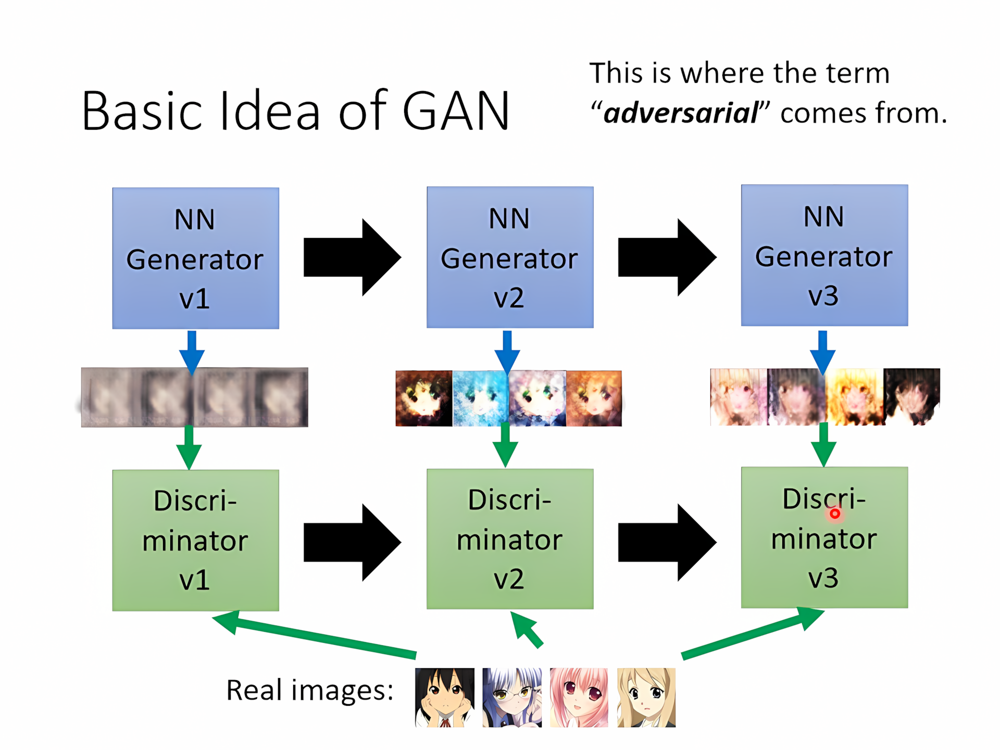

[TOC]

---

## 一、基本概念

### 1、结构

#### 生成器（Generator）

- **输入噪声**：生成器接收一个随机噪声向量（通常是一个高维的随机向量，或者从标准分布（例如高斯分布）中抽取），这个噪声是生成器的“种子”，它并不代表任何特定的数据或信息。

- **数据生成**：生成器通过一系列的神经网络层（通常是全连接层、卷积层等），将噪声转化为一个数据样本，可能是图像、音频、文本等，具体取决于生成的任务。

- 简单分布的方程我们知道，比如高斯分布、正态分布……

??? question  "为什么要分布？"

    比如生成视频的模型单纯使用监督学习可能出现出现鬼影的情况，这时就应该加入分布**处理多样性和不确定性**

    - 当任务需要创造力（e.g. 绘画、chatbot

---

#### 判别器（Discriminator）

它的任务是区分由生成器（Generator）生成的假数据和真实数据。经过对抗训练，生成器生成的数据越来越真实，判别器则变得越来越难以分辨真假数据。

---

### 2、无条件生成

这样的模型会从**随机噪声**生成图像，而**不依赖于任何输入**或指导图像内容的特定信息。

---

算法

- step1：固定生成器 $G$，更新判别器 $D$（就当作分类的问题来做）
- step2：固定判别器 $D$，更新生成器 $G$
- 反复重复step1，step2

---

## 二、理论

