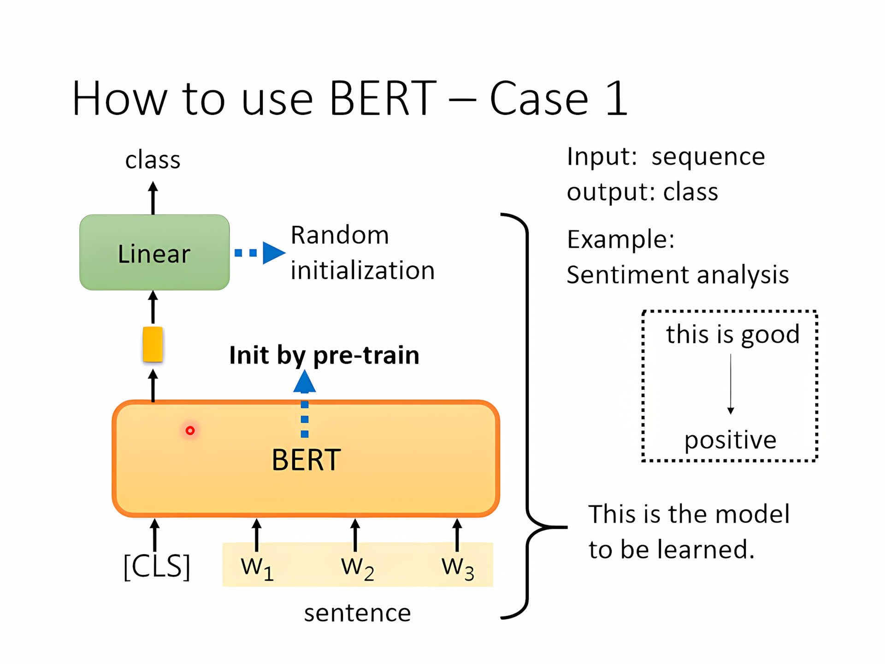
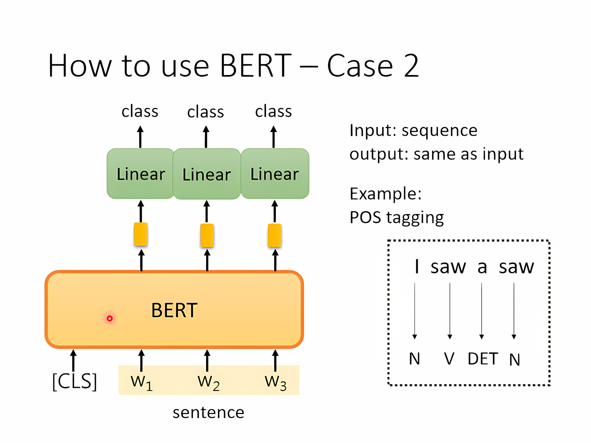
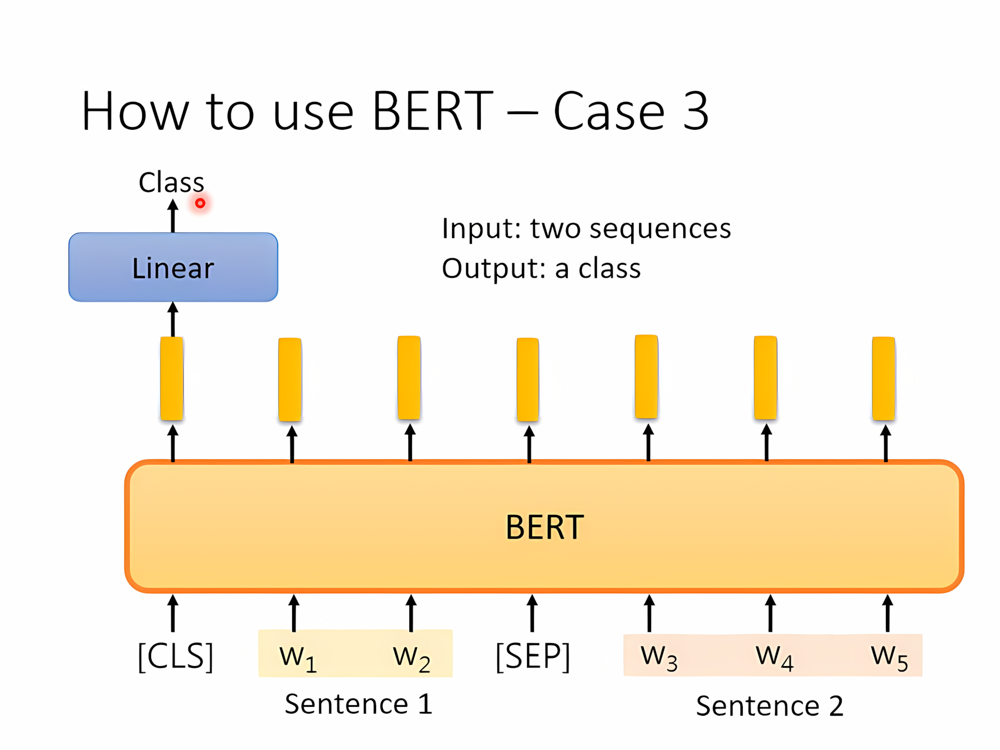
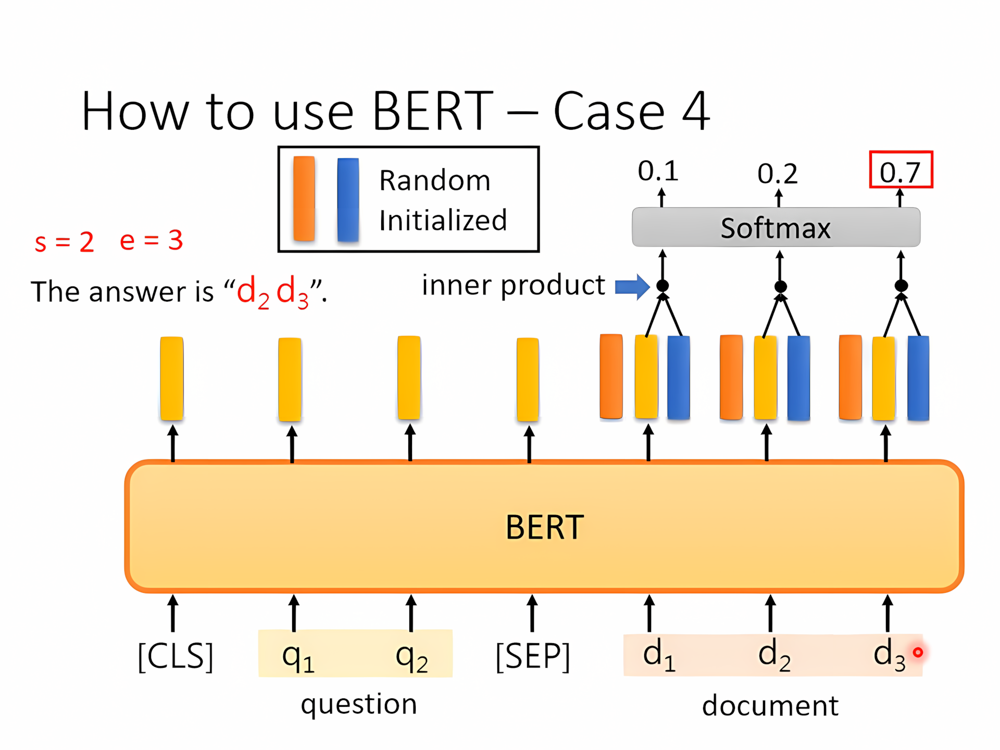
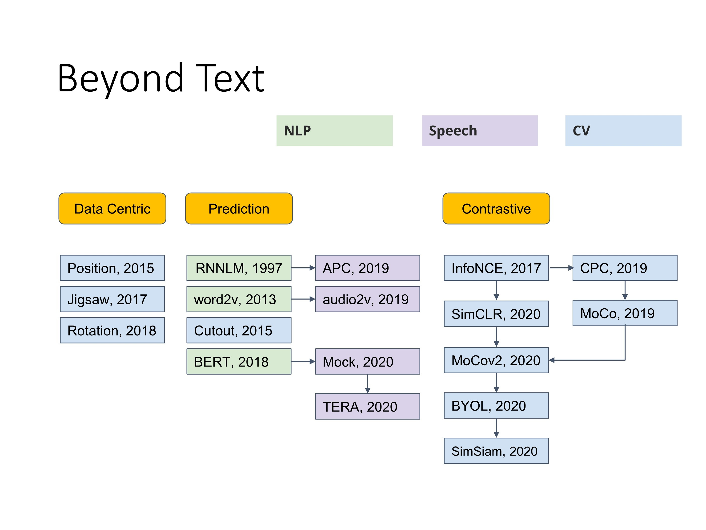

[TOC]

---

## 一、BERT简介

自监督学习：没有label

### 1、**BERT**

- 用的就是Transformer **==Encoder==**
- **输入掩码**：随机<u>盖住</u>输入的token 或者 随机<u>改写</u>某些token
- 经过encoder之后再经过**linear**和softmax，和事实相比较1，然后减小差距

---

### **2、其他操作**

!!! tip
	`[CLS]` 是 BERT 中专门用于分类任务的“总览”向量，位置固定在最前面，输出可以表示整段输入的语义。

- NSP（Next Sentence Prediction）:

    - `[CLS] 句子A [SEP] 句子B [SEP]`

    - 模型最后用 `[CLS]` 对应的输出向量，接一个全连接层预测：这两个句子是不是连续的。

    - > 后来研究发现 NSP 的效果并不是那么显著，比如 RoBERTa 就**移除了 NSP**，只用 MLM 也能取得很强的效果。

- SOP（Sentence Order Prediction）:

    - 给定两个连续的句子 A 和 B，判断它们是否是**正确的顺序**。

| 任务 | 目标                 | 难度       | 应用模型 |
| ---- | -------------------- | ---------- | -------- |
| NSP  | 判断两句是否相邻     | 相对简单   | BERT     |
| SOP  | 判断两句顺序是否正确 | 更难更有效 | ALBERT   |

---

### 3、如何使用BERT

BERT就相当于干细胞，会做填空题但是对于下游任务不太在行，需要基于我们有的少量有标注的数据**微调**（Fine tune）

- 使用**预训练的BERT**（会做填空题的）和**随机初始化的LInear层** 来做训练

---

- 和普通初始化不同就是使用了pre-trained model

---

给定一篇文章（document）和一个问题（question） → 模型输出两个整数：答案在文章中字符的“起始”和“结束”位置。

- 随机初始化query矩阵然后和文章做点乘，经过softmax确定s,e数值

---

### 4、预训练seq2seq模型

- 扰乱encoder的输入，目标是decoder还原扰乱前的输入
- 如何扰乱：删除，旋转，调换顺序……（MASS/BERT等方法）

---

## 二、关于BERT的奇闻轶事

### 1、为什么 BERT 能工作？

- 经过 BERT 处理后，每个词会被转换成一个高维向量（embedding），这个向量不仅表示该词的含义，还**考虑了它在具体上下文中的语义信息**。
- 与传统的词向量（如 Word2Vec、GloVe）不同，BERT 输出的是**动态词向量**：同一个词在不同句子中会有不同的表示。例如，"bank" 在“river bank”和“financial bank”中的表示不同。因此，BERT 可以看作是一种**进阶的上下文感知型词嵌入模型**。
- 它进一步扩展了早期如 CBOW（Continuous Bag-of-Words）模型的思想：CBOW 是通过上下文预测中心词的 embedding，但它是静态的、不感知上下文顺序的。而 BERT 通过双向 Transformer 编码器，不仅能**看到前文和后文**，还能构建出更准确的语义表示。

!!! bug
	使用BERT来分类蛋白质、DNA、音符也有更好的效果

---

### 2、多语言BERT

多语言预训练，**英文微调，中文测试**居然也有很好的效果

| 模型                    | 预训练语言 | 微调语言    | 测试语言 | EM   | F1       |
| ----------------------- | ---------- | ----------- | -------- | ---- | -------- |
| **QANet**               | 无预训练   | 中文        | 中文     | 66.1 | 78.1     |
| **BERT (中文预训练)**   | 中文       | 中文        | 中文     | 82.0 | 89.1     |
| **BERT (多语言预训练)** | 104种语言  | 中文        | 中文     | 81.2 | 88.7     |
| **BERT (多语言预训练)** | 104种语言  | 英文        | 中文     | 63.3 | 78.8     |
| **BERT (多语言预训练)** | 104种语言  | 中文 + 英文 | 中文     | 82.6 | **90.1** |

**可能解释**：不同语言的相同词汇在word-embedding之后有类似的向量（Cross-lingual alignment），使用MRR（Mean Reciprocal Rank）来衡量，MRR 在跨语言任务中的作用是评估模型在多个语言中将词汇对齐的效果，越高的 MRR 表示模型越能成功地将相同语义的词汇映射到相似的向量空间中。

---

## 三、GPT

与BERT做填空题不同，GPT目标是根据前面的生成后面的

GPT的**few-shot learning**是指它能够通过提供少量的示例来理解并执行某个任务，而不需要像传统的机器学习模型那样进行大量的训练。具体来说，GPT能够通过“提示”（prompts）来接收任务，并基于提供的几个示例生成合理的输出。

### 1、few-shot learning

- **无梯度下降**，所以又称为In-context learning 

在few-shot learning中，通常有以下几种模式：

1. **Zero-shot**：没有提供任何示例，模型仅凭借其预先学到的知识直接完成任务。例如，如果给模型一个问题，模型就会尽量用它知道的知识来回答，而不需要额外的训练。
2. **One-shot**：提供一个示例，模型基于这个单一的示例来理解任务并生成答案。这是GPT能够处理的情况，通常一个清晰的例子足够让模型理解任务。
3. **Few-shot**：提供多个示例（通常是几个），让模型更好地理解任务和目标。这比one-shot更有效，通常模型可以通过几个例子来捕捉到任务的模式，并且在实际应用中表现出较好的效果。

!!! note "🚀"
    自监督学习还可以应用于其他许多场景等待探索
    
    

---
## 🌟 HW07

- [:fontawesome-brands-git-alt: __HW07__ reference code -- “__BERT__”](https://github.com/Gerard-Devlin/NTU-EE5184/tree/main/HW07)

