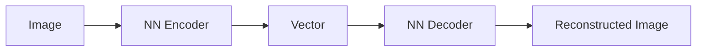
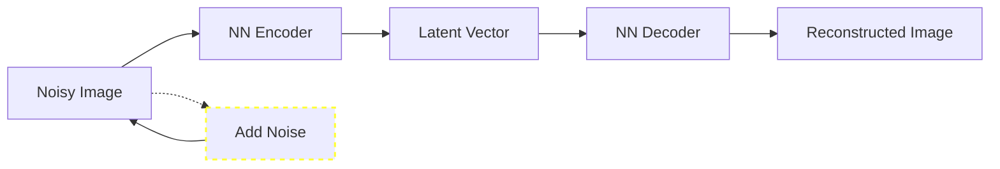
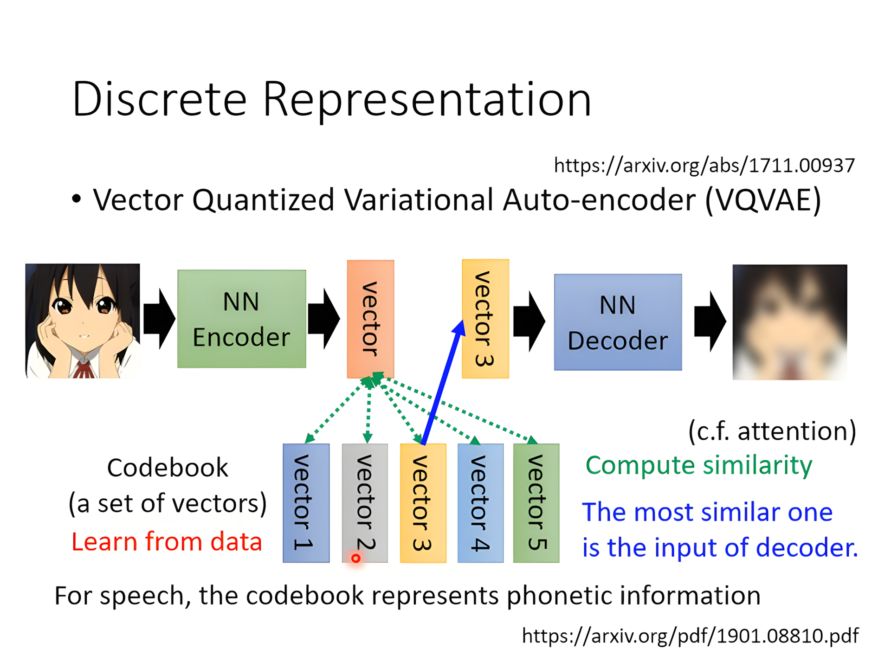
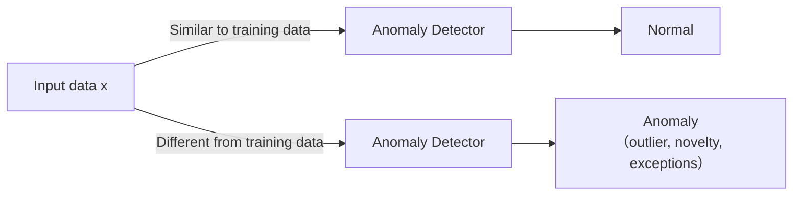
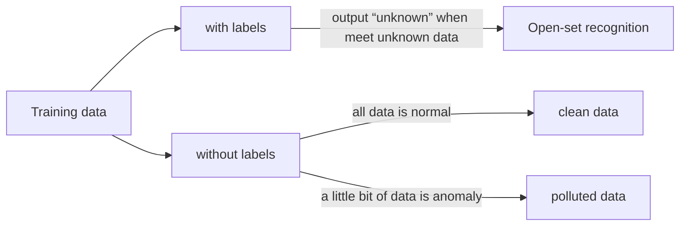
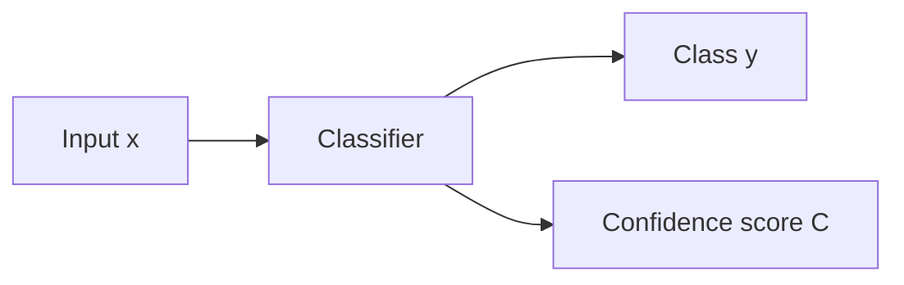

[TOC]

---

## 一、基本概念

使用自监督学习pretrain得到auto-encoder

**目标：**使输入图像和输出图像<u>**尽可能接近**</u>，这与 **CycleGAN** 的目标非常相似。通过自监督学习的方式，编码器学习将输入图像压缩为潜在向量（Latent Vector），解码器再根据该潜在向量重建原始图像。在训练过程中，我们并不直接使用标签数据，而是通过 **自监督任务**（如添加噪声、预测重建等）来强迫模型学习如何有效地提取输入数据的特征。

用于下游任务：经过自监督学习预训练的 **编码器** 部分，可以作为下游任务的特征提取器。在这个过程中，编码器将输入数据映射到一个 **低维潜在空间**（即bottleneck，Latent Vector），其中包含了数据的最重要特征。这个潜在表示（Latent Vector）被认为是对输入数据的一个紧凑而有用的描述。

---

**去噪自编码器**（Denoising Autoencoder，简称 DAE）：其实和BERT很像，也是在输入中加入了噪声

---

## 二、特征解耦

通过编码器得到一个潜在向量时，向量里的每个数字代表了输入数据的一部分信息，但我们不知道每个数字具体表示什么。这是因为编码器把所有信息混在了一起，像形状、颜色、背景等都混在同一个向量里，没办法分开。这叫做“特征纠缠”。

“特征解耦”就是想把这些混在一起的信息分开，让每个数字代表一个独立的特征，比如某个数字只代表颜色，另一个数字只代表形状。这样可以让模型更容易理解，也能让它在新数据上表现得更好。

---

### 1、离散表示
在离散表示的过程中，我们常用 二元表示 或者 one-hot表示 来表示一个潜在向量（latent vector）。这些表示方式主要用于将连续的潜在空间离散化，从而让模型能够在离散的空间中进行学习和生成。

VQ-VAE（Vector Quantized Variational Autoencoder）是一种基于离散潜在表示的变分自编码器，它通过引入量化操作将潜在空间映射到离散的表示中。具体来说，它会将连续的潜在向量映射到一个固定大小的离散字典中，而这个字典是由一组离散的编码向量组成的。这样，VQ-VAE就能够利用这种离散表示来生成和重构数据，而不是像传统的变分自编码器那样使用连续潜在空间。

---

## 三、更多应用

把decoder当作生成器用，比如VAE，Anomaly Detection

### 1、异常检测

!!! bug
    比较容易收集正常资料，异常资料难以收集（one class） → auto-encoder

训练出auto-encoder然后看输入输出差异，如果差异很大则为异常

---

## 四、异常检测

目标：找出异常的数据（**和资料不像的**）

用二元分类？→ ❌ 不能穷举所有除了正常的数据以外的情况；难以收集异常数据

---

### 1、有label的分类

$$
f(x) = 
\begin{cases} 
\text{normal}, & c(x) > \lambda \\
\text{anomaly}, & c(x) \leq \lambda 
\end{cases}
$$

**Dev Set（开发集/验证集）**：实际上就是validation set

- 开发集（或称验证集）是用于在训练过程中评估模型性能的数据集。它用于调整模型的超参数（如学习率、正则化项等），并帮助监控模型是否过拟合。
- 验证集不参与训练，但它能够提供模型在未见过数据上的表现，帮助评估模型的泛化能力。

在异常检测中，**准确率不是一个好指标**，因为大部分数据可能是正常的，模型如果都预测为正常，准确率会很高，但并没有识别出异常。所以我们更关注模型在识别异常时的表现，比如召回率或F1分数，而不是简单的准确率。

决定$\lambda$：不单纯由多少数量的被检测错误来决定，而是要根据实际情况乘以一个cost table来计算损失

---

