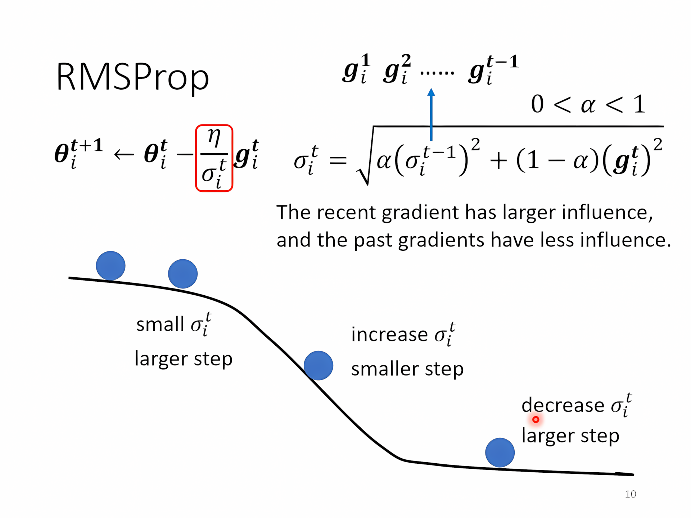
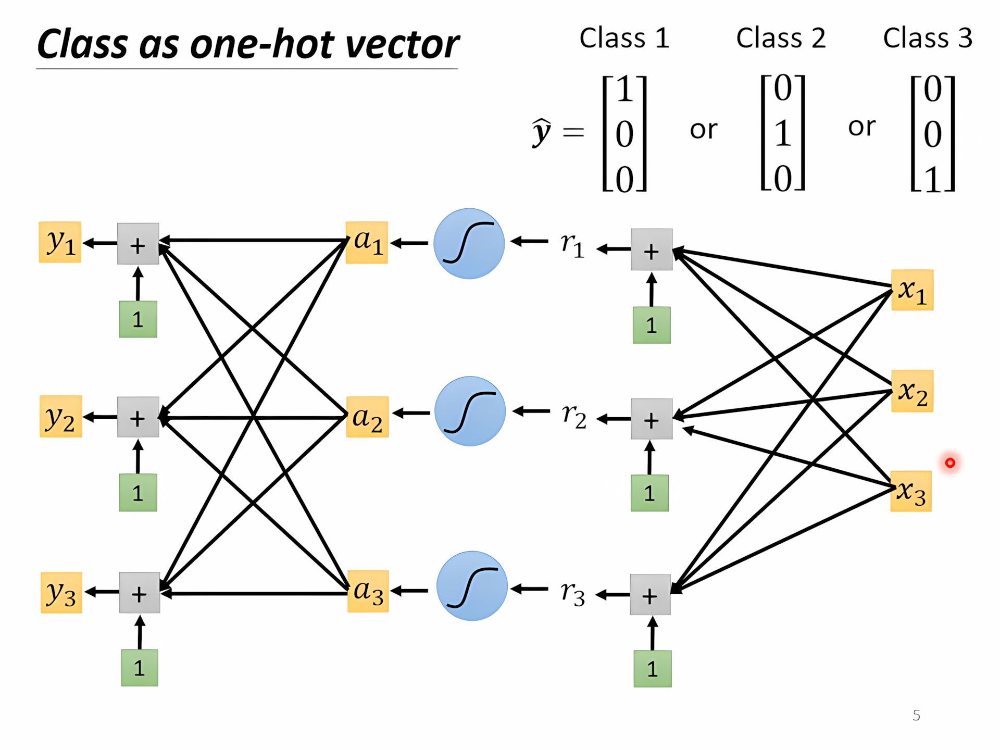
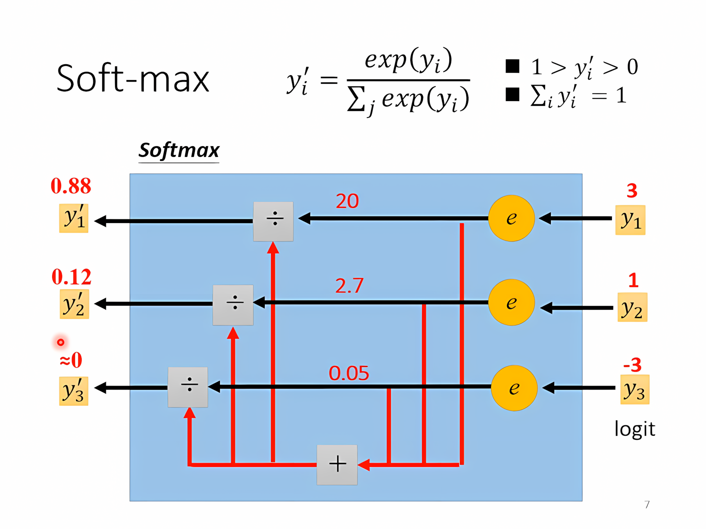
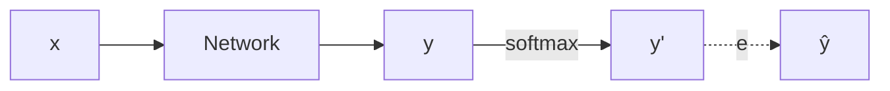
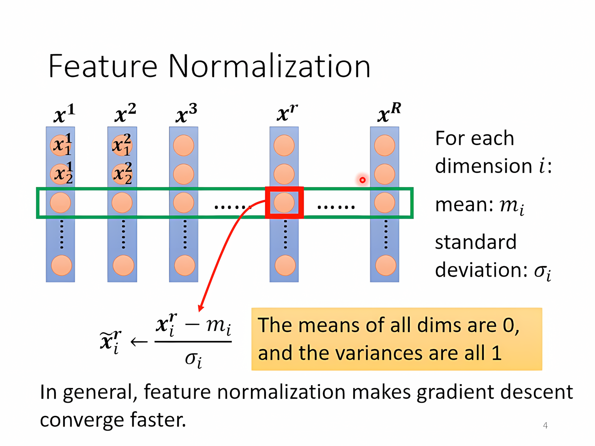
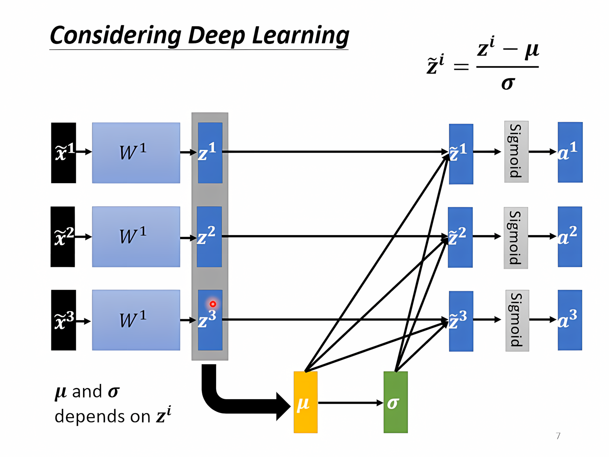

[TOC]

---



## 一、常见问题

- **模型偏差（Model Bias）**：模型表达能力不足，即使充分训练也无法拟合训练集。可以增加特征、加深网络或更换模型结构。
- **优化失败（Optimization Failure）**：模型有足够的表达能力，但优化器没有在训练集上找到足够低的损失。
- **过拟合（Overfitting）**：训练误差很低，验证误差却明显更高。可以增加训练数据、使用数据增强、限制模型复杂度或加入正则化。

!!! question "如何判断是哪一种问题？"
    先观察训练集上的损失。如果换成表达能力更强的模型后，训练损失仍然降不下来，问题更可能出在优化过程；如果训练损失很低而验证损失较高，则更可能是过拟合。

!!! tip "训练集、验证集与测试集"
    验证集用于选择模型和调整超参数，测试集只用于最后评估泛化能力。
    
    Kaggle 的 Public Leaderboard 只基于一部分测试数据，Private Leaderboard 则基于隐藏数据。反复根据公开榜单调参会造成对 Public 数据的过拟合，因此不能把公开榜单当作训练反馈。

---

## 二、梯度下降问题

梯度下降可能在局部极小值（local minimum）附近停滞，也可能遇到鞍点（saddle point）、平坦区域或不合适的学习率。

??? example "Hessian 矩阵"
    Hessian 矩阵由多元函数的二阶偏导数组成。对于 $n$ 元函数 $f(x_1,x_2,\ldots,x_n)$，第 $i$ 行第 $j$ 列为：
    
    $$
    H(f)_{ij} = \frac{\partial^2 f}{\partial x_i \partial x_j}
    $$
    
    对于二元函数 $f(x,y)$：
    
    $$
    H(f) = \begin{bmatrix}
    \frac{\partial^2 f}{\partial x^2} & \frac{\partial^2 f}{\partial x \partial y} \\
    \frac{\partial^2 f}{\partial y \partial x} & \frac{\partial^2 f}{\partial y^2}
    \end{bmatrix}
    $$
    
    在临界点 $\theta$ 附近，令参数变化量为 $\Delta\theta$。由于一阶梯度为 $0$，二阶近似为：

    $$
    L(\theta+\Delta\theta)
    \approx L(\theta)+\frac{1}{2}\Delta\theta^T H\Delta\theta
    $$
    
    - 对任意非零向量 $v$ 都有 $v^THv>0$：Hessian 正定，该点是局部极小值。
    - 对任意非零向量 $v$ 都有 $v^THv<0$：Hessian 负定，该点是局部极大值。
    - 不同方向上既有正值又有负值：Hessian 不定，该点是鞍点。

---

## 三、Batch 与 Momentum

### 1、Batch

一个 `epoch` 表示模型完整看过一次训练集。训练集通常会被打乱（shuffle）并划分为多个 `batch`，每处理一个 `batch` 就更新一次参数。

极端：

| Batch Size     | 每个 epoch 的更新次数 | 特点                     |
| -------------- | ---------------------- | ------------------------ |
| $N$（全批量）  | $1$ 次                  | 梯度稳定，但单次计算量大 |
| $1$（随机梯度）| $N$ 次                  | 更新频繁，但梯度噪声大   |
| Mini-batch     | $\lceil N/B\rceil$ 次 | 兼顾并行效率和梯度稳定性 |

GPU 可以并行处理一个 batch 中的样本，因此适当增大 `batch size` 往往能提高吞吐量；但 batch 过大会增加显存占用，而且不一定带来更好的泛化效果。

较小 batch 中的梯度噪声有时能帮助模型离开尖锐极小值或鞍点附近；较大 batch 的梯度更稳定，但通常需要同步调整学习率。

---

### 2、Momentum

可以把梯度下降想象成小球沿着损失曲面向下滚动。动量会累积过去一段时间的下降方向，从而减小来回震荡，并帮助参数穿过较平坦的区域。

一种常见写法是：

$$
v_t = \beta v_{t-1} + (1-\beta)\nabla L(\theta_t)
$$

$$
\theta_{t+1} = \theta_t - \eta v_t
$$

- $v_t$ 是梯度的指数加权平均。
- $\eta$ 是学习率。
- $\beta$ 是动量系数，常取接近 $1$ 的值。
- $\nabla L(\theta_t)$ 是当前参数处的梯度。

---

## 四、自适应学习率

损失无法继续下降，不一定意味着模型已经到达临界点，也可能是学习率不合适。可以同时观察损失曲线和梯度范数（gradient norm）：

- 学习率过大：参数反复越过极小值，损失震荡甚至发散。
- 学习率过小：更新幅度太小，在平坦区域中下降非常缓慢。

$\text{原始：}\theta_i^{t+1} \leftarrow \theta_i^t - \eta g_i^t$，$g_i^t = \frac{\partial L}{\partial \theta_i} \Big|_{\theta = \theta^t}$

$\text{改进：}\theta_i^{t+1} \leftarrow \theta_i^t - \frac{\eta}{\sigma_i^t} g_i^t$

!!! question "怎么算出 $\sigma$？"

### 1、梯度的均方根

梯度的均方根（Root Mean Square，RMS）用于衡量历史梯度的典型尺度。它本身不是完整的优化器，但可以用来缩放不同参数的更新幅度。

$$
\theta_i^{1} \leftarrow \theta_i^{0} - \frac{\eta}{\sigma_i^{0}} g_i^{0} \quad\quad \sigma_i^{0} = \sqrt{(g_i^{0})^2} = |g_i^{0}|
$$

$$
\theta_i^{2} \leftarrow \theta_i^{1} - \frac{\eta}{\sigma_i^{1}} g_i^{1} \quad\quad \sigma_i^{1} = \sqrt{\frac{1}{2} \left[ (g_i^{0})^2 + (g_i^{1})^2 \right]}
$$

$$
\theta_i^{3} \leftarrow \theta_i^{2} - \frac{\eta}{\sigma_i^{2}} g_i^{2} \quad\quad \sigma_i^{2} = \sqrt{\frac{1}{3} \left[ (g_i^{0})^2 + (g_i^{1})^2 + (g_i^{2})^2 \right]}
$$

$$
\vdots
$$

$$
\theta_i^{t+1} \leftarrow \theta_i^{t} - \frac{\eta}{\sigma_i^{t}} g_i^{t}
\quad\quad
\sigma_i^{t} = \sqrt{\frac{1}{t+1}\sum_{\tau=0}^{t}(g_i^{\tau})^2}
$$

- 当某个参数的历史梯度较小时，$\sigma_i^t$ 较小，它会得到相对更大的有效步长；反之则会得到更小的有效步长。实际实现还会在分母中加入很小的 $\varepsilon$，避免除以 $0$。

---

### 2、RMSProp
是为了解决 AdaGrad 中“学习率衰减太快”的问题而提出的，RMSProp 让优化器更多地关注 “当前和最近的梯度”，而不是 “所有历史的梯度”，这样可以保持一个合理的学习率，不会让学习率因为历史梯度积累而快速变得很小。

$$
\theta_i^{1} \leftarrow \theta_i^{0} - \frac{\eta}{\sigma_i^{0}} g_i^{0} \quad\quad \sigma_i^{0} = \sqrt{(g_i^{0})^2} \quad\quad 0 < \alpha < 1
$$

$$
\theta_i^{2} \leftarrow \theta_i^{1} - \frac{\eta}{\sigma_i^{1}} g_i^{1} \quad\quad \sigma_i^{1} = \sqrt{ \alpha (\sigma_i^{0})^2 + (1 - \alpha)(g_i^{1})^2 }
$$

$$
\theta_i^{3} \leftarrow \theta_i^{2} - \frac{\eta}{\sigma_i^{2}} g_i^{2} \quad\quad \sigma_i^{2} = \sqrt{ \alpha (\sigma_i^{1})^2 + (1 - \alpha)(g_i^{2})^2 }
$$

$$
\vdots
$$

$$
\theta_i^{t+1} \leftarrow \theta_i^{t} - \frac{\eta}{\sigma_i^{t}} g_i^{t} \quad\quad \sigma_i^{t} = \sqrt{ \alpha (\sigma_i^{t-1})^2 + (1 - \alpha)(g_i^{t})^2 }
$$



---

### 3、Adam

$=\text{RMSProp + Momentum}$

```python
optimizer = optim.Adam(model.parameters(), lr=0.01)
```

---

### 4、Learning rate Scheduling

- 学习率衰减（Learning rate decay）
    - 随时间增加减小学习率 $\eta$
- 预热（Warm up）
    - $\eta$ 先增大后减小

??? info
    **结合关系图**
    
    $\text{最终更新公式} = \underbrace{\eta}_{\text{全局}} \times \underbrace{\text{调度因子}(\text{scheduler})}_{\text{随epoch调整}} \times \underbrace{\text{自适应比例}(\text{如} \frac{1}{\sigma_i})}_{\text{局部，RMS/Adam}}$
    
    **总结它们的关系**：
    
    |                          | 功能                     | 影响的层面             | 作用                                     |
    | ------------------------ | ------------------------ | ---------------------- | ---------------------------------------- |
    | RMSProp/Adam             | 自适应调整不同参数的步长 | **参数层面（局部）**   | 避免某些参数因梯度过大或过小而更新不稳定 |
    | Learning Rate Scheduling | 随训练进度调整整体学习率 | **优化器的全局学习率** | 保证训练初期大胆搜索，后期精细收敛       |

---

## 五、分类

### 1、二元分类

$h$ 是二元分类分割的阈值，$h^{train}$ 是训练集上找到的最好阈值，$h^{all}$ 是总体上最好的阈值

我们希望 $L(h^{train}, D_{all}) - L(h^{all}, D_{all}) \leq \delta$

什么样的 $D_{train}$ 能满足这个条件？

- → 对于**所有**的 $h \in \mathcal{H}$，都有 $|L(h, D_{train}) - L(h, D_{all})| \leq \delta / 2$

??? example "Derivation"
    $$
    \begin{aligned}
    L(h^{train}, D_{all}) \leq L(h^{train}, D_{train}) + \frac{\delta}{2} \\ \leq L(h^{all},D_{train}) + \frac{\delta}{2} \\ \leq L(h^{all},D_{all}) +\frac{\delta}{2} + \frac{\delta}{2} \\= L(h^{all},D_{all}) + \delta
    \end{aligned}
    $$

Hoeffding’s Inequality:

$$
P(\mathcal{D}_{train} \text{ is bad due to } h) \leq 2\exp(-2N\varepsilon^2)
$$

所以增大$N$，或者减小 $\mathcal{H}$ 来减小选到不好的训练资料的几率

!!! bug
    更小的 $\mathcal{H}$，更大的$L(H^{all},D_{all})$（理想崩坏），鱼与熊掌不可兼得

---
### 2、多元分类







- Mean Square Error (MSE)
    - $e = \sum_i (\hat{y}_i - y'_i)^2$
    - **MSE** 在输出接近目标时（比如 softmax 输出接近 0 或 1 时），梯度会变小，导致学习速度变慢（尤其在深度网络中容易陷入「梯度消失」）。

- Cross-entropy → 更常用于**分类**任务
    - $e = -\sum_i \hat{y}_i \ln y'_i$

!!! tip
    PyTorch中Cross-entropy已经和softmax绑在一起不用再写softmax

---

## 六、批次标准化

### 1、训练


两次标准化：

- 输入标准化
- $\times w_i$ 之后再标准化（可以在进入激活函数前，也可以在之后）



!!! bug
    训练时，上百万笔资料无法全部进GPU，只能考虑一个 `mini batch` 的数据

---

### 2、测试

**测试阶段**，一般是逐个样本测试，或者 batch 很小，这时候再去计算 $\mu$ 和 $\sigma$ 会不稳定。

→ **解决方案：滑动平均（Moving Average）**

所以，在训练阶段，BN 还会**维护一个全局的滑动平均**（moving average）：

$\bar{\mu} \leftarrow p \cdot \bar{\mu} + (1-p) \cdot \mu^t$

- $\bar{\mu}$ 是**全局的均值估计**（历史值）
- $\mu^t$ 是当前 batch 的均值
- $p$ 是平滑因子，通常 $p$ 比如是 **0.9 或 0.99**

---


## 🌟 HW02
<div class="grid cards" markdown>

- [:fontawesome-brands-git-alt: __HW02__ reference code -- “__Classification__”](https://github.com/Gerard-Devlin/NTU-EE5184/tree/main/HW02)

</div>

!!! tip
    思路照旧：仍然是调整 __网络结构__，调整超参数、优化器

1、__Model__

```python
class BasicBlock(nn.Module):
    def __init__(self, input_dim, output_dim):
        super(BasicBlock, self).__init__()
        self.block = nn.Sequential(
            nn.Linear(input_dim, output_dim),  # 线性层，将输入维度映射到输出维度
            nn.ReLU(),  # ReLU 激活函数，添加非线性变换
            nn.BatchNorm1d(output_dim),  # 批量归一化，标准化每个小批量的输入
            nn.Dropout(0.25),  # Dropout 层，随机丢弃 25% 的神经元，防止过拟合
        )

    def forward(self, x):  # 前向传播方法，定义如何计算输出
        x = self.block(x)  # 将输入 x 通过 self.block 传递
        return x  # 返回经过层堆叠后的输出
```

2、__Hyperparameter__

```python
# 数据参数
concat_nframes = 21              # 要拼接的帧数，n 必须是奇数（总共 2k+1 = n 帧），需要调整以获得更高的得分
```

