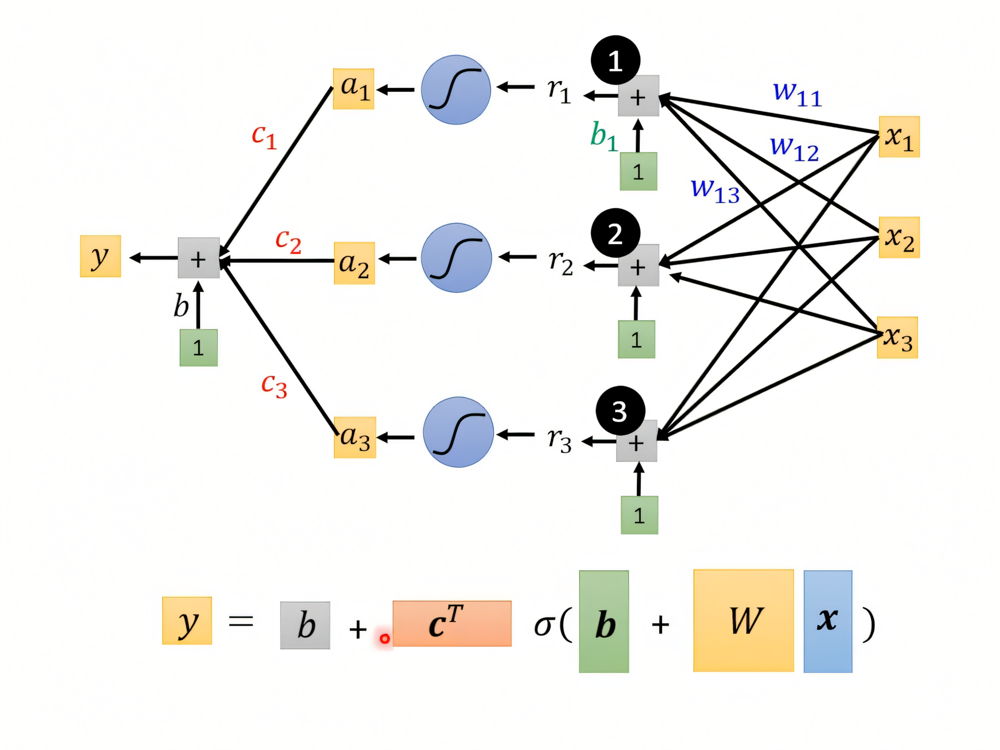
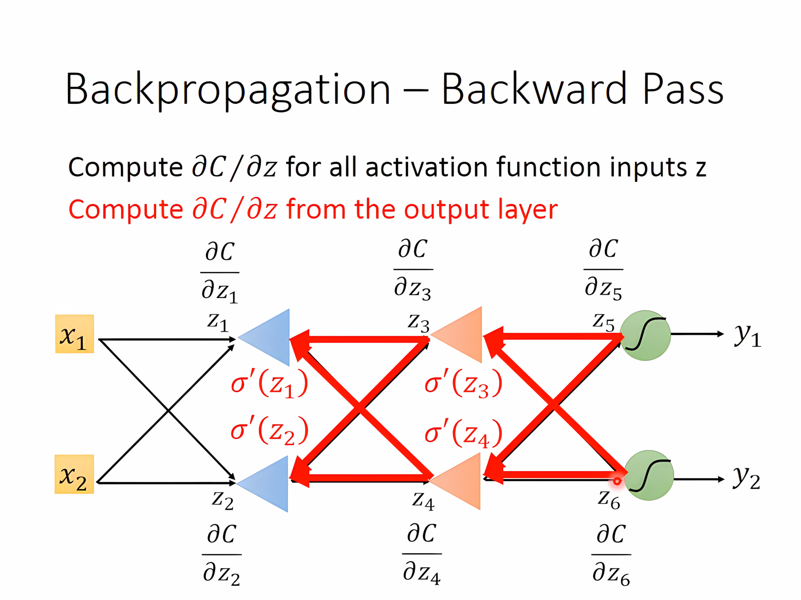
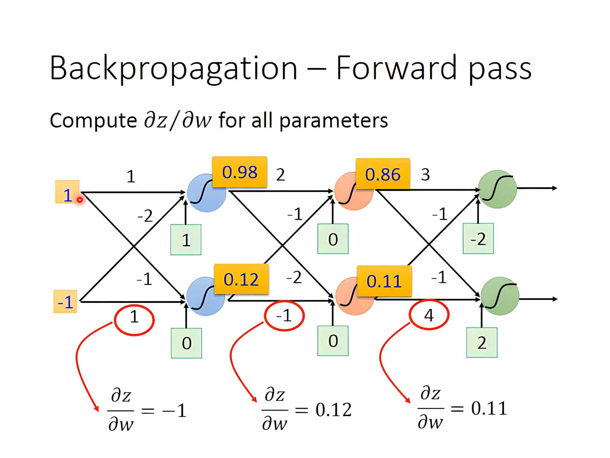

[TOC]

---

!!! tip
    本文是对于机器学习基础概念的简单回顾，具体可以参照 **[机器学习（ML）](../ML＆DL/1 、监督学习.md)**的文档


## 一、通用步骤

- *step1*：找出 $f$ 来**拟合**

- *step2*：从训练函数定义 $Loss$ 

    - $$
      \begin{aligned}
      MAE:e = |y - \hat{y}| \\
       MSE:e = (y - \hat{y})^2
       \end{aligned}
      $$

-  *step3*：**梯度下降**寻找最优解（局部）

    - $$
      w^*,b^*=\arg \min_{w,b} L
      $$

!!! note
    **超参数**：需要自己设定的参数，e.g. 激活函数、batch、epoch ……

---

## 二、激活函数

线性模型 $y=\vec w·\vec x+b$ 不能拟合复杂情况，需要更有**弹性**的函数

用足够多的激活函数凑出piecewise linear，再用足够多的piecewise linear来逼近原来的曲线
$$
\begin{align}
y=c·\frac{1}{1+e^{-(b+wx_1)}}\\
=c·sigmoid(b+wx_1)
\end{align}
$$
通过调整 $w,b,c$ 来组合出不同的 $sigmoid$ 函数

- 进而改进模型
  $$
  f=y = b + \sum_i c_i \, \text{sigmoid} \left( b_i + \sum_j w_{ij} x_j \right)
  $$
  



---

- 改进 $Loss$

  将参数展开成列向量 $\theta$，然后 $\theta^* = \arg\min_{\theta} L$


$$
\theta = \begin{bmatrix}
\theta_1 \\
\theta_2 \\
\theta_3 \\
\vdots
\end{bmatrix}
$$


  - 随机初始化 $\theta^0$


$$
\quad g_{gradient} = \begin{bmatrix}
\frac{\partial L}{\partial \theta_1} \bigg|_{\theta=\theta^0} \\
\frac{\partial L}{\partial \theta_2} \bigg|_{\theta=\theta^0} \\
\vdots
\end{bmatrix}
=\nabla L(\theta^0)
$$


!!! tip

    把数据分成多个 `batch`，`1 epoch` = 把所有 `batch` 运行过一遍
    
    - e.g. N = 10,000， B = 10，每个`epoch`更新1,000 次
    
    通过增加网络层数可以显著降低 $Loss$
    
    Deep Learning 中 Deep 代表有许多的隐藏层，但是光通过叠层数会导致**过拟合**（overfitting）的问题

---

## 三、反向传播

$$
L(\theta) = \sum_{n=1}^{N} c^n(\theta)\Rightarrow
\frac{\partial L(\theta)}{\partial w} = \sum_{n=1}^{N} \frac{\partial c^n(\theta)}{\partial w}
$$

- 前向传播（Forward pass）
    - 计算所有参数的偏导数 $\frac{\partial z}{\partial w}$。


- 反向传播（Backward pass）

    - 计算所有激活函数输入 $z$ 的偏导数 $\frac{\partial C}{\partial z}$。

    - 简单讲核心思想就是：

      **反向传播是通过链式法则，将损失对输出的误差，逐层反向传播，计算各层参数的梯度，从而用来更新参数，降低损失。**





---

## 🌟 HW01

<div class="grid cards" markdown>

- [:fontawesome-brands-git-alt: __HW01__ reference code -- “__Regression__”](https://github.com/Gerard-Devlin/NTU-EE5184/tree/main/HW01)

</div>

1、__Model__

!!! failure "Odd"
    发现不用 `batchnorm` 和 `dropout` 反而效果更好

```python
class My_Model(nn.Module):
    def __init__(self, input_dim):
        super(My_Model, self).__init__()
        self.layers = nn.Sequential(
            # 第一层
            nn.Linear(input_dim, 32),
            nn.LeakyReLU(),

            # 第二层
            nn.Linear(32, 16),
            nn.LeakyReLU(),

            # 第三层
            nn.Linear(16, 8),
            nn.LeakyReLU(),
			
            # 输出
            nn.Linear(8, 1)
        )

    def forward(self, x):
        x = self.layers(x)
        x = x.squeeze(1) # (B, 1) -> (B)
        return x
```
??? tip "Architecture" 
        
    - 使用以下命令来查看网络架构
    
    ```python
    from torchsummary import summary
    summary(model, input_size=(input_dim,))
    ```
    
    ```
    ----------------------------------------------------------------
            Layer (type)               Output Shape         Param #
    ================================================================
                Linear-1                   [-1, 32]             672
             LeakyReLU-2                   [-1, 32]               0
                Linear-3                   [-1, 16]             528
             LeakyReLU-4                   [-1, 16]               0
                Linear-5                    [-1, 8]             136
             LeakyReLU-6                    [-1, 8]               0
                Linear-7                    [-1, 1]               9
    ================================================================
    Total params: 1,345
    Trainable params: 1,345
    Non-trainable params: 0
    ----------------------------------------------------------------
    Input size (MB): 0.00
    Forward/backward pass size (MB): 0.00
    Params size (MB): 0.01
    Estimated Total Size (MB): 0.01
    ----------------------------------------------------------------
    ```

2、__Feature Selection__

```python
def select_feat(train_data, valid_data, test_data, select_all=True):
    '''Selects useful features to perform regression'''
    y_train, y_valid = train_data[:,-1], valid_data[:,-1]
    raw_x_train, raw_x_valid, raw_x_test = train_data[:,:-1], valid_data[:,:-1], test_data

    if select_all:
        feat_idx = list(range(raw_x_train.shape[1]))
    else:
        selector = SelectKBest(score_func=f_regression, k=20)  # 选择 k 个最佳特征
        selector.fit(raw_x_train, y_train)  				# 训练特征选择器
        feat_idx = selector.get_support(indices=True)  		 # 获取选中的特征索引

        return raw_x_train[:,feat_idx], raw_x_valid[:,feat_idx], raw_x_test[:,feat_idx], y_train, y_valid
```

3、__Training Loop__

**优化器**和**反向传播**都在这边定义

```python
optimizer = torch.optim.Adam(
    model.parameters(),           # 传入模型的参数
    lr=config['learning_rate'],   # 学习率（从 config 字典获取）
    weight_decay=config.get('weight_decay', 1e-4),  # L2 正则化（默认值 1e-4）
)
```

4、__Hyperparameter__

```python
config = {
    'seed': 804286,   
    'select_all': False,   # 是否选取所有特征
    'valid_ratio': 0.2,   # validation_size = train_size * valid_ratio
    'n_epochs': 3000,             
    'batch_size': 256, 
    'learning_rate': 1e-5,
    'early_stop': 400,    # 如果模型没有进步则早停    
    'save_path': './models/model.ckpt'  # 保存模型
}
```

---

