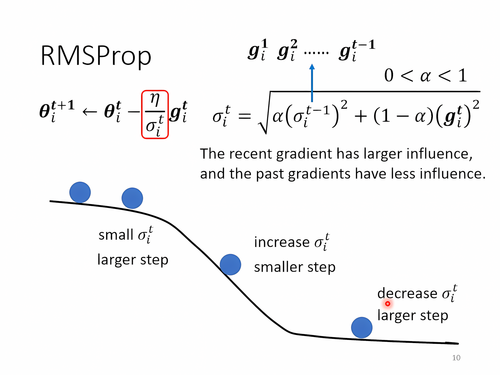
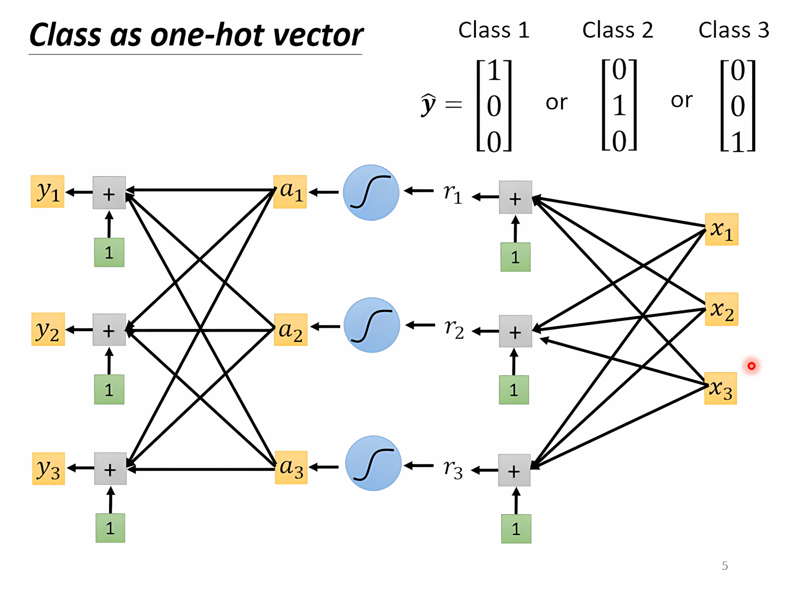
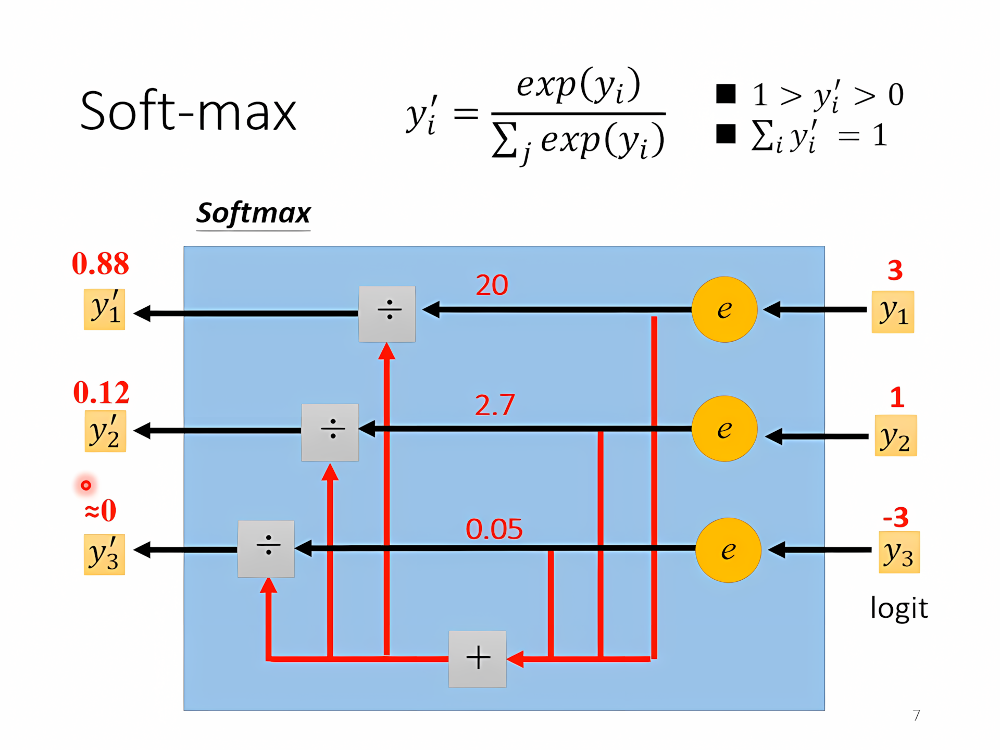
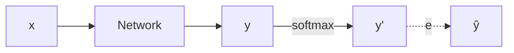
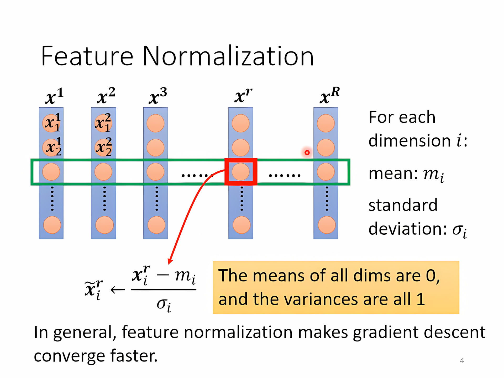
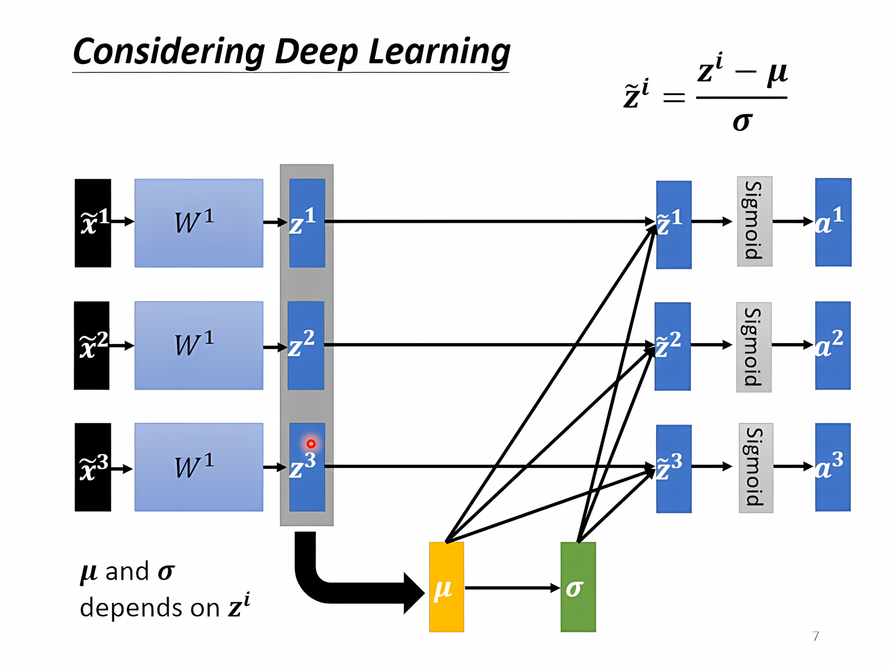

[TOC]

---



## 一、常见问题

- *Model Bias*
    - 模型太简单 → 重新设计模型，更有弹性（e.g. 更多feature，deep 
- *Optimization*
    - 梯度下降找到的 $Loss$ 不够低

!!! question
    到底是什么问题？ 

    - 改变模型 → 比如层数增加，loss在training set增加，说明不是overfitting不是弹性不够，而是optimization的问题

- Overfitting
    - 增加训练数据
      - 数据增强（e.g. 图片左右镜像、……
      - 限制模型选择
      - 正则化

!!! tip
    Kaggle 
    
    - Public：公开数据集
      - Private：隐藏数据集，防止为了benchmark而选择出好的模型但其实不行，所以不要用public数据集来调模型
    
    Validation 验证集：使用验证集来**挑**选合适的**模型**

---

## 二、梯度下降问题

梯度下降失败原因（e.g. local minima、saddle point……


??? example "$Hessian$"
      $Hessian$ 矩阵是多元函数的二阶偏导数构成的方阵，在多变量微积分和优化理论中扮演着重要的角色。对于一个具有 $n$ 个变量的函数 $f(x_1, x_2, \ldots, x_n)$，其Hessian矩阵 $H(f)$ 是一个 $n \times n$ 的矩阵，矩阵中的每个元素是函数对一对变量的二阶偏导数。
    
      具体来说，Hessian矩阵 $H(f)$ 的第 $i$ 行第 $j$ 列的元素是函数 $f$ 对变量 $x_i$ 和 $x_j$ 的二阶偏导数，即：
    
      $$
      H(f)_{ij} = \frac{\partial^2 f}{\partial x_i \partial x_j}
      $$
    
      对于一个二元函数 $f(x, y)$，其Hessian矩阵可以表示为：
    
    $$
    H(f) = \begin{bmatrix}
    \frac{\partial^2 f}{\partial x^2} & \frac{\partial^2 f}{\partial x \partial y} \\
    \frac{\partial^2 f}{\partial y \partial x} & \frac{\partial^2 f}{\partial y^2}
    \end{bmatrix}
    $$


    
    在临界点处：
    $$
    L(\theta) \approx L(\theta') + \frac{1}{2} (\theta - \theta')^T H (\theta - \theta')
    $$
    
    代入不同的$\theta$ ,
    
    - $v^THv>0\Rightarrow \text{Local minima}$；
    
      - $v^THv<0\Rightarrow \text{Local maxima}$；
    
      - 都有则是 $\text{saddle point}$
    
    性质：
    
    1. **正定性**：如果Hessian矩阵是正定的，该点是局部最小值。
       2. **负定性**：如果Hessian矩阵是负定的，该点是局部最大值。
       3. **不定性**：如果Hessian矩阵是不定的（即有正有负的特征值），那么函数在该点有一个鞍点。

---

## 三、`batch`和`momentum`

### 1、`batch`

`1 epoch` = 把所有 `batch` 运行过一遍 → 每个 `epoch` 后要shuffle

极端：

| Batch Size | 描述                                      | 更新策略                                   |
|-------------------|-------------------------------------------|--------------------------------------------|
| N（全批量）       | 在看到所有20个样本后更新                  | 每个epoch更新一次，**噪声**小             |
| 1                 | 每个样本更新一次，一个epoch更新20次        | 每个样本更新一次，**噪声**大                   |

GPU可以进行**平行运算**，所以`batch size`增加，运行时间不会很明显增加

奇怪：batch size越大，明明噪声小，但是训练结果越差 → optimization fail，可能卡在鞍点

---

### 2、`momentum`

物理世界，球从高处滚下不一定会卡在 $\text{local minima}$ 或者 $\text{saddle point}$，会继续滚动

更新步长，计算方式是上一步的移动量减去当前梯度
$$
\theta_{\text{new}} = \theta - \alpha \left( v + \beta \nabla L(\theta) \right) 
$$
其中：

- $\theta$ 是当前的参数向量。
- $\theta_{\text{new}}$ 是更新后的参数向量。
- $\alpha$ 是学习率。
- $v$ 是动量项，通常是上一步梯度的指数加权平均。
- $\beta$ 是动量系数，控制着动量项的影响程度。
- $\nabla L(\theta)$ 是当前梯度。

---

## 四、自适应学习率

- 有时候 $Loss$ 无法再下降不是因为卡在critical point，而是可能**学习率**选择不合适而导致不能下降，这时候可以通过观察gradient 的norm来判断是由于卡在critical point还是**学习率**选择不合适
    - **学习率**选择过大 → 越过极小值而无法抵达
    - **学习率**选择过小 → 在gradient平缓的地方难以梯度下降

$\text{原始：}\theta_i^{t+1} \leftarrow \theta_i^t - \eta g_i^t$，$g_i^t = \frac{\partial L}{\partial \theta_i} \Big|_{\theta = \theta^t}$

$\text{改进：}\theta_i^{t+1} \leftarrow \theta_i^t - \frac{\eta}{\sigma_i^t} g_i^t$

!!! question "怎么算出 $\sigma$？"

### 1、Root Mean Square
主要用于平衡梯度的尺度，防止梯度太大或太小，但它本身不是一个优化算法，只是一个度量或规范化手段，常见于比如 AdaGrad 这种方法。

$$
\theta_i^{1} \leftarrow \theta_i^{0} - \frac{\eta}{\sigma_i^{0}} g_i^{0} \quad\quad \sigma_i^{0} = \sqrt{(g_i^{0})^2} = |g_i^{0}|
$$

$$
\theta_i^{2} \leftarrow \theta_i^{1} - \frac{\eta}{\sigma_i^{1}} g_i^{1} \quad\quad \sigma_i^{1} = \sqrt{\frac{1}{2} \left[ (g_i^{0})^2 + (g_i^{1})^2 \right]}
$$

$$
\theta_i^{3} \leftarrow \theta_i^{2} - \frac{\eta}{\sigma_i^{2}} g_i^{2} \quad\quad \sigma_i^{2} = \sqrt{\frac{1}{3} \left[ (g_i^{0})^2 + (g_i^{1})^2 + (g_i^{2})^2 \right]}
$$

$$
\vdots
$$

$$
\theta_i^{t+1} \leftarrow \theta_i^{t} - \frac{\eta}{\sigma_i^{t}} g_i^{t} \quad\quad \sigma_i^{t} = \sqrt{ \frac{1}{t+1} \sum_{i=0}^{t} (g_i^{t})^2 }
$$

- 坡度平缓 → 算出的gradient小 → $\sigma$ 小 → $\frac{\eta}{\sigma}$ 大 → 下降的快

---

### 2、RMSProp
是为了解决 AdaGrad 中“学习率衰减太快”的问题而提出的，RMSProp 让优化器更多地关注 “当前和最近的梯度”，而不是 “所有历史的梯度”，这样可以保持一个合理的学习率，不会让学习率因为历史梯度积累而快速变得很小。

$$
\theta_i^{1} \leftarrow \theta_i^{0} - \frac{\eta}{\sigma_i^{0}} g_i^{0} \quad\quad \sigma_i^{0} = \sqrt{(g_i^{0})^2} \quad\quad 0 < \alpha < 1
$$

$$
\theta_i^{2} \leftarrow \theta_i^{1} - \frac{\eta}{\sigma_i^{1}} g_i^{1} \quad\quad \sigma_i^{1} = \sqrt{ \alpha (\sigma_i^{0})^2 + (1 - \alpha)(g_i^{1})^2 }
$$

$$
\theta_i^{3} \leftarrow \theta_i^{2} - \frac{\eta}{\sigma_i^{2}} g_i^{2} \quad\quad \sigma_i^{2} = \sqrt{ \alpha (\sigma_i^{1})^2 + (1 - \alpha)(g_i^{2})^2 }
$$

$$
\vdots
$$

$$
\theta_i^{t+1} \leftarrow \theta_i^{t} - \frac{\eta}{\sigma_i^{t}} g_i^{t} \quad\quad \sigma_i^{t} = \sqrt{ \alpha (\sigma_i^{t-1})^2 + (1 - \alpha)(g_i^{t})^2 }
$$



---

### 3、Adam

$=\text{RMSProp + Momentum}$

```python
optimizer = optim.Adam(model.parameters(), lr=0.01)
```

---

### 4、Learning rate Scheduling

- 学习率衰减（Learning rate decay）
    - 随时间增加减小学习率 $\eta$
- 预热（Warm up）
    - $\eta$ 先增大后减小

??? info
    **结合关系图**
    
    $\text{最终更新公式} = \underbrace{\eta}_{\text{全局}} \times \underbrace{\text{调度因子}(\text{scheduler})}_{\text{随epoch调整}} \times \underbrace{\text{自适应比例}(\text{如} \frac{1}{\sigma_i})}_{\text{局部，RMS/Adam}}$
    
    **总结它们的关系**：
    
    |                          | 功能                     | 影响的层面             | 作用                                     |
    | ------------------------ | ------------------------ | ---------------------- | ---------------------------------------- |
    | RMSProp/Adam             | 自适应调整不同参数的步长 | **参数层面（局部）**   | 避免某些参数因梯度过大或过小而更新不稳定 |
    | Learning Rate Scheduling | 随训练进度调整整体学习率 | **优化器的全局学习率** | 保证训练初期大胆搜索，后期精细收敛       |

---

## 五、分类

### 1、二元分类

$h$ 是二元分类分割的阈值，$h^{train}$ 是训练集上找到的最好阈值，$h^{all}$ 是总体上最好的阈值

我们希望 $L(h^{train}, D_{all}) - L(h^{all}, D_{all}) \leq \delta$

什么样的 $D_{train}$ 能满足这个条件？

- → 对于**所有**的 $h \in \mathcal{H}$，都有 $|L(h, D_{train}) - L(h, D_{all})| \leq \delta / 2$

??? example "Derivation"
    $$
    \begin{aligned}
    L(h^{train}, D_{all}) \leq L(h^{train}, D_{train}) + \frac{\delta}{2} \\ \leq L(h^{all},D_{train}) + \frac{\delta}{2} \\ \leq L(h^{all},D_{all}) +\frac{\delta}{2} + \frac{\delta}{2} \\= L(h^{all},D_{all}) + \delta
    \end{aligned}
    $$

Hoeffding’s Inequality:

$$
P(\mathcal{D}_{train} \text{ is bad due to } h) \leq 2\exp(-2N\varepsilon^2)
$$

所以增大$N$，或者减小 $\mathcal{H}$ 来减小选到不好的训练资料的几率

!!! bug
    更小的 $\mathcal{H}$，更大的$L(H^{all},D_{all})$（理想崩坏），鱼与熊掌不可兼得

---
### 2、多元分类







- Mean Square Error (MSE)
    - $e = \sum_i (\hat{y}_i - y'_i)^2$
    - **MSE** 在输出接近目标时（比如 softmax 输出接近 0 或 1 时），梯度会变小，导致学习速度变慢（尤其在深度网络中容易陷入「梯度消失」）。

- Cross-entropy → 更常用于**分类**任务
    - $e = -\sum_i \hat{y}_i \ln y'_i$

!!! tip
    PyTorch中Cross-entropy已经和softmax绑在一起不用再写softmax

---

## 六、批次标准化

### 1、训练


两次标准化：

- 输入标准化
- $\times w_i$ 之后再标准化（可以在进入激活函数前，也可以在之后）



!!! bug
    训练时，上百万笔资料无法全部进GPU，只能考虑一个 `mini batch` 的数据

---

### 2、测试

**测试阶段**，一般是逐个样本测试，或者 batch 很小，这时候再去计算 $\mu$ 和 $\sigma$ 会不稳定。

→ **解决方案：滑动平均（Moving Average）**

所以，在训练阶段，BN 还会**维护一个全局的滑动平均**（moving average）：

$\bar{\mu} \leftarrow p \cdot \bar{\mu} + (1-p) \cdot \mu^t$

- $\bar{\mu}$ 是**全局的均值估计**（历史值）
- $\mu^t$ 是当前 batch 的均值
- $p$ 是平滑因子，通常 $p$ 比如是 **0.9 或 0.99**

---


## 🌟 HW02
<div class="grid cards" markdown>

- [:fontawesome-brands-git-alt: __HW02__ reference code -- “__Classification__”](https://github.com/Gerard-Devlin/NTU-EE5184/tree/main/HW02)

</div>

!!! tip
    思路照旧：仍然是调整 __网络结构__，调整超参数、优化器

1、__Model__

```python
class BasicBlock(nn.Module):
    def __init__(self, input_dim, output_dim):
        super(BasicBlock, self).__init__()
        self.block = nn.Sequential(
            nn.Linear(input_dim, output_dim),  # 线性层，将输入维度映射到输出维度
            nn.ReLU(),  # ReLU 激活函数，添加非线性变换
            nn.BatchNorm1d(output_dim),  # 批量归一化，标准化每个小批量的输入
            nn.Dropout(0.25),  # Dropout 层，随机丢弃 25% 的神经元，防止过拟合
        )

        def forward(self, x):  # 前向传播方法，定义如何计算输出
            x = self.block(x)  # 将输入 x 通过 self.block 传递
            return x  # 返回经过层堆叠后的输出
```

2、__Hyperparameter__

```python
# 数据参数
concat_nframes = 21              # 要拼接的帧数，n 必须是奇数（总共 2k+1 = n 帧），需要调整以获得更高的得分
```

