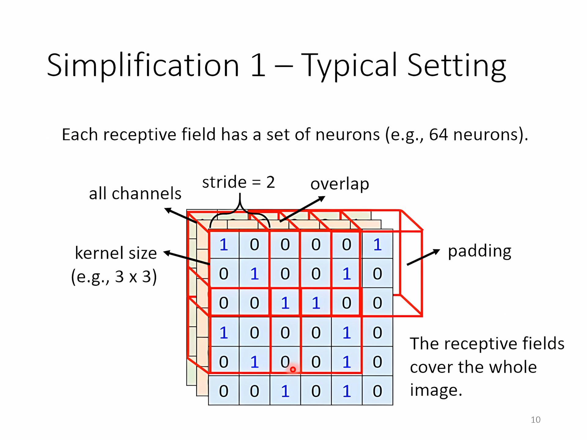
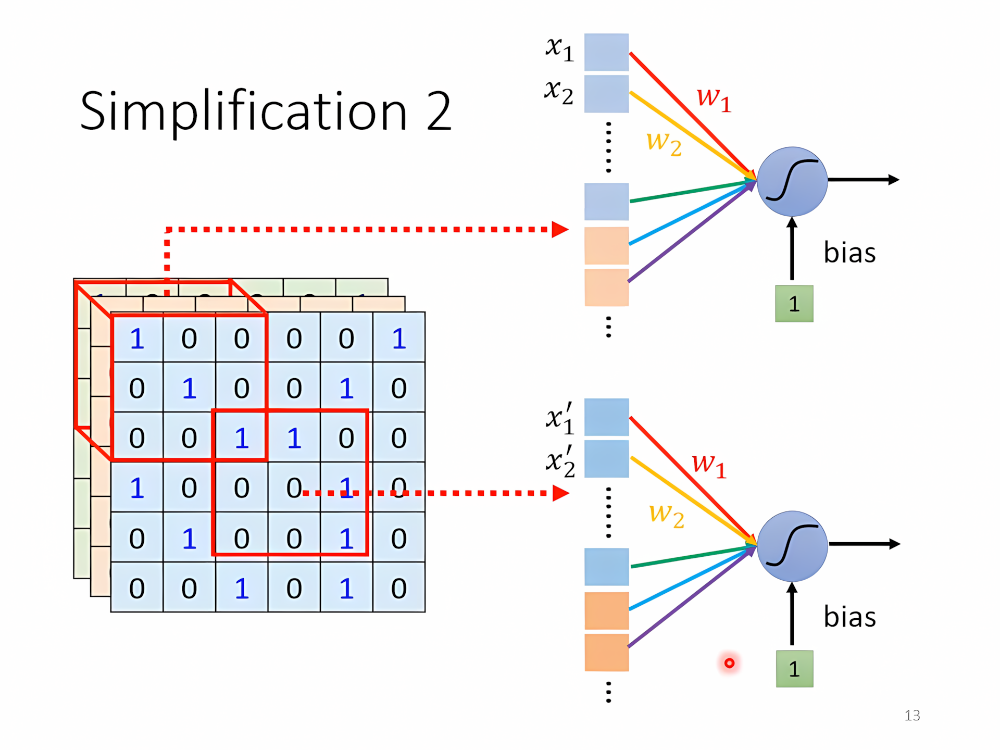
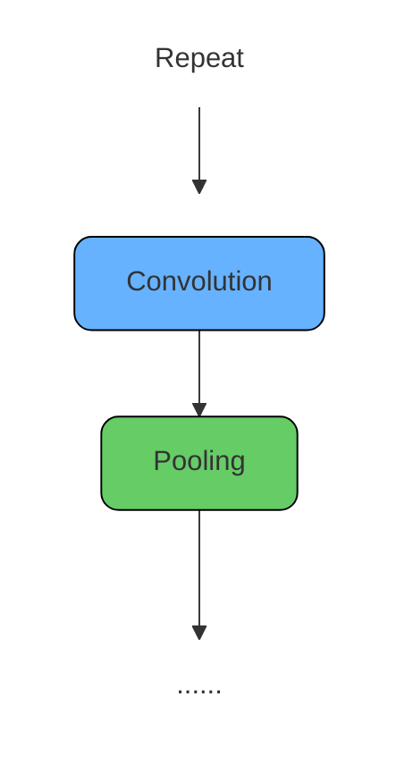

[TOC]

---

## 一、卷积

label是一个高维的one-hot vector

- 图像是一个三维tensor（长、宽、通道）
- 如果是100 × 100 的图片，全连接则会有 $100 × 100 × 3 × 1000 = 3\times10^7$ 个weight需要调整，计算量非常大
- 人看图片也是根据图片中的特征，也许并不需要整张图片

---

### 1、神经元视角

每个neuron只考虑自己的receptive field中的即可，比如receptive field是 $3\times3$，那么每个neuron只需要考虑 $3\times3\times3$ 的一个列向量

经典设计：

- 考虑所有通道
- kernel size ：$3\times3$
- 一个receptive field 会有一组neuron对其响应
- stride = 2 → overlap = 1

__参数共享__：某些neuron参数一样，检测的是相同的内容

```mermaid
graph TD
%% 最外层 Fully Connected Layer
    subgraph A[Fully Connected Layer]
        style A fill:#99ccff,stroke:#000,stroke-width:1px

    %% 第二层 Receptive Field
        subgraph B[Receptive Field]
            style B fill:#99ff99,stroke:#000,stroke-width:1px

        %% 第三层 Parameter Sharing
            subgraph C[Parameter Sharing]
                style C fill:#ffccaa,stroke:#000,stroke-width:1px

            %% 最内层 Convolutional Layer
                D[Convolutional Layer]
            end
        end
    end

```

!!! danger "？Bias"
    bias很大，但是由于图像识别本身就可以接受弹性，而全连接会存在过拟合问题

---

### 2、卷积核视角

convolution层里面有**很多**`filter`，每个`filter`就是$3\times3\times3$ 的`tensor`，和图片中的receptive field做点乘 → **寻找特征**

每个filter和原图中的receptive field点成得到的新图称为“Feature Map”，比如有63个fliter，stride = 1，那么第二层就会有 $3\times3\times64$个filter

----

共用参数就是filter，filter扫过整张图片就是convolution的过程

| **神经元视角**                   | **卷积核（滤波器）视角**         |
| -------------------------------- | -------------------------------- |
| 每个神经元只考虑一个感受野。     | 有一组滤波器用来检测局部小模式。 |
| 不同感受野位置的神经元共享参数。 | 每个滤波器在输入图像上滑动卷积。 |

---

## 二、池化

Max/Min/Mean Pooling：通过在窗口内选取 最大/最小/平均 值来**缩小特征图尺寸**，同时保留关键信息。

!!! example "AlphaGo"
    CNN应用于下围棋
    
    1. **围棋棋盘是一个二维空间（19x19的网格）**
    
           - 棋盘就像一张图像，黑白棋子分布在网格上，棋子形成的形状、连接、眼、死活等都有**局部和全局的空间模式**。
           - CNN 善于处理这种“网格状”的数据，就像它处理图像中的像素关系一样。
    
    2. **局部模式识别（局部特征提取）**
           - 在围棋中，有很多**局部定式**（比如星位小飞、二间夹、虎口）是围棋手熟知的战术。
    
    3. **Pooling移除**
           - 但是这里特别注意不需要pooling，浅显的想就是随意地移除行或者列棋局是不一样的，而且本来就是19x19尺寸很小不需要下采样来降低尺寸

---

## 🌟 HW03

- [:fontawesome-brands-git-alt: __HW03__ reference code -- “__CNN__”](https://github.com/Gerard-Devlin/NTU-EE5184/tree/main/HW03)

