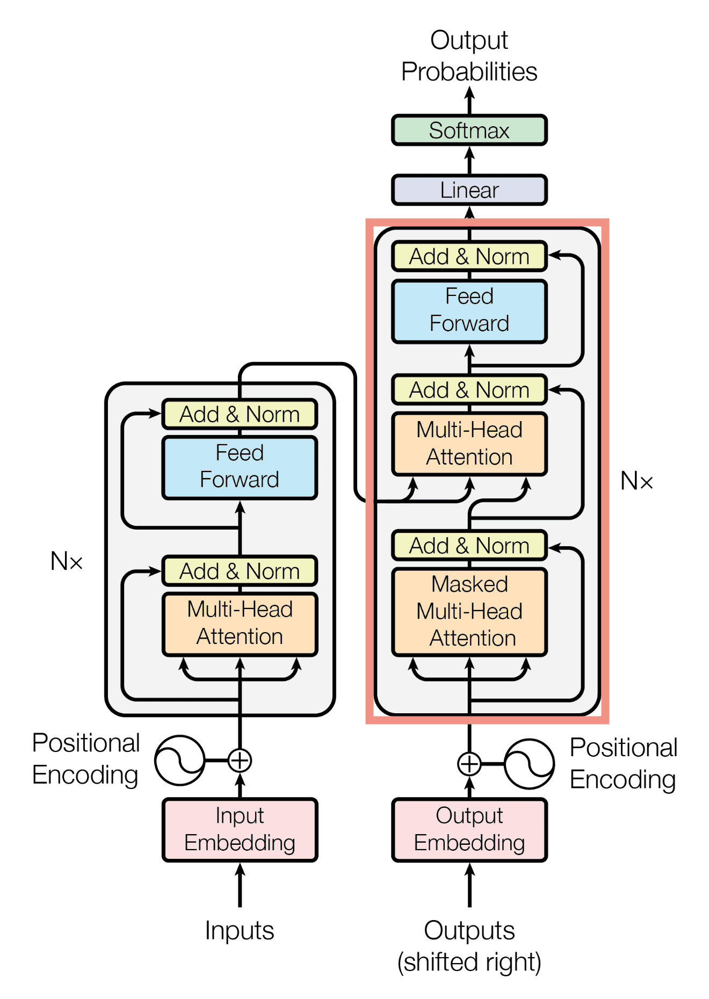
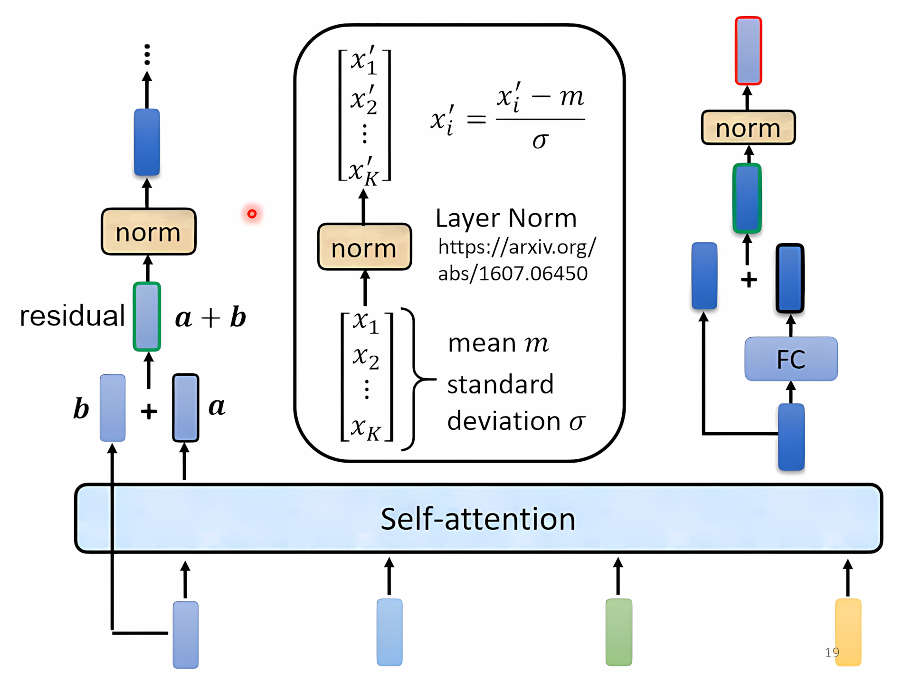
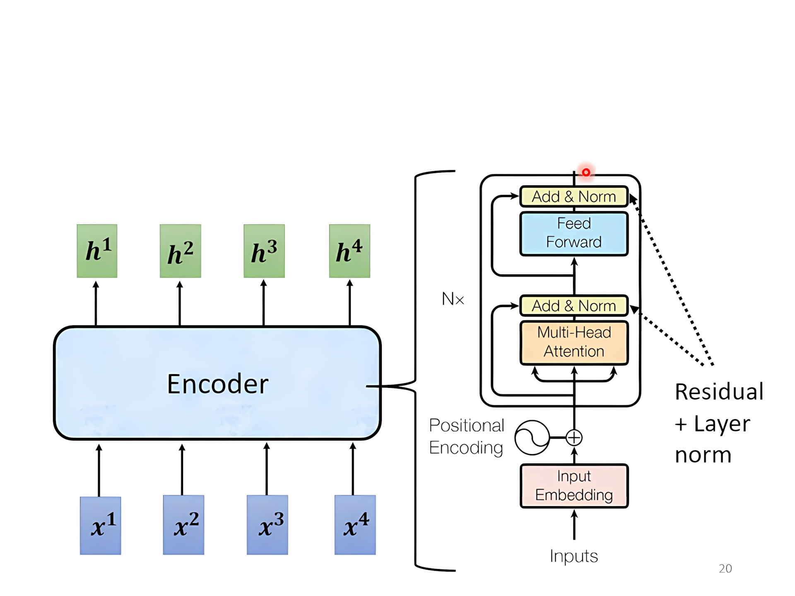
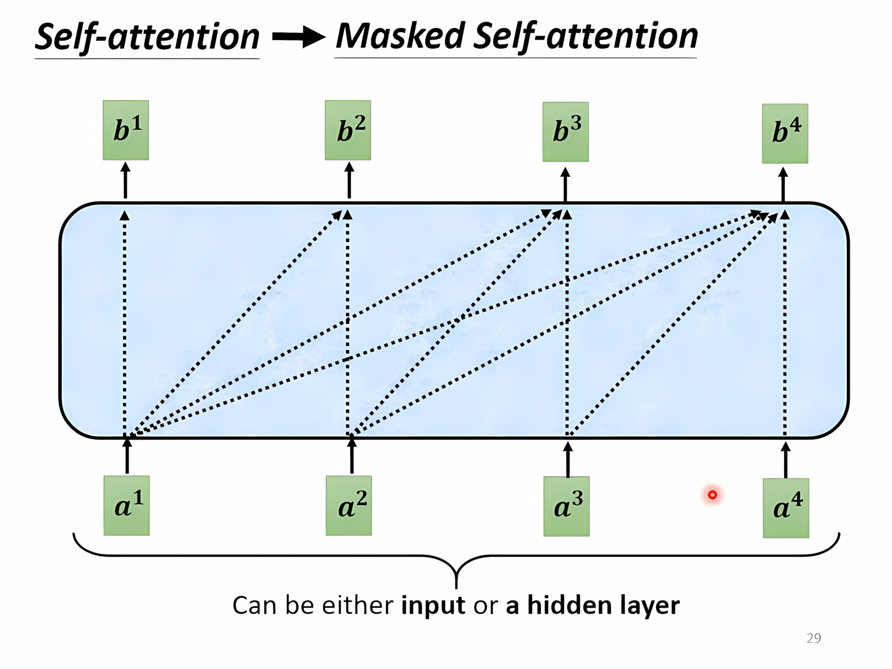
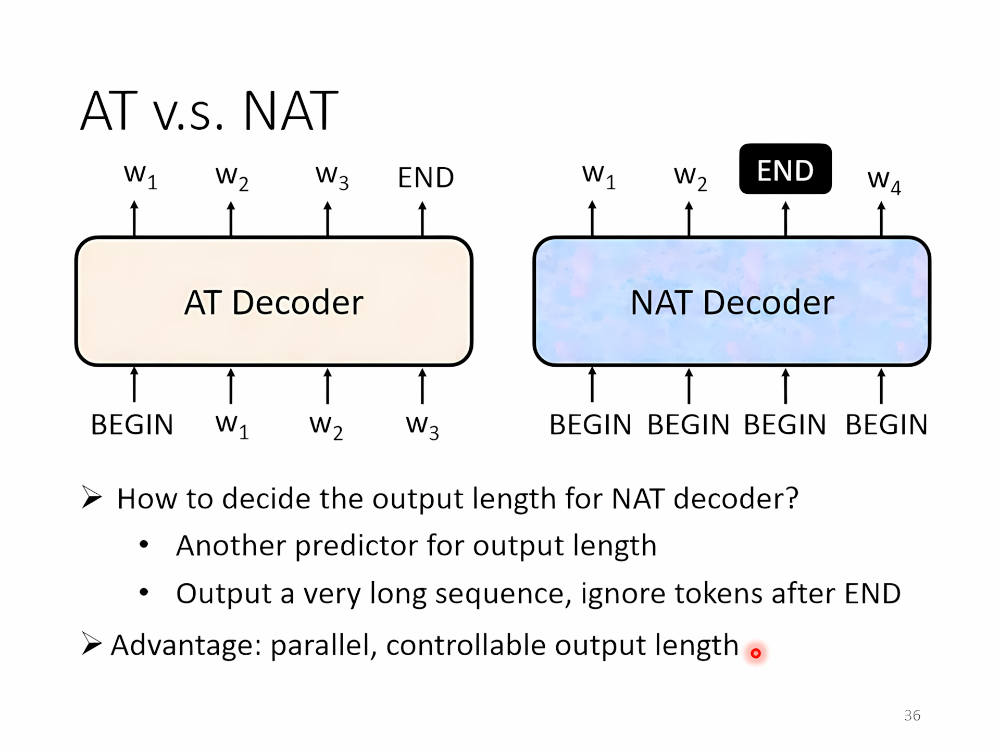
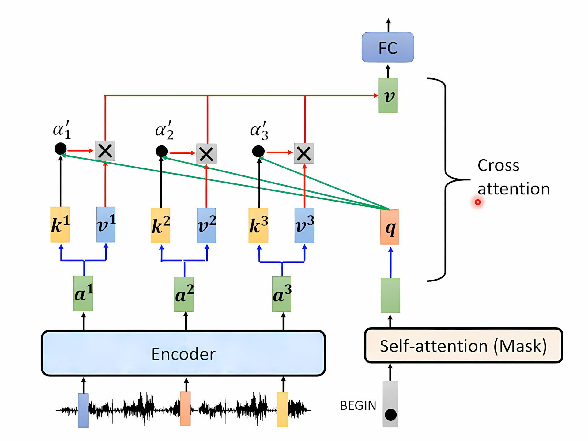

[TOC]

---

## 一、简述

输入一个sequence输出一个sequence，输出长度由模型决定（语音识别中甚至可以做到语言没有文字形式也可以做翻译!）

应用：语音识别、语音合成（TTS）、Chatbot、NLP（看作是Q&A → 用**seq2seq**的模型解决）、文法剖析、Muti-label Classification、目标检测……

!!! info
    Muti-label Classification和Muti-class Classification 有区别，前者是一个东西可以有多个标签，后者是多类用softmax即可

---

## 二、Transformer模型

### 1、`Encoder`

输入和进入self-attention block之后做残差连接（residual），在做normalization（layer normalization，只对一个向量即可不需要batch）。之后再经过FC layer，同样也有一个残差连接，再做一个layer normalization。

!!! warning
    但是这边原始的网络架构也不是最优的

---

### 2、`Decoder`

#### AT Decoder  v.s. NAT Decoder

**自回归**（Autoregressive）是指一种模型或过程，其中给定时间步的输出依赖于之前的输出，通常用于处理序列数据。在自回归模型中，每次预测都是基于当前输入和先前生成的输出进行的。

给一个`special token`表示开始，用一个one-hot vector表示，向量大小为字库的大小（汉字用一个字，英文用subword），经过decoder再经过softmax输出概率最高的字，decoder把前一个时间点的输出当作下一次的输入（有可能error propagation），再给定一个`special token` 表示结束

观察图发现decoder中间去掉和encoder是几乎一样的，除了输入经过的是`Masked Muti-head Attention`。

---

#### Masked Muti-head Attention

- **掩码**：在掩码自注意力中，会对注意力矩阵应用掩码。如果词元 `i` 正在关注词元 `j`（且 `j > i`），则掩码会将这些位置的注意力分数设置为 `-inf`，这样它们的贡献在通过 softmax 后会变成零。

- **因果性**：这种机制防止未来的词元影响当前词元，保持序列生成过程中的因果关系。

!!! question
    怎么决定输出序列长度 → 给定一个special token 表示结束

---

### 3、Encoder → Decoder

Cross attention机制，再**LSTM encoder/decoder**中也有使用，不只是在transformer中才出现

---

