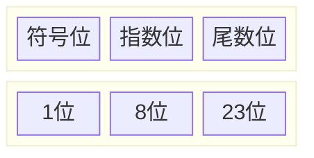

<h1 >
    计算机数据
</h1>

[TOC]

---

## 一、位运算

基本的位运算共$6$种，分别为按位与、按位或、按位异或、按位取反、左移和右移。

### 1、与、或、异或

这三者都是两数间的运算，因此在这里一起讲解。

它们都是将两个整数作为二进制数，对二进制表示中的每一位逐一运算。

| 运算 | 运算符 | 数学符号表示 |                解释                |
| :--- | :----: | :----------- | :--------------------------------: |
| 与   |  `&`   | $\And$       |  只有两个对应位都为 $1$ 时才为$1$  |
| 或   |  `|`   | $\lor$       | 只要两个对应位中有一个$1$时就为$1$ |
| 异或 |  `^`   | $\oplus$     |    只有两个对应位不同时才为$1$     |

异或运算的逆运算是它本身，也就是说两次异或同一个数最后结果不变，即 $a \oplus b \oplus b = a$。

!!! tip
	> 不用中间变量交换两个数
    ```c++
    void swap(int *x, int *y) {
    	*x = *x ^ *y;
    	*y = *x ^ *y;
    	*x = *x ^ *y;
	}
    ```

举例：

$$
\begin{aligned} 5 &=(101)_2\\ 6 &=(110)_2\\ 5\operatorname\&6 &=(100)_2 =\ 4\\ 5\operatorname|6 &=(111)_2 =\ 7\\ 5\oplus6 &=(011)_2 =\ 3\\ \end{aligned}
$$

### 2、取反

单目运算。

它的作用是把 $num$ 的二进制补码中的 $0$和$1$全部取反（$0$变为$1$，$1$ 变为$0$)。

!!! note
	补码：在二进制表示下，正数和 $0$ 的补码为其本身，负数的补码是将其对应正数 ==**按位取反后加一**==。

举例（有符号整数）：

$$
\begin{aligned} 5&=(00000101)_2\\ 
\text{~}5&=(11111010)_2=-6\\ 
-5\text{ 的补码}&=(11111011)_2\\ 
\text{~}(-5)&=(00000100)_2=4 \end{aligned}
$$

### 3、左移和右移

- 左移：`num << i`
- 右移：`num >> i` 

举例：

$$
\begin{aligned} 11&=(00001011)_2\\ 11<<3&=(01011000)_2=88\\ 11>>2&=(00000010)_2=2 \end{aligned}
$$

!!! tip
	-  左移 $i$ 位相当于 $\times 2^i$
	-  右移 $i$ 位相当于 $\div 2^i(取整)$

---

## 二、进制转换

- 小数：小数部分$\times 2$，取整数部分

---

## 三、原码、反码、补码

| 类型 |                             规则                             |
| :--: | :----------------------------------------------------------: |
| 原码 |  正数最高位为$0$，其他位不变；负数1最高位为$1$，其他位不变   |
| 反码 |  正数最高位为$0$，其他位不变；负数1最高位为$1$，其他位取反   |
| 补码 | 正数最高位为$0$，其他位不变；负数最高位为$1$，其他位取反再加$1$ |

!!! example
    |      | $13$         | $-13$         |
    | ---- | ---------- | ----------- |
    | 原码 | $00001101$ | $10001101$  |
    | 反码 | $00001101$ | $11110010$  |
    | 补码 | $00001101$ | $111110011$ |

---

## 四、单精度浮点


!!! tip
    - 符号位： 正数为 $0$，负数为 $1$
    - $step1:十进制转二进制$
    - $step2:转化成1.XXX的形式,XXX即为尾数$
    - $step3:指数+127偏移量，再转化为二进制$
    - $step4：拼接$

!!! example
    $0.75的单精度浮点形式$

    $①(0.75)_{10}=(0.11)_{2}$
    
    $②0.11=1.1\times 10^{-1}，尾数为1$
    
    $③指数位（8位，不够前面补0）：-1+127=126\Rightarrow 01111110$
    
    $④拼接：0 \text{ }01111110\text{ } 10000000000000000000000$


