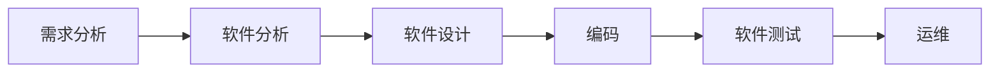
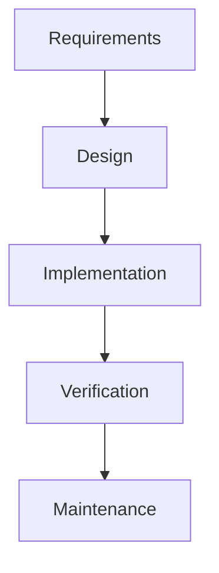
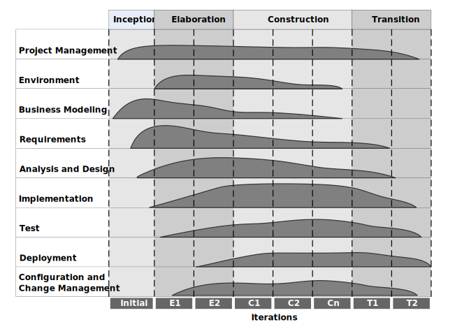
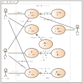
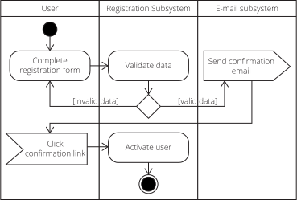
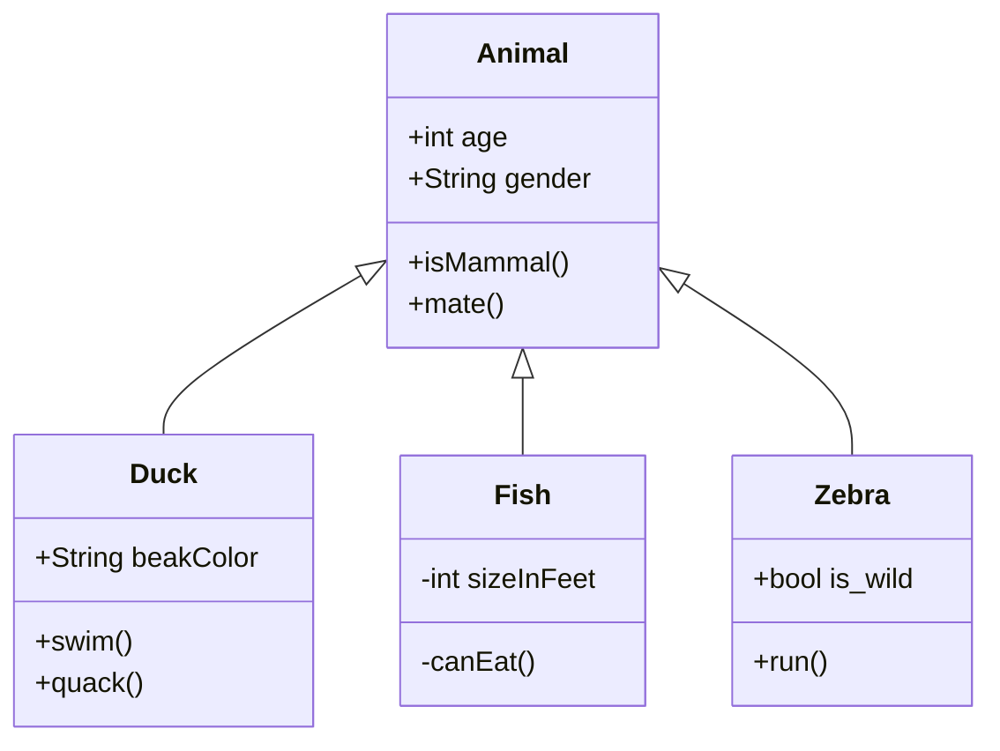

<h1>
    软件工程
</h1>

[TOC]

--- 

## 一、软件工程概要
### 1、定义
研究如何用**系统化、规范化**工程原则和方法指导软件开发维护的学科
### 2、目标
- 提高软件开发效率
- 提高软件质量
- 提高软件可维护性
---

## 二、软件生存周期和模型
### 1、生存周期

### 2、软件过程模型
#### (1)瀑布模型

阶段间顺序性和依赖性

- 必须等待前一阶段
- 依赖于文档
- 编码阶段才完成程序

!!! danger	
	- 存在问题:
	  ==需求分析== 在开发初期容易出错

#### (2)原型模型

#### (3)螺旋模型
1. 典型的迭代模型
2. 依赖于风险评估成败
.svg)

#### (4)构件集成模型
1. 基于构件
2. 不断迭代

### 3、过程模型新发展
#### (1)统一过程 RUP (Rational United Process) 

基于迭代，四个阶段(初始、细化、构造、交付)

#### (2)敏捷过程
以人为核心，迭代的，循序渐进的

把大项目分为小项目，分别完成，过程中软件一直可用

---
## 三、软件开发方法和工具
!!! tip
	> 个性化→结构化→面向对象→基于构件→新方法

### 1、结构化
面向数据流，**==自顶向下逐步求精==**
#### 工具
| **建模类型**     | **工具/描述** |
|--------------|-----------|
| 数据流图 (DFD)   | 功能建模      |
| 数据字典 (DD)    |           |
| 加工说明 (PSPEC) |           |
| 结构图 (SC)     |           |
| 实体关系图 (EC)   | 数据建模      |
| 状态图          | 行为建模      |

### 2、面向对象
#### 工具UML(Unified Modeling Language)
##### （1）用例图

##### （2）活动图

##### （3）类图

