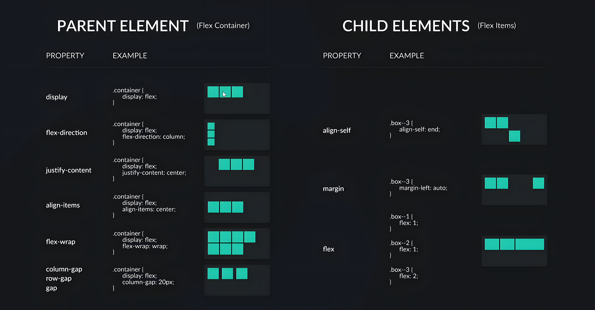

[TOC]

------

## 一、基础

使用 vscode 自带的 Emmet abbreviation 可以创建如下框架，是所有网页的基础

```html
<!DOCTYPE html>
<html>
    <head>
        <meta charset="utf-8" />
        <meta http-equiv="X-UA-Compatible" content="IE=edge" />
        <title>Page Title</title>
        <meta name="viewport" content="width=device-width, initial-scale=1" />
        <link rel="stylesheet" type="text/css" media="screen" href="main.css" />
        <script src="main.js"></script>
    </head>
    <body></body>
</html>

```

------

## 二、选择器

| 类型       | 示例                   | 说明                            |
| ---------- | ---------------------- | ------------------------------- |
| 通用选择器 | `*`                    | 匹配所有元素                    |
| 标签选择器 | `div`, `p`, `button`   | 按 HTML 标签名匹配              |
| 类选择器   | `.btn`                 | 匹配 `class="btn"` 的元素       |
| ID 选择器  | `#header`              | 匹配 `id="header"` 的元素       |
| 伪类选择器 | `:hover`, `:nth-child` | 匹配某种状态下的元素            |
| 后代选择器 | `.nav a`               | 匹配 `.nav` 中的所有 `<a>` 元素 |
| 属性选择器 | `input[type="text"]`   | 匹配具有特定属性的元素          |
| 组合选择器 | `.menu > li:hover`     | 多条件组合匹配                  |

在 `html` 中定义 `class="dd-toggle"`

在 `css` 文件里引入 

```css
.dd-toggle {
}
```

> [!NOTE]
>
> ```css
> <button class="menu__button menu__button--active">
> ```
>
> - 可以同时拥有两个类
>
> ```css
> .card p {
>   color: red;
> }
> ```
>
> - 可以选择子类
>
>
> p 是后代选择器，选中 .card 内部任意层级的 <p> 元素；
>
> 所以它不要求 p 是直接子元素，只要是在 .card 元素的 DOM 树里面，都会生效。

### 1、`inherit`

```html
<body class="app">
 	<header class="header">
            <button class="dd-toggle">File</button>
    </header>
</body>
```

在 `CSS` 文件中定义这样的继承就能让 `dd-toggle` 类继承 `body` 的属性

```css
button {
    border: initial;
    background-color: initial;
    color: inherit;
    font: inherit;
}
```

> [!TIP]
>
> ```css
> object-fit: <fill-mode>;
> ```
>
> | 值           | 解释                                                        |
> | ------------ | ----------------------------------------------------------- |
> | `fill`       | 默认值，拉伸图片以填满容器，**可能会变形**。                |
> | `contain`    | 图像等比缩放，以**完整显示在容器中**，可能有空白。          |
> | `cover`      | 图像等比缩放，以**填满整个容器**，超出的部分会被裁剪。      |
> | `none`       | 保持图像原始大小，**不缩放、不裁剪**。                      |
> | `scale-down` | 根据 `none` 和 `contain` 的效果中选一个**最小的尺寸显示**。 |

> [!TIP]
>
> ```css
> .dd-toggle:nth-of-type(4) {
>     margin-left: auto;
> }
> ```
>
>  `:nth-of-type(4)`：是一个伪类选择器，**选择该元素类型中第 4 个元素**
>
>  `margin-left: auto;`：表示将这个元素**自动向右推移，常用于实现右对齐**

### 2、`@keyframes`

```css
/* KEYFRAMES */
@keyframes fade-in-from-top {
    0% {
        opacity: 0;
        transform: translateY(-50px);
    }

    100% {
        opacity: 1;
        transform: translateY(0px);
    }
}
```

------

## 三、`FlexBox`



一定先定义 

```css
display: flex;
```

------

### （1）定位

```css
.menu__button--active {
    background-color: #2b363b;
    color: #fff;
    position: relative; /* 创建定位上下文 */
}

.menu__button--active::before {
    content: '';
    width: 3px;
    height: 100%;
    background-color: #375bb6;
    position: absolute; /* 相对于 .menu__button--active 来定位 */
    left: 0;
    top: 0;
}
```

> [!NOTE]
>
> - `hover:` 的 `transition` 效果是在原选择器上定义，而不是在 `hover` 选择器上定义

------

## 四、BEM

BEM 把一个 UI 组件分为三个部分：

| 概念     | 含义                              | 示例类名             |
| -------- | --------------------------------- | -------------------- |
| Block    | 独立的功能模块（组件）            | `menu`               |
| Element  | Block 的组成部分，不能单独使用    | `menu__item`         |
| Modifier | Block 或 Element 的不同状态或变体 | `menu__item--active` |

------

